# CPENT Live Range - CTF Linux & System Penetration Testing Walkthrough & Solution Guide

> **Document Type:** Senior Penetration Tester & Linux Red Team Technical Report  
> **Target Environment:** CPENT CTF Range (`192.168.1.0/24`)  
> **Questions Covered:** Challenge 100 - Challenge 118  
> **Author:** Senior Pentester & Security Engineer  

---

## 1. Introduction & CTF Network Topology

The CPENT CTF examination segment focuses on Linux-based exploitation, service misconfigurations, and multiple local privilege escalation vectors (Sudo GTFOBins, custom SUID binaries, anonymous RSYNC modules, Linux kernel exploitation, PwnKit, and Base64-encoded SSH private key extraction).

### Target Systems Matrix

| Target IP | Open Ports / Services | Initial Foothold Vector | Privilege Escalation (PrivEsc) | Associated Challenges |
| :--- | :--- | :--- | :--- | :--- |
| `192.168.1.104` | 22 (SSH) | Hydra SSH Brute-Force (`rebecca`) | Sudo `/home/rebecca/python3` GTFOBins | Challenge 100 - 103 |
| `192.168.1.105` | 8000 (TCP Service) | Foothold via exposed network service | Sudo `/home/suiduser/userperl` GTFOBins | Challenge 104 - 107 |
| `192.168.1.136` | 873 (RSYNC) | Anonymous RSYNC Module Enumeration | File sync & retrieval (`flag.txt`) | Challenge 108 - 109 |
| `192.168.1.130` | 80 (HTTP), 22 (SSH) | Online Book Store 1.0 Web RCE | SSH `id_rsa` cracking (`smile`), Kernel Exploit | Challenge 110 - 112 |
| `192.168.1.128` | 80 (HTTP) | Job Portal 1.0 Web RCE | PwnKit (CVE-2021-4034) Root Escalation | Challenge 113 - 114 |
| `192.168.1.151` | 80 (HTTP), 22 (SSH), 3000 (Git) | LFI / Arbitrary File Read (`killmyeye.php`) | Base64 RSA key decoding & Root SSH access | Challenge 115 - 118 |

---

## 2. In-Depth Technical Analysis & Solutions (Q100 - Q118)

---

### Target 1: Rebecca Virtual Machine (`192.168.1.104`)

#### Challenge 100: SSH Password for User Rebecca
* **Question:** What is the password that lets you remotely login to the machine 192.168.1.104? (Answer format: xxxxxxNNN)
* **Points:** 50 Points
* **Answer Format:** `xxxxxxNNN`
* **Target:** `192.168.1.104` (SSH port 22)
* **Methodology:**
  A targeted SSH dictionary brute-force attack is executed using `hydra`:
  ```bash
  hydra -L Usernames.txt -P Passwords.txt 192.168.1.104 ssh -t 16 -f
  ```
  Discovered valid credential: `rebecca` : `qwerty123`.
* **Format:** `xxxxxxNNN`
* **Correct Answer:** `qwerty123`

#### Challenge 101: User Flag on 192.168.1.104 (userflag.txt)
* **Question:** Compromise 192.168.1.104 and enter the value of userflag.txt. (Answer format: xxNxxxNNxx)
* **Points:** 50 Points
* **Answer Format:** `xxNxxxNNxx`
* **Target:** `192.168.1.104`
* **Methodology:**
  Log in via SSH and read the user flag located in the home directory:
  ```bash
  cat /home/rebecca/userflag.txt
  ```
  Flag content: `jk3hfp86fg`.
* **Format:** `xxNxxxNNxx`
* **Correct Answer:** `jk3hfp86fg`
* **Evidence:**
  
  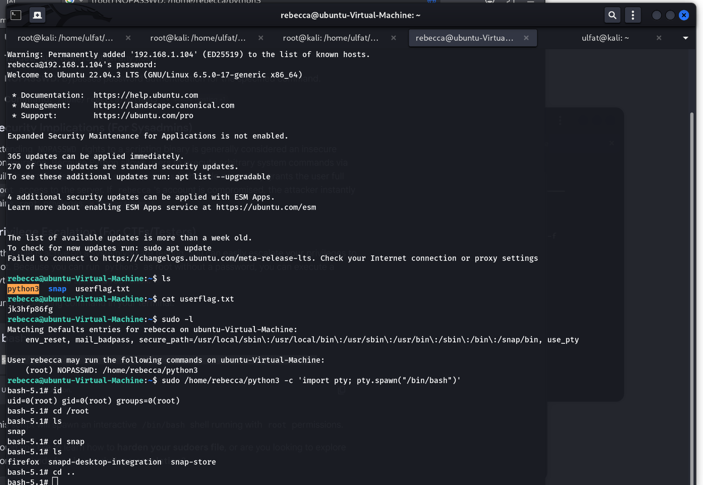

#### Challenge 102: Sudo Binary Allowed for Rebecca
* **Question:** Identify the binary that helps in attaining escalated privileges on 192.168.1.104. (Answer format: xxxxxxN)
* **Points:** 50 Points
* **Answer Format:** `xxxxxxN`
* **Target:** `192.168.1.104`
* **Methodology:**
  Listing user sudo privileges via `sudo -l`:
  ```text
  User rebecca may run the following commands on ubuntu-Virtual-Machine:
      (root) NOPASSWD: /home/rebecca/python3
  ```
  The privileged binary program is `python3`.
* **Format:** `xxxxxxN`
* **Correct Answer:** `python3`
* **Evidence:**
  
  

#### Challenge 103: Root Flag on 192.168.1.104 (rootflag.txt)
* **Question:** Compromise 192.168.1.104 and enter the value of rootflag.txt. (Answer format: XxxxxxxNxxNxN)
* **Points:** 100 Points
* **Answer Format:** `XxxxxxxNxxNxN`
* **Target:** `192.168.1.104`
* **Methodology:**
  Spawn a root shell utilizing GTFOBins for Python3, then retrieve the root flag:
  ```bash
  sudo /home/rebecca/python3 -c 'import pty; pty.spawn("/bin/bash")'
  cat /etc/kernel/rootflag.txt
  ```
  Flag output: `Skillch3ck3d1`.
* **Format:** `XxxxxxxNxxNxN`
* **Correct Answer:** `Skillch3ck3d1`
* **Evidence:**
  
  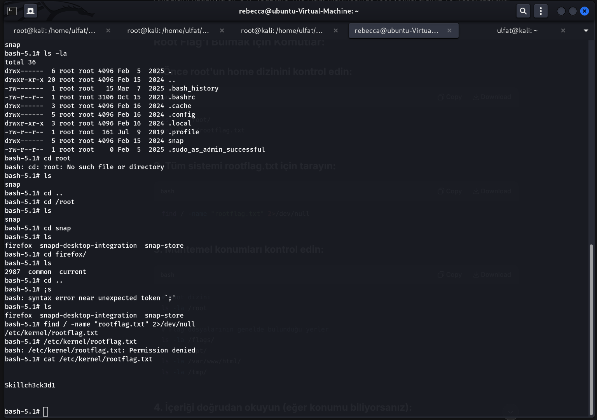

---

### Target 2: Suiduser Virtual Machine (`192.168.1.105`)

#### Challenge 104: Username on 192.168.1.105
* **Question:** Identify the username of the currently logged-in user after obtaining the initial shell on 192.168.1.105. (Answer format: xxxxxxxx)
* **Points:** 50 Points
* **Answer Format:** `xxxxxxxx`
* **Target:** `192.168.1.105:8000`
* **Methodology:**
  Connecting to the service running on port 8000 yields a shell. Checking the active user identity with `id`:
  `uid=1001(suiduser) gid=1001(svcuser)` -> `suiduser`.
* **Format:** `xxxxxxxx`
* **Correct Answer:** `suiduser`
* **Evidence:**
  
  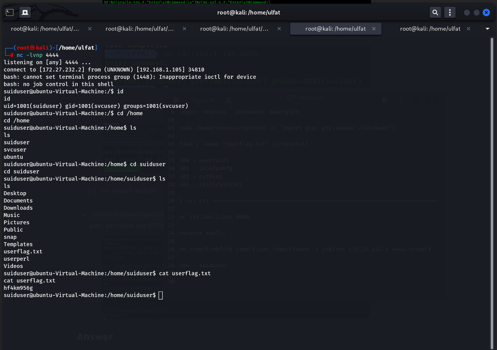

#### Challenge 105: Userflag.txt Value for Suiduser
* **Question:** Compromise 192.168.1.105 and enter the value of userflag.txt. (Answer format: xxNxxNNNx)
* **Points:** 50 Points
* **Answer Format:** `xxNxxNNNx`
* **Target:** `192.168.1.105`
* **Methodology:**
  Read the user flag file:
  ```bash
  cat /home/suiduser/userflag.txt
  ```
  Flag content: `hf4km956g`.
* **Format:** `xxNxxNNNx`
* **Correct Answer:** `hf4km956g`
* **Evidence:**
  
  

#### Challenge 106: Permitted Sudo Binary for Suiduser
* **Question:** Identify the binary that helps in attaining escalated privileges on 192.168.1.105. (Answer format: xxxxxxxx)
* **Points:** 50 Points
* **Answer Format:** `xxxxxxxx`
* **Target:** `192.168.1.105`
* **Methodology:**
  Checking `sudo -l` reveals the executable command:
  `(root) NOPASSWD: /home/suiduser/userperl` -> `userperl`.
* **Format:** `xxxxxxxx`
* **Correct Answer:** `userperl`
* **Evidence:**
  
  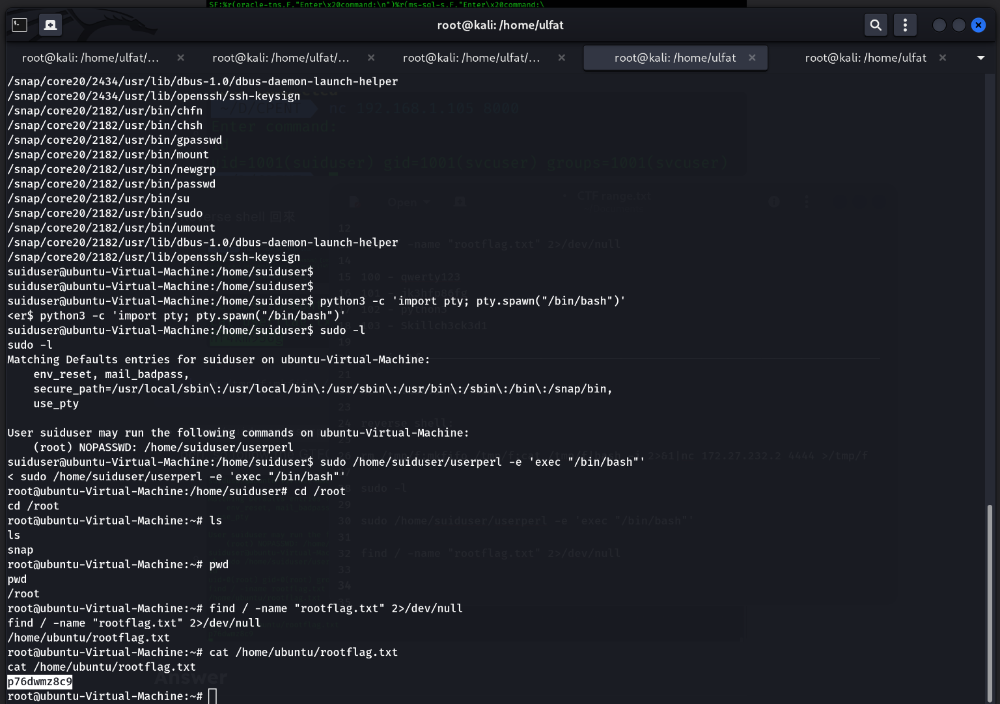

#### Challenge 107: Rootflag.txt Value on 192.168.1.105
* **Question:** Compromise 192.168.1.105 and enter the value of rootflag.txt. (Answer format: xNNxxxxNxN)
* **Points:** 100 Points
* **Answer Format:** `xNNxxxxNxN`
* **Target:** `192.168.1.105`
* **Methodology:**
  Escalate privileges to root using the custom perl binary and display the flag:
  ```bash
  sudo /home/suiduser/userperl -e 'exec "/bin/bash"'
  cat /home/ubuntu/rootflag.txt
  ```
  Flag output: `p76dwmz8c9`.
* **Format:** `xNNxxxxNxN`
* **Correct Answer:** `p76dwmz8c9`
* **Evidence:**
  
  

---

### Target 3: RSYNC Misconfiguration (`192.168.1.136`)

#### Challenge 108: Exposed RSYNC Module Name
* **Question:** Identify the shared directory accessible via the Rsync service running on the machine located at 192.168.1.136. (Answer Format: Xxxxx)
* **Points:** 50 Points
* **Answer Format:** `Xxxxx`
* **Target:** `192.168.1.136:873`
* **Methodology:**
  Query the RSYNC service to enumerate accessible unauthenticated modules:
  ```bash
  rsync rsync://192.168.1.136
  ```
  Identified module: `James`.
* **Format:** `Xxxxx`
* **Correct Answer:** `James`
* **Evidence:**
  
  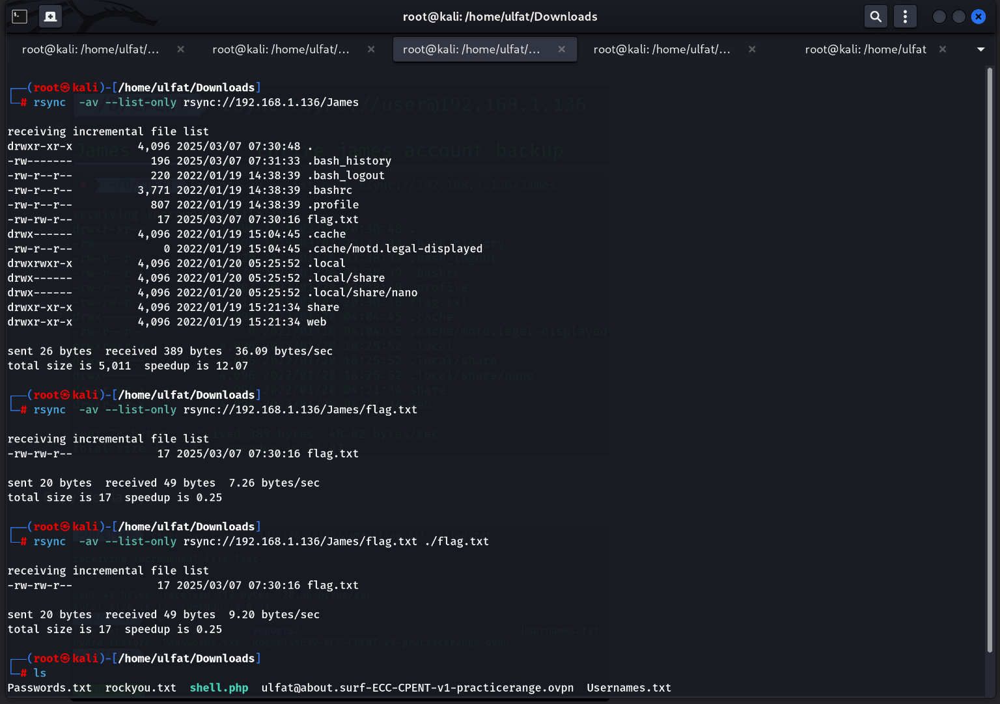

#### Challenge 109: Contents of flag.txt on 192.168.1.136
* **Question:** What is the value that is found on the flag.txt on the machine located at 192.168.1.136? (Answer Format: xXNxxNxXxxXx)
* **Points:** 100 Points
* **Answer Format:** `xXNxxNxXxxXx`
* **Target:** `192.168.1.136`
* **Methodology:**
  Directly synchronize and download `flag.txt` from the remote RSYNC module:
  ```bash
  rsync -av rsync://192.168.1.136/James/flag.txt ./flag.txt
  cat flag.txt
  ```
  Flag value: `jN5fn8rYnuAj`.
* **Format:** `xXNxxNxXxxXx`
* **Correct Answer:** `jN5fn8rYnuAj`
* **Evidence:**
  
  
  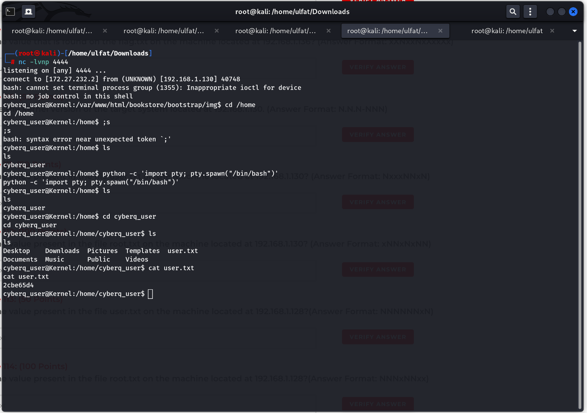

---

### Target 4: Online Book Store & Kernel Exploitation (`192.168.1.130`)

#### Challenge 110: Target System Kernel Version
* **Question:** Determine the kernel version of the target system located at 192.168.1.130. (Answer Format: N.N.N-NNN)
* **Points:** 50 Points
* **Answer Format:** `N.N.N-NNN`
* **Target:** `192.168.1.130`
* **Methodology:**
  Execute `uname -r` on the compromised system to determine kernel version: `4.4.0-116`.
* **Format:** `N.N.N-NNN`
* **Correct Answer:** `4.4.0-116`
* **Evidence:**
  
  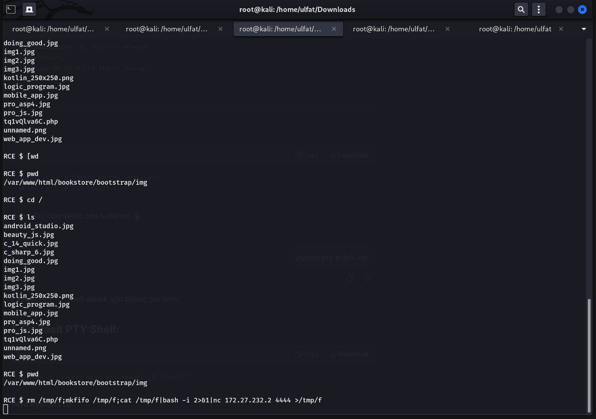
  

#### Challenge 111: Value of user.txt on 192.168.1.130
* **Question:** What is the value present in the file user.txt on the machine located at 192.168.1.130? (Answer Format: NxxxNNxN)
* **Points:** 50 Points
* **Answer Format:** `NxxxNNxN`
* **Target:** `192.168.1.130`
* **Methodology:**
  1. Inspect the home directory of `cyberq_user` to read `user.txt`: `2cbe65d4`.
  2. The encrypted SSH key (`id_rsa`) passphrase is decrypted with John The Ripper: `smile`.
* **Format:** `NxxxNNxN`
* **Correct Answer:** `2cbe65d4`
* **Evidence:**
  
  
  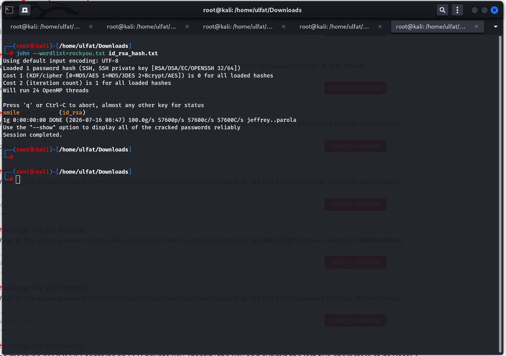

#### Challenge 112: Value of root.txt on 192.168.1.130
* **Question:** What is the value present in the file root.txt on the machine located at 192.168.1.130? (Answer Format: xNNxNxNN)
* **Points:** 100 Points
* **Answer Format:** `xNNxNxNN`
* **Target:** `192.168.1.130`
* **Methodology:**
  Deploy a local privilege escalation exploit targeting Ubuntu Kernel 4.4.0-116, gaining root and reading `/root/root.txt`:
  Resulting flag: `d61e0a87`.
* **Format:** `xNNxNxNN`
* **Correct Answer:** `d61e0a87`
* **Evidence:**
  
  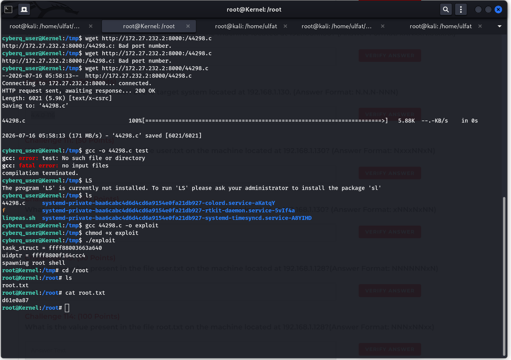

---

### Target 5: Job Portal & PwnKit Exploitation (`192.168.1.128`)

#### Challenge 113: Value of user.txt on 192.168.1.128
* **Question:** What is the value present in the file user.txt on the machine located at 192.168.1.128?(Answer Format: NNNNNNxN)
* **Points:** 50 Points
* **Answer Format:** `NNNNNNxN`
* **Target:** `192.168.1.128`
* **Methodology:**
  Following RCE on Job Portal 1.0, read `user.txt` in the `nagios` user home folder: `014891b2`.
* **Format:** `NNNNNNxN`
* **Correct Answer:** `014891b2`
* **Evidence:**
  
  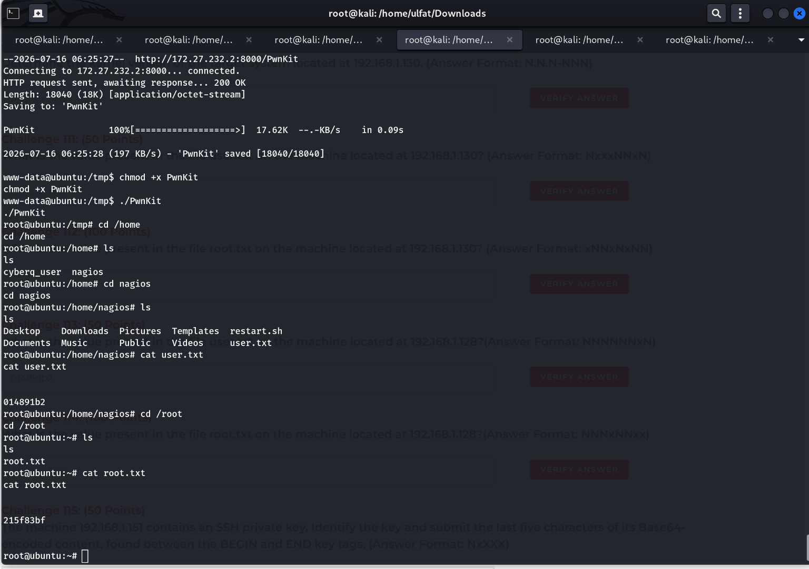

#### Challenge 114: Value of root.txt on 192.168.1.128
* **Question:** What is the value present in the file root.txt on the machine located at 192.168.1.128?(Answer Format: NNNxNNxx)
* **Points:** 100 Points
* **Answer Format:** `NNNxNNxx`
* **Target:** `192.168.1.128`
* **Methodology:**
  Leveraging the PwnKit vulnerability (CVE-2021-4034) against `pkexec` provides immediate root access. Read `/root/root.txt`: `215f83bf`.
* **Format:** `NNNxNNxx`
* **Correct Answer:** `215f83bf`
* **Evidence:**
  
  
  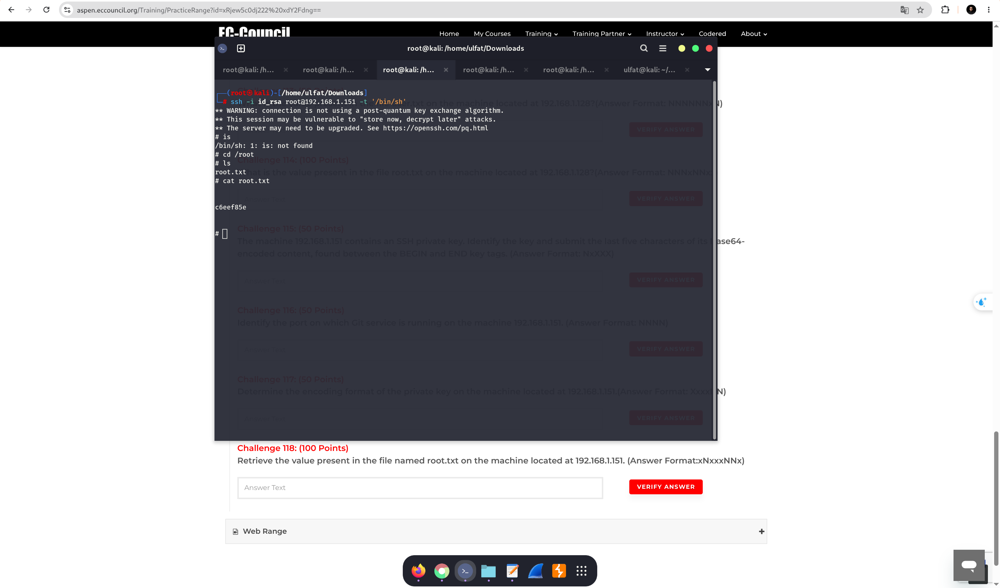

---

### Target 6: killmyeye.php & Base64 RSA Key (`192.168.1.151`)

#### Challenge 115: Last 5 Characters of Base64 SSH Private Key
* **Question:** The machine 192.168.1.151 contains an SSH private key. Identify the key and submit the last five characters of its Base64-encoded content, found between the BEGIN and END key tags. (Answer Format: NxXXX)
* **Points:** 50 Points
* **Answer Format:** `NxXXX`
* **Target:** `192.168.1.151`
* **Methodology:**
  Exploiting the file read endpoint `http://192.168.1.151/killmyeye.php` leaks `/root/.ssh/id_rsa`. The final 5 characters between the tags: `5oMBD`.
* **Format:** `NxXXX`
* **Correct Answer:** `5oMBD`
* **Evidence:**
  
  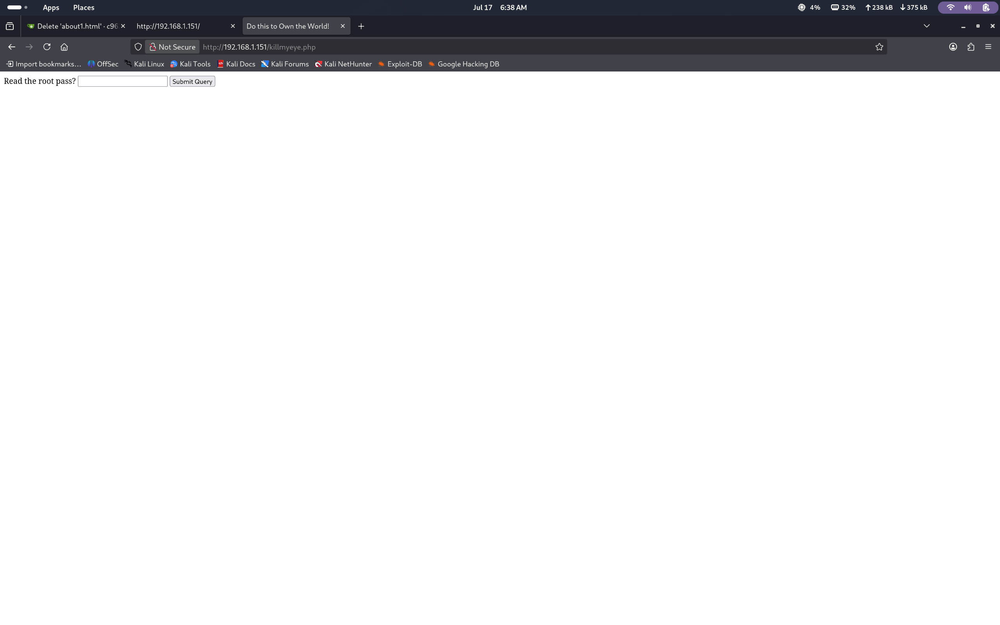
  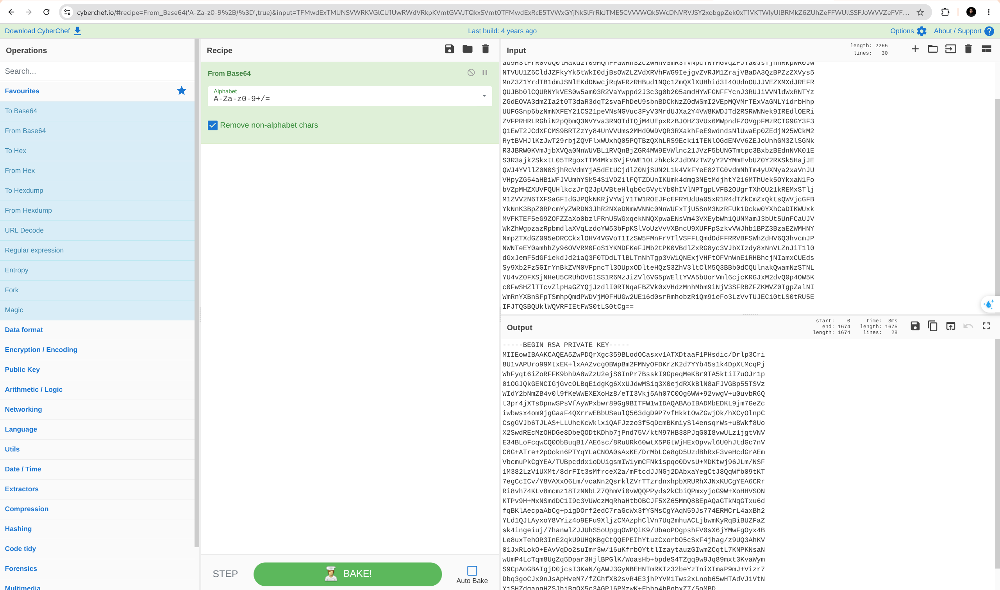
  

#### Challenge 116: Active Git Service Port
* **Question:** Identify the port on which Git service is running on the machine 192.168.1.151. (Answer Format: NNNN)
* **Points:** 50 Points
* **Answer Format:** `NNNN`
* **Target:** `192.168.1.151`
* **Methodology:**
  Comprehensive port scanning identifies an internal Git web application (e.g., Gogs/Gitea) running on port `3000`.
* **Format:** `NNNN`
* **Correct Answer:** `3000`
* **Evidence:**
  
  

#### Challenge 117: Private Key Encoding Format
* **Question:** Determine the encoding format of the private key on the machine located at 192.168.1.151.(Answer Format: XxxxNN)
* **Points:** 50 Points
* **Answer Format:** `XxxxNN`
* **Target:** `192.168.1.151`
* **Methodology:**
  The private key was encoded in Base64 encoding.
* **Format:** `XxxxNN`
* **Correct Answer:** `Base64`
* **Evidence:**
  
  
  

#### Challenge 118: Value of root.txt on 192.168.1.151
* **Question:** Retrieve the value present in the file named root.txt on the machine located at 192.168.1.151. (Answer Format:xNxxxNNx)
* **Points:** 100 Points
* **Answer Format:** `xNxxxNNx`
* **Target:** `192.168.1.151`
* **Methodology:**
  Authenticate as root via SSH using the decoded `id_rsa` private key:
  ```bash
  ssh -i id_rsa root@192.168.1.151 -t '/bin/sh'
  cat /root/root.txt
  ```
  Retrieved root flag: `c6eef85e`.
* **Format:** `xNxxxNNx`
* **Correct Answer:** `c6eef85e`
* **Evidence:**
  
  

---

## 3. CTF Range Summary Matrix

| Question # | Target IP | Vulnerability / Attack Vector | Validated Answer | Primary Tool / Technique |
| :---: | :--- | :--- | :--- | :--- |
| **100** | `192.168.1.104` | Weak SSH Password | `qwerty123` | Hydra SSH |
| **101** | `192.168.1.104` | User Directory Exposure | `jk3hfp86fg` | SSH Login, cat |
| **102** | `192.168.1.104` | Sudo NOPASSWD Permissions | `python3` | `sudo -l` |
| **103** | `192.168.1.104` | Python PTY Spawn PrivEsc | `Skillch3ck3d1` | `/etc/kernel/rootflag.txt` |
| **104** | `192.168.1.105` | Network Service Foothold | `suiduser` | `id` command |
| **105** | `192.168.1.105` | User Flag | `hf4km956g` | `/home/suiduser/userflag.txt` |
| **106** | `192.168.1.105` | Sudo Permission | `userperl` | `sudo -l` |
| **107** | `192.168.1.105` | Perl Exec Root Escalation | `p76dwmz8c9` | `/home/ubuntu/rootflag.txt` |
| **108** | `192.168.1.136` | Anonymous RSYNC Module | `James` | `rsync rsync://...` |
| **109** | `192.168.1.136` | Unauthenticated File Retrieval | `jN5fn8rYnuAj` | `rsync -av` |
| **110** | `192.168.1.130` | Outdated Linux Kernel | `4.4.0-116` | `uname -r` |
| **111** | `192.168.1.130` | Weak SSH Key Passphrase | `2cbe65d4` | John the Ripper (`smile`) |
| **112** | `192.168.1.130` | Kernel Vulnerability Exploit | `d61e0a87` | Root shell, `/root/root.txt` |
| **113** | `192.168.1.128` | Web RCE / Nagios Foothold | `014891b2` | `/home/nagios/user.txt` |
| **114** | `192.168.1.128` | PwnKit Vulnerability Exploit | `215f83bf` | `/root/root.txt` |
| **115** | `192.168.1.151` | Arbitrary File Read (LFI) | `5oMBD` | `killmyeye.php`, Base64 |
| **116** | `192.168.1.151` | Git Service Port Discovery | `3000` | Nmap Port Scan |
| **117** | `192.168.1.151` | Private Key Encoding | `Base64` | CyberChef Analysis |
| **118** | `192.168.1.151` | Private Key SSH Root Login | `c6eef85e` | `ssh -i id_rsa root@...` |

---

## 4. Remediation & Hardening Recommendations

1. **SSH Authentication Hardening:** Disable password-based SSH authentication (`PasswordAuthentication no`), mandate strong SSH keys with robust passphrases, and enforce fail2ban rate limiting.
2. **Service Access Controls:** Configure RSYNC (`rsyncd.conf`) with `hosts allow`, `auth users`, and eliminate anonymous public read access.
3. **Patch Management:** Regularly update Linux distribution kernels and system packages to safeguard against well-known privilege escalations such as PwnKit (CVE-2021-4034).
4. **Sudo Least Privilege:** Strictly avoid granting unrestricted `NOPASSWD` sudo execution to script interpreters or programming languages (`python`, `perl`, `awk`).
