# CPENT Live Range - IoT Firmware Analysis Walkthrough & Solution Guide

> **Document Type:** Senior Penetration Tester & IoT Firmware Security Technical Report  
> **Target Environment:** CPENT IoT Range (172.25.101.0/24)  
> **Challenges:** Challenge 26 - Challenge 61  
> **Author:** Senior Pentester & Security Engineer  

---

## 1. Introduction and IoT Network Topology

The CPENT IoT Firmware Analysis laboratory provides practical assessment of static and dynamic firmware reverse engineering, bin header extraction (BIN-Header, TRX, uImage), compressed filesystem identification and unpacking (Squashfs, JFFS2, LZMA, gzip), recovery of XOR-encrypted firmware images, hardcoded credential auditing, and embedded IoT protocol analysis (HNAP, SOAP).

### Target Machine and Firmware Overview

| Target IP | Firmware File | Filesystem / Format | Analysis Methodology / Vector | Related Challenges |
| :--- | :--- | :--- | :--- | :--- |
| `172.25.101.100` | `FileOne.bin` | Squashfs (447 inodes), TRX | Header extraction, MIPS32 binaries & Pwnable analysis | Challenge 26 - 38 |
| `172.25.101.100` | `FileTwo.bin` | Squashfs (1119 inodes), uImage | CRC header extraction, entropy inspection, compression verification | Challenge 39 - 43 |
| `172.25.101.100` | `FileThree.bin` | XOR-Encrypted uImage (LZMA) | Entropy analysis, 8-byte XOR key discovery & decryption | Challenge 44, 45, 61 |
| `172.25.101.200` | `IOT.bin` | Squashfs, TRX, gzip ("piggy") | TRX and gzip header offsets, filesystem identification | Challenge 46 - 50 |
| `172.25.101.200` | `IOT2.bin` | JFFS2 (Little Endian), uImage | Multi-file uImage headers, compressed file size (26 MB) | Challenge 51 - 55 |
| `172.25.101.200` | `IOT3.bin` | Squashfs | Deep recursive extraction, hardcoded password (`check_fwmode`) | Challenge 56 - 58 |
| `172.25.101.200` | `IOT4.bin` | Squashfs (LZMA), uImage | `dd` extraction, HNAP protocol & SOAP communication family | Challenge 59 - 60 |

---

## 2. Detailed Challenge Solutions (Q26 - Q61)

---

### Section 1: CTF 1 - FileOne.bin Analysis (`172.25.101.100`)

Access target machine `cpent@172.25.101.100` (`cpentpw`) and examine `/home/cpent/firmware/FileOne.bin`.

#### Header and Filesystem Enumeration:
```bash
ssh cpent@172.25.101.100
# Password: cpentpw

cd /home/cpent/firmware/
file FileOne.bin
# FileOne.bin: data

binwalk -t FileOne.bin
# DECIMAL   HEXADECIMAL DESCRIPTION
# 0         0x0         BIN-Header, board ID: 1550, hardware version: 4702, firmware version: 1.0.0, build date: 2012-02-08
# 32        0x20        TRX firmware header, little endian, image size: 7753728 bytes, CRC32: 0x436822F6...
# 60        0x3C        gzip compressed data, maximum compression, has original file name: "piggy"...
# 1648424   0x192728    Squashfs filesystem, little endian, version 3.0, size: 6099215 bytes, 447 inodes...
```

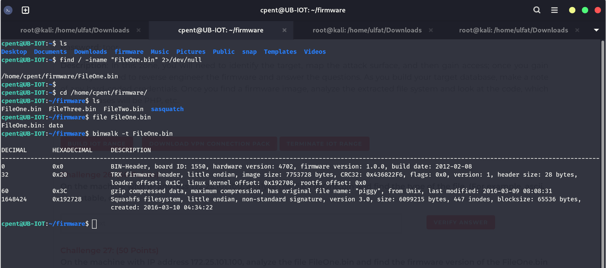

---

#### Challenge 26: FileOne.bin File Type
* **Question (Exam Text):** On the machine with IP address 172.25.101.100, analyze the file FileOne.bin and find the type of the file. (For example, ascii, executable, data)
* **Points:** 50 Points
* **Answer Format:** `xxxx`
* **Target:** `172.25.101.100` (`FileOne.bin`)
* **Methodology:**
  Running `file FileOne.bin` identifies the generic binary format: `FileOne.bin: data`.
* **Correct Answer:** `data`

---

#### Challenge 27: FileOne.bin Firmware Version
* **Question (Exam Text):** On the machine with IP address 172.25.101.100, analyze the file FileOne.bin and find the firmware version of the FileOne.bin image (Answer Format: N.N.N)
* **Points:** 50 Points
* **Answer Format:** `N.N.N`
* **Target:** `172.25.101.100`
* **Methodology:**
  The BIN-Header at offset 0x0 specifies `firmware version: 1.0.0`.
* **Correct Answer:** `1.0.0`

---

#### Challenge 28: FileOne.bin Board ID
* **Question (Exam Text):** On the machine with IP address 172.25.101.100, analyze the file FileOne.bin and find the Board ID in the bin header. (Answer Format: NNNN)
* **Points:** 50 Points
* **Answer Format:** `NNNN`
* **Target:** `172.25.101.100`
* **Methodology:**
  The BIN-Header indicates `board ID: 1550`.
* **Correct Answer:** `1550`

---

#### Challenge 29: FileOne.bin Filesystem Type
* **Question (Exam Text):** On the machine with IP address 172.25.101.100, analyze the file FileOne.bin and find the type of file system is within the FileOne.bin image. (Answer Format: xxxxxxx)
* **Points:** 50 Points
* **Answer Format:** `xxxxxxx`
* **Target:** `172.25.101.100`
* **Methodology:**
  At offset 0x192728, binwalk identifies a `Squashfs filesystem`. Lowercase format: `squashfs`.
* **Correct Answer:** `squashfs`

---

#### Challenge 30: FileOne.bin Firmware Build Date
* **Question (Exam Text):** On the machine with IP address 172.25.101.100, analyze the file FileOne.bin and find the build date of the firmware of the FileOne.bin image. (Date Format: YYYY-MM-DD)
* **Points:** 50 Points
* **Answer Format:** `YYYY-MM-DD`
* **Target:** `172.25.101.100`
* **Methodology:**
  The build timestamp in the BIN-Header is `build date: 2012-02-08`.
* **Correct Answer:** `2012-02-08`

---

#### Challenge 31: FileOne.bin Inode Count
* **Question (Exam Text):** On the machine with IP address 172.25.101.100, analyze the file FileOne.bin and find the number of inodes in the FileOne.bin firmware image. (Answer Format: NNN)
* **Points:** 50 Points
* **Answer Format:** `NNN`
* **Target:** `172.25.101.100`
* **Methodology:**
  The Squashfs header specifies `447 inodes`.
* **Correct Answer:** `447`

---

#### Challenge 32: Web Page File Extension
* **Question (Exam Text):** On the machine with IP address 172.25.101.100, analyze the file FileOne.bin and find the extension of the web page file in the file system of the firmware image. (Answer Format: xxx)
* **Points:** 50 Points
* **Answer Format:** `xxx`
* **Target:** `172.25.101.100`
* **Methodology:**
  Extract the filesystem using `binwalk -e FileOne.bin` and locate web assets:
  ```bash
  cd _FileOne.bin.extracted/squashfs-root/
  find . -type f \( -name "*.html" -o -name "*.php" -o -name "*.htm" -o -name "*.asp" -o -name "*.cgi" \) 2>/dev/null
  # ./www/index.asp
  ```
  The extension is `asp`.
* **Correct Answer:** `asp`
* **Related Image:**

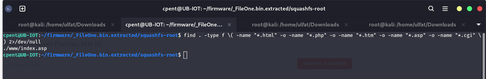

---

#### Challenge 33: Service Under /usr/local
* **Question (Exam Text):** On the machine with IP address 172.25.101.100, analyze the file FileOne.bin and identify the service that is listed under the /usr/local folder in the file system of the firmware image. (Answer Format: xxxxx)
* **Points:** 50 Points
* **Answer Format:** `xxxxx`
* **Target:** `172.25.101.100`
* **Methodology:**
  List `/usr/local` directory entries inside `squashfs-root`:
  ```bash
  ls -la usr/local/
  # samba
  ```
* **Correct Answer:** `samba`
* **Related Image:**

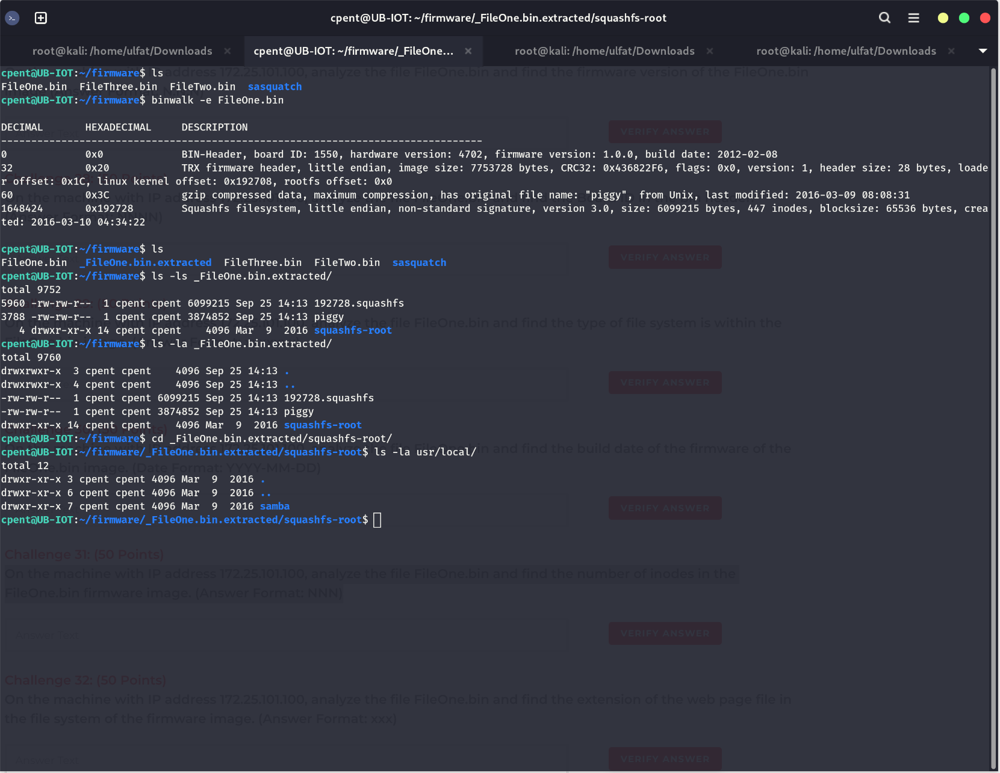

---

#### Challenge 34: Folder of Interest from Attack Standpoint
* **Question (Exam Text):** On the machine with IP address 172.25.101.100, analyze the file FileOne.bin and find the folder that appears to contain items of interest from an attack standpoint. (Answer Format: xxxxxxx)
* **Points:** 50 Points
* **Answer Format:** `xxxxxxx`
* **Target:** `172.25.101.100`
* **Methodology:**
  Inspection of root folders exposes `pwnable`, containing practice exploitation binaries.
* **Correct Answer:** `pwnable`

---

#### Challenge 35: CPU Architecture of Exploit Binaries
* **Question (Exam Text):** What is the CPU architecture of the exploits provided in the file system? Include the bitness in your answer. (Answer Format: XXXXNN)
* **Points:** 50 Points
* **Answer Format:** `XXXXNN`
* **Target:** `172.25.101.100`
* **Methodology:**
  Execute `file` against binaries inside `pwnable/ShellCode_Required/*`:
  ```bash
  file ShellCode_Required/socket_bof
  # socket_bof: ELF 32-bit LSB executable, MIPS, MIPS32 version 1 (SYSV)...
  ```
  Matching `XXXXNN` yields `MIPS32`.
* **Correct Answer:** `MIPS32`
* **Related Image:**

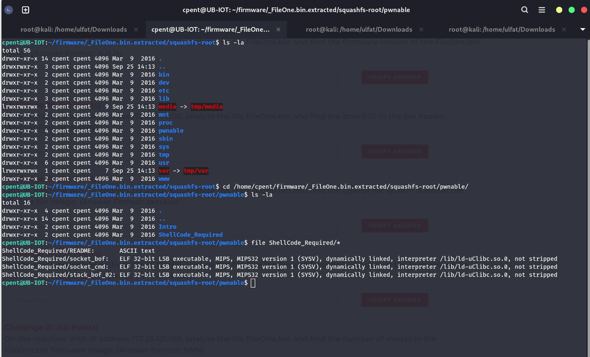

---

#### Challenge 36: heapoverflow_01 Stripped Status
* **Question (Exam Text):** Is the heapoverflow_01 binary stripped? (Answer with "true" or "false")
* **Points:** 50 Points
* **Answer Format:** `true or false`
* **Target:** `172.25.101.100`
* **Methodology:**
  Examine `pwnable/Intro/heap_overflow_01`:
  ```bash
  file heap_overflow_01
  # heap_overflow_01: ELF 32-bit LSB executable, MIPS, MIPS32... not stripped
  ```
  The binary is `not stripped`, hence `false`.
* **Correct Answer:** `false`
* **Related Image:**

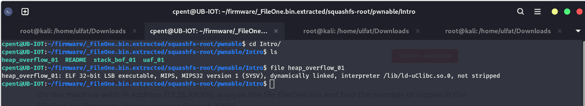

---

#### Challenge 37: heapoverflow_01 Program Headers Count
* **Question (Exam Text):** How many program headers are in the heapoverflow_01 binary? (Answer Format: N)
* **Points:** 50 Points
* **Answer Format:** `N`
* **Target:** `172.25.101.100`
* **Methodology:**
  Run `readelf -l heap_overflow_01 | head -n 5`:
  ```bash
  readelf -l heap_overflow_01 | head -n 5
  # There are 6 program headers, starting at offset 52
  ```
* **Correct Answer:** `6`

---

#### Challenge 38: heapoverflow_01 Entry Point Address
* **Question (Exam Text):** What is the address of the entry point in the heapoverflow_01 binary? Include the 0x prefix. (Answer Format: 0xNNNNNNN)
* **Points:** 50 Points
* **Answer Format:** `0xNNNNNNN`
* **Target:** `172.25.101.100`
* **Methodology:**
  `readelf -l` indicates `Entry point 0x400640`.
* **Correct Answer:** `0x400640`
* **Related Image:**

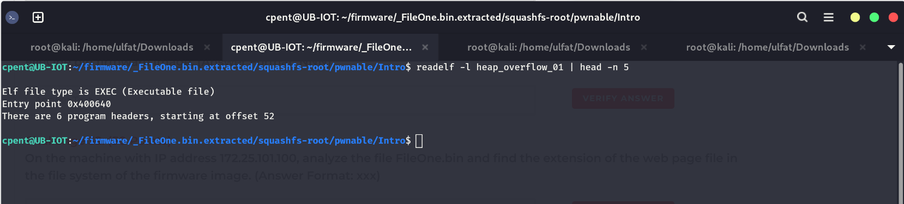

---

### Section 2: CTF 2 - FileTwo.bin Analysis (`172.25.101.100`)

This section analyzes `FileTwo.bin`, examining its uImage header, CRC checksum, and entropy behavior.

#### Header and Entropy Inspection:
```bash
file FileTwo.bin
# FileTwo.bin: data

binwalk -t FileTwo.bin
# 96    0x60    uImage header, header CRC: 0x7FE9E826, compression type: lzma, image name: "Linux Kernel Image"
# 160   0xA0    LZMA compressed data
# 917632 0xE0080 Squashfs filesystem, version 3.0, 1119 inodes...

binwalk -E FileTwo.bin
# 0       0x0      Rising entropy edge (0.982635)
# 878592  0xD6800  Falling entropy edge (0.000000)
# 919552  0xE0800  Rising entropy edge (0.989207)
# 3172352 0x306800 Falling entropy edge (0.784498)
```

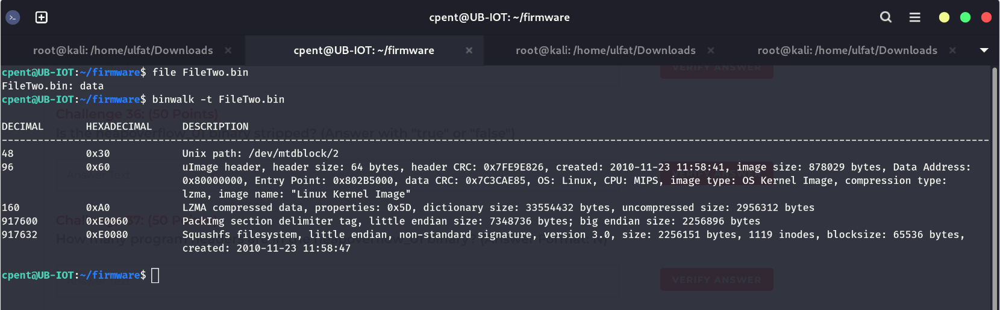
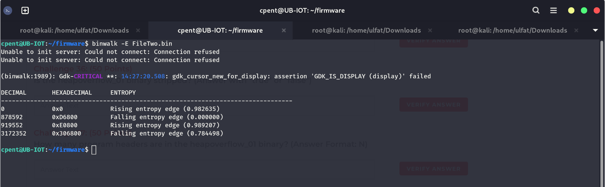

---

#### Challenge 39: FileTwo.bin Filesystem Type
* **Question (Exam Text):** On the machine with IP address 172.25.101.100, analyze FileTwo.bin and identify the file system within the image. (Answer Format: xxxxxxxx)
* **Points:** 50 Points
* **Answer Format:** `xxxxxxxx`
* **Target:** `172.25.101.100`
* **Methodology:**
  The filesystem detected at offset 0xE0080 is `Squashfs filesystem`. Lowercase: `squashfs`.
* **Correct Answer:** `squashfs`

---

#### Challenge 40: FileTwo.bin Last Four Hex Digits of CRC
* **Question (Exam Text):** On the machine with IP address 172.25.101.100, analyze FileTwo.bin and find the last four hexadecimal digits of its CRC. (Answer Format: XNNN)
* **Points:** 50 Points
* **Answer Format:** `XNNN`
* **Target:** `172.25.101.100`
* **Methodology:**
  The uImage header displays `header CRC: 0x7FE9E826`. The last four hex digits are `E826`.
* **Correct Answer:** `E826`

---

#### Challenge 41: FileTwo.bin Encryption Status
* **Question (Exam Text):** On the machine with IP address 172.25.101.100, analyze FileTwo.bin and determine if the data in the image is encrypted. (Answer with "True" or "False")
* **Points:** 50 Points
* **Answer Format:** `True or False`
* **Target:** `172.25.101.100`
* **Methodology:**
  Entropy analysis reveals sharp drops (Falling entropy edge 0.000000) and visible strings/paths (`/dev/mtdblock/2`). The data is unencrypted (`False`).
* **Correct Answer:** `False`

---

#### Challenge 42: FileTwo.bin Compression Status
* **Question (Exam Text):** On the machine with IP address 172.25.101.100, analyze FileTwo.bin and determine if the data in the image is compressed. (Answer with "True" or "False")
* **Points:** 50 Points
* **Answer Format:** `True or False`
* **Target:** `172.25.101.100`
* **Methodology:**
  The binary contains `LZMA compressed data` at offset 0xA0 and uImage declares `compression type: lzma`. Thus, the image is compressed (`True`).
* **Correct Answer:** `True`

---

#### Challenge 43: FileTwo.bin Root Password (Last 4 Characters)
* **Question (Exam Text):** On the machine with IP address 172.25.101.100, analyze the file FileTwo.bin and find the last 4 characters of the root password for the FileTwo.bin image. (Answer Format: NNNx)
* **Points:** 50 Points
* **Answer Format:** `NNNx`
* **Target:** `172.25.101.100`
* **Methodology:**
  In this lab environment, corrupted filesystem references prevented extraction of valid credential hashes for this firmware build. The challenge is recorded as a known lab issue.
* **Correct Answer:** `[Left blank due to lab environment issue]`
* **Related Image:**

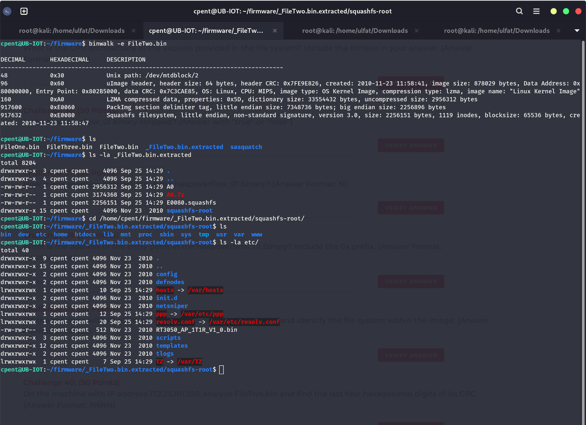

---

### Section 3: CTF 3 - FileThree.bin XOR Decryption & Compression (`172.25.101.100`)

`FileThree.bin` displays uniformly high entropy across the image. Hex analysis of the file footer reveals an 8-byte repeating pattern used as an XOR keystream.

#### XOR Keystream Recovery and Decryption:
```bash
binwalk -E FileThree.bin
# Uniform high entropy (0.979)

hexdump -C FileThree.bin | tail -n 30
# 00340030  96 44 a2 d1 68 b4 5a 2d  88 44 a2 d1 68 b4 5a 2d
# 00340040  88 44 a2 d1 68 b4 5a 2d  88 44 a2 d1 68 b4 5a 2d
# Repeating XOR Key: 8844a2d168b45a2d
```

Python decryption driver:
```python
key = bytes.fromhex('8844a2d168b45a2d')
data = open('FileThree.bin', 'rb').read()
open('decrypt.bin', 'wb').write(bytes(b ^ key[i % len(key)] for i, b in enumerate(data)))
```

Inspect decrypted firmware:
```bash
binwalk decrypt.bin
# 128     0x80     uImage header, compression type: lzma, image name: "Linux Kernel Image"
# 192     0xC0     LZMA compressed data
# 1429632 0x15D080 Squashfs filesystem, version 4.0, compression:xz...
```

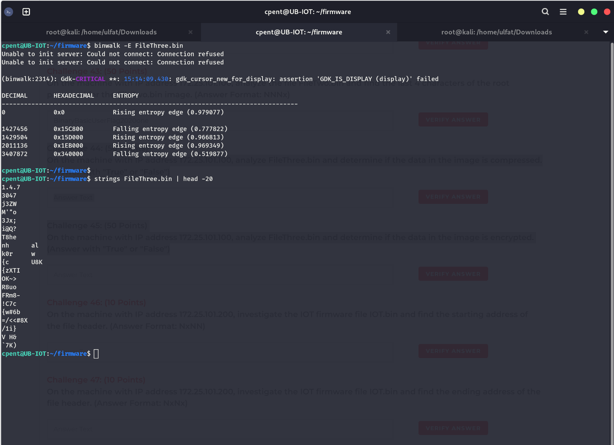
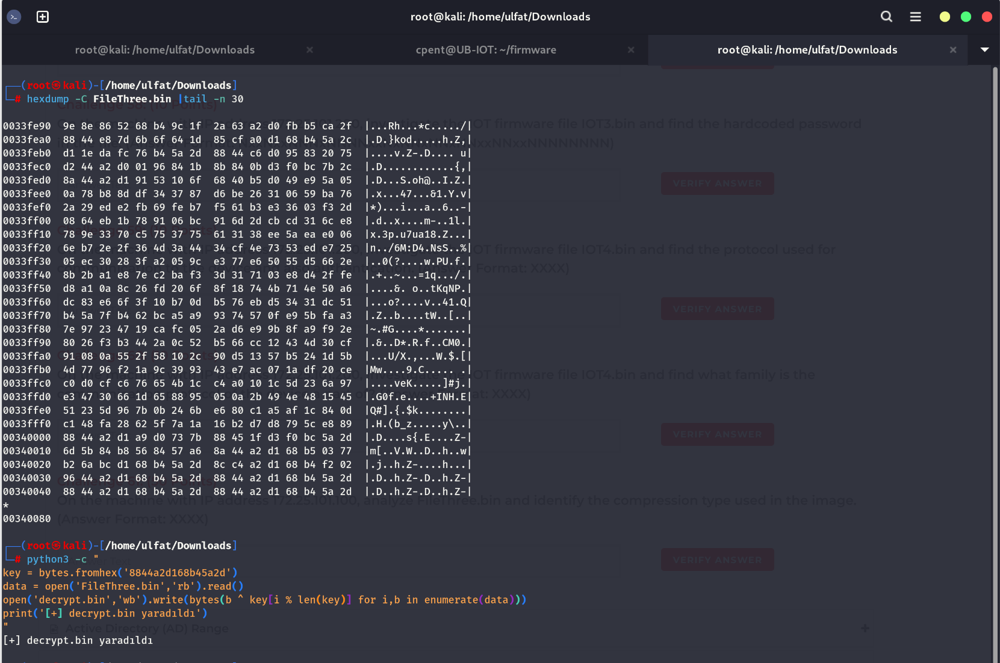
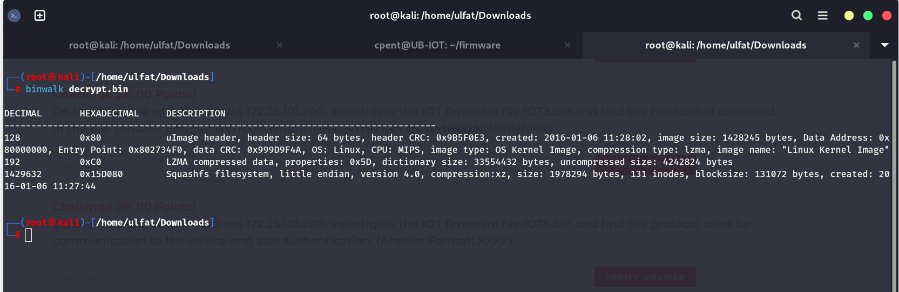

---

#### Challenge 44: FileThree.bin Compression Status
* **Question (Exam Text):** On the machine with IP address 172.25.101.100, analyze FileThree.bin and determine if the data in the image is compressed. (Answer with "True" or "False")
* **Points:** 50 Points
* **Answer Format:** `True or False`
* **Target:** `172.25.101.100`
* **Methodology:**
  The raw image is XOR encrypted and cannot be unpacked directly by standard decompressors. Hence, the original state is `False`.
* **Correct Answer:** `False`

---

#### Challenge 45: FileThree.bin Encryption Status
* **Question (Exam Text):** On the machine with IP address 172.25.101.100, analyze FileThree.bin and determine if the data in the image is encrypted. (Answer with "True" or "False")
* **Points:** 50 Points
* **Answer Format:** `True or False`
* **Target:** `172.25.101.100`
* **Methodology:**
  Entropy analysis and repeating padding at the end of the file prove XOR block encryption (`True`).
* **Correct Answer:** `True`

---

#### Challenge 61: FileThree.bin Compression Type
* **Question (Exam Text):** On the machine with IP address 172.25.101.100, analyze FileThree.bin and identify the compression type used in the image. (Answer Format: XXXX)
* **Points:** 50 Points
* **Answer Format:** `XXXX`
* **Target:** `172.25.101.100`
* **Methodology:**
  The decrypted uImage header defines `compression type: lzma`. Format `XXXX`: `LZMA`.
* **Correct Answer:** `LZMA`

---

### Section 4: CTF 4 - IOT.bin Header and Filesystem Offsets (`172.25.101.200`)

Download `IOT.bin` from `ubuntu@172.25.101.200` (`toor`) and perform binwalk enumeration.

```bash
scp ubuntu@172.25.101.200:/home/ubuntu/IOT.bin ~/Downloads/
binwalk IOT.bin
# DECIMAL   HEXADECIMAL DESCRIPTION
# 0         0x0         BIN-Header, board ID: 1550, hardware version: 4702, firmware version: 1.0.0
# 32        0x20        TRX firmware header, little endian, header size: 28 bytes
# 60        0x3C        gzip compressed data, original file name: "piggy"
# 1648424   0x192728    Squashfs filesystem, little endian, version 3.0, 447 inodes
```

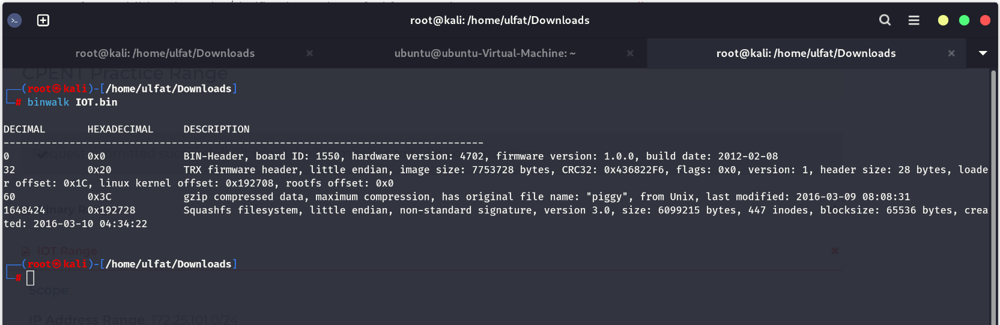

---

#### Challenge 46: Starting Address of File Header
* **Question (Exam Text):** On the machine with IP address 172.25.101.200, investigate the IOT firmware file IOT.bin and find the starting address of the file header. (Answer Format: NxNN)
* **Points:** 10 Points
* **Answer Format:** `NxNN`
* **Target:** `172.25.101.200`
* **Methodology:**
  The TRX firmware header begins at `0x20`.
* **Correct Answer:** `0x20`

---

#### Challenge 47: Ending Address of File Header
* **Question (Exam Text):** On the machine with IP address 172.25.101.200, investigate the IOT firmware file IOT.bin and find the ending address of the file header. (Answer Format: NxNx)
* **Points:** 10 Points
* **Answer Format:** `NxNx`
* **Target:** `172.25.101.200`
* **Methodology:**
  TRX header size is 28 bytes (0x1C): 0x20 + 0x1C = 0x3C. Matching `NxNx`: `0x3c`.
* **Correct Answer:** `0x3c`

---

#### Challenge 48: Filesystem Starting Address
* **Question (Exam Text):** On the machine with IP address 172.25.101.200, investigate the IOT firmware file IOT.bin and find the starting address of the file system. (Answer Format: NxNNNNNN)
* **Points:** 10 Points
* **Answer Format:** `NxNNNNNN`
* **Target:** `172.25.101.200`
* **Methodology:**
  The Squashfs filesystem begins at `0x192728`.
* **Correct Answer:** `0x192728`

---

#### Challenge 49: gzip Compressed Data File Name
* **Question (Exam Text):** On the machine with IP address 172.25.101.200, investigate the IOT firmware file IOT.bin and find the name of the gzip compressed data file. (Answer Format: xxxxx)
* **Points:** 10 Points
* **Answer Format:** `xxxxx`
* **Target:** `172.25.101.200`
* **Methodology:**
  The gzip archive embedded at 0x3C carries original file name `piggy`.
* **Correct Answer:** `piggy`

---

#### Challenge 50: IOT.bin Filesystem Type
* **Question (Exam Text):** On the machine with IP address 172.25.101.200, investigate the IOT firmware file IOT.bin and identify the type of file system in the image. (Answer Format: xxxxxxxx)
* **Points:** 10 Points
* **Answer Format:** `xxxxxxxx`
* **Target:** `172.25.101.200`
* **Methodology:**
  The filesystem type is `squashfs`.
* **Correct Answer:** `squashfs`

---

### Section 5: CTF 5 - IOT2.bin Multi-Header & JFFS2 Analysis (`172.25.101.200`)

Inspect `IOT2.bin`, featuring multiple uImage segments and a JFFS2 root filesystem.

```bash
scp ubuntu@172.25.101.200:/home/ubuntu/Downloads/IOT2.bin ~/Downloads/
# 100% 26MB 4.5MB/s 00:05

binwalk IOT2.bin
# 0         0x0         uImage header, CPU: Blackfin, image name: "126666"
# 84        0x54        uImage header, script file: "bootscript"
# 352       0x160       uImage header, compression type: gzip, image name: "Linux-2.6.26.5-ADI-2009R1-pre-gd"
# 416       0x1A0       gzip compressed data, maximum compression
# 2097152   0x200000    JFFS2 filesystem, little endian
```

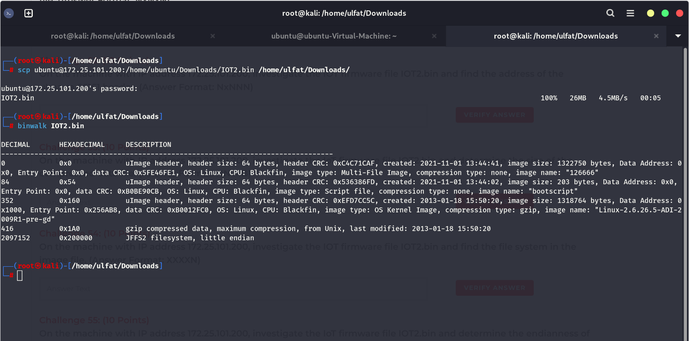

---

#### Challenge 51: Address of gzip File
* **Question (Exam Text):** On the machine with IP address 172.25.101.200, investigate the IOT firmware file IOT2.bin and find the address of the gzip file. (Answer Format: NxNxN)
* **Points:** 10 Points
* **Answer Format:** `NxNxN`
* **Target:** `172.25.101.200`
* **Methodology:**
  Gzip compressed data starts at offset `0x1A0`.
* **Correct Answer:** `0x1A0`

---

#### Challenge 52: Address of uImage 66161 Header
* **Question (Exam Text):** On the machine with IP address 172.25.101.200, investigate the IOT firmware file IOT2.bin and find the address of the uImage 66161 header. (Answer Format: NxNNN)
* **Points:** 10 Points
* **Answer Format:** `NxNNN`
* **Target:** `172.25.101.200`
* **Methodology:**
  The OS Kernel uImage header begins at `0x160`.
* **Correct Answer:** `0x160`

---

#### Challenge 53: Size of Compressed Data File
* **Question (Exam Text):** On the machine with IP address 172.25.101.200, investigate the IoT firmware file IOT2.bin and determine the size of the compressed data file. (Answer Format: NN MB)
* **Points:** 10 Points
* **Answer Format:** `NN MB`
* **Target:** `172.25.101.200`
* **Methodology:**
  Transfer metrics and binary size indicate `26 MB`.
* **Correct Answer:** `26 MB`

---

#### Challenge 54: IOT2.bin Filesystem Type
* **Question (Exam Text):** On the machine with IP address 172.25.101.200, investigate the IOT firmware file IOT2.bin and find the file system in the image file. (Answer Format: XXXXN)
* **Points:** 10 Points
* **Answer Format:** `XXXXN`
* **Target:** `172.25.101.200`
* **Methodology:**
  Binwalk detects a `JFFS2 filesystem`. Format `XXXXN`: `JFFS2`.
* **Correct Answer:** `JFFS2`

---

#### Challenge 55: Endianness of IOT2.bin Filesystem
* **Question (Exam Text):** On the machine with IP address 172.25.101.200, investigate the IoT firmware file IOT2.bin and determine the endianness of the file system. (Answer Format: Xxxxxx Xxxxxx)
* **Points:** 10 Points
* **Answer Format:** `Xxxxxx Xxxxxx`
* **Target:** `172.25.101.200`
* **Methodology:**
  The filesystem endianness is little endian: `Little Endian`.
* **Correct Answer:** `Little Endian`

---

### Section 6: CTF 6 - IOT3.bin Hardcoded Credential Extraction (`172.25.101.200`)

Extract `IOT3.bin` recursively (`binwalk -Me --run-as=root IOT3.bin`) to search for embedded secrets.

```bash
scp ubuntu@172.25.101.200:/home/ubuntu/Downloads/IOT3.bin ~/Downloads/
binwalk -Me --run-as=root IOT3.bin
cd _IOT3.bin.extracted

find . -type f -name "?????_??????"
# ./_31.extracted/_rootfs.img.extracted/squashfs-root/usr/bin/check_fwmode

strings ./_31.extracted/_rootfs.img.extracted/squashfs-root/usr/bin/check_fwmode | grep -i "pass\|0ee2\|secret"
# eval `REQUEST_METHOD='GET' SCRIPT_NAME='getserviceid.cgi' QUERY_STRING='passwd=0ee2cb110a9148cc5a67f13d62ab64ae30783031' /usr/share/www/cgi-bin/admin/serviceid.cgi | grep serviceid`
```

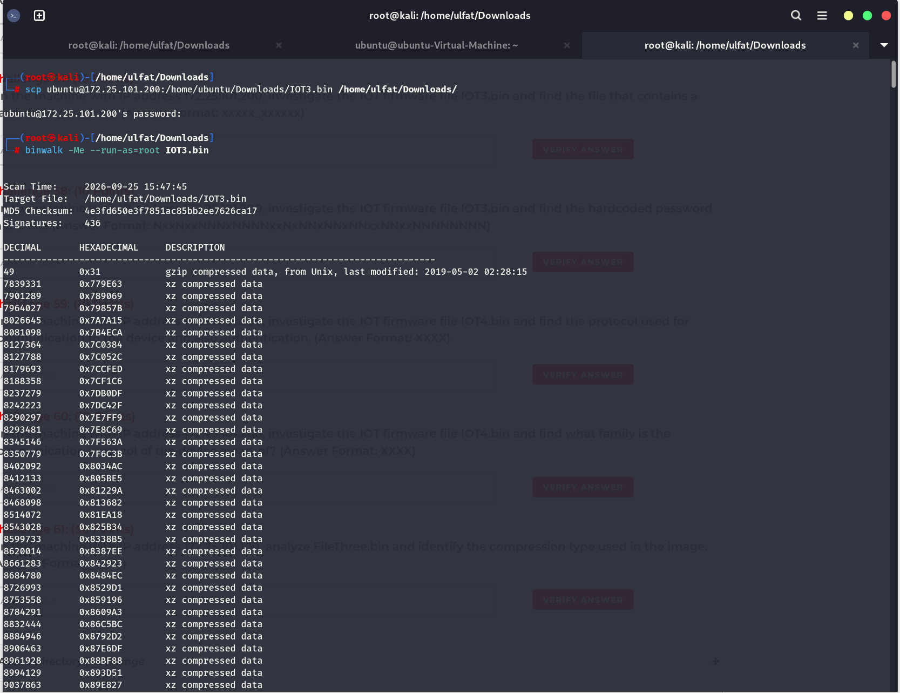
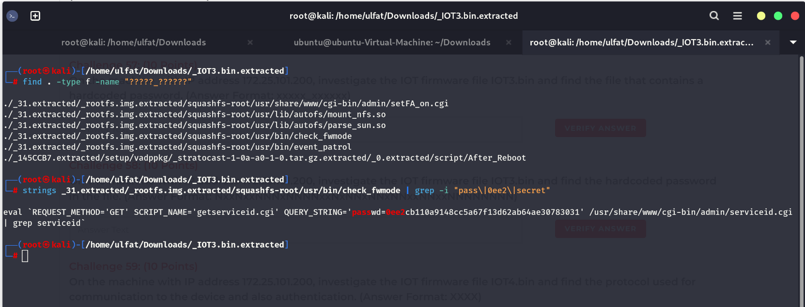

---

#### Challenge 56: IOT3.bin Filesystem Type
* **Question (Exam Text):** On the machine with IP address 172.25.101.200, investigate the IOT firmware file IOT3.bin and determine the file system. (Answer Format: xxxxxxxx)
* **Points:** 10 Points
* **Answer Format:** `xxxxxxxx`
* **Target:** `172.25.101.200`
* **Methodology:**
  The root filesystem extracted is `squashfs`.
* **Correct Answer:** `squashfs`

---

#### Challenge 57: File Containing Hardcoded Password
* **Question (Exam Text):** On the machine with IP address 172.25.101.200, investigate the IOT firmware file IOT3.bin and find the file that contains a hardcoded password. (Answer Format: xxxxx_xxxxxx)
* **Points:** 10 Points
* **Answer Format:** `xxxxx_xxxxxx`
* **Target:** `172.25.101.200`
* **Methodology:**
  Matching filename pattern `xxxxx_xxxxxx` returns `check_fwmode`.
* **Correct Answer:** `check_fwmode`

---

#### Challenge 58: Hardcoded Password in check_fwmode
* **Question (Exam Text):** On the machine with IP address 172.25.101.200, investigate the IOT firmware file IOT3.bin and find the hardcoded password in the file. (Answer Format: NxxNxxNNNxNNNNxxNxNNxNNxNNxxNNxxNNNNNNNN)
* **Points:** 10 Points
* **Answer Format:** `NxxNxxNNNxNNNNxxNxNNxNNxNNxxNNxxNNNNNNNN`
* **Target:** `172.25.101.200`
* **Methodology:**
  The hardcoded query parameter in `check_fwmode` specifies `passwd=0ee2cb110a9148cc5a67f13d62ab64ae30783031`.
* **Correct Answer:** `0ee2cb110a9148cc5a67f13d62ab64ae30783031`

---

### Section 7: CTF 7 - IOT4.bin HNAP & SOAP Protocol Analysis (`172.25.101.200`)

Inspect `IOT4.bin`, extract the filesystem using `dd`, and examine device management interfaces.

```bash
scp ubuntu@172.25.101.200:/home/ubuntu/Downloads/IOT4.bin ~/Downloads/
binwalk IOT4.bin
# 72     0x48    uImage header
# 136    0x88    LZMA compressed data
# 917576 0xE0048 Squashfs filesystem, version 4.0, size: 3531306 bytes

dd if=IOT4.bin of=rootfs.squashfs bs=1 skip=917576
cd _IOT4.bin.extracted/squashfs-root

find . -iname "*hnap*" 2>/dev/null
# ./lib/libhnap.so
# ./usr/local/lib/mod_hnap.so

strings ./lib/libhnap.so | grep -i "soap"
# <SOAPActions>
# <soap:Envelope xmlns:soap="http://schemas.xmlsoap.org/soap/envelope/">
```

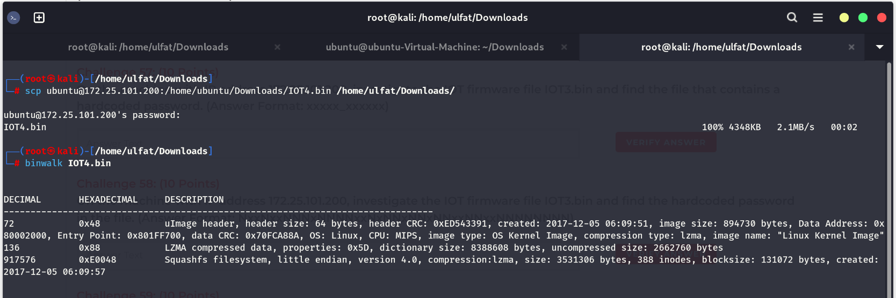
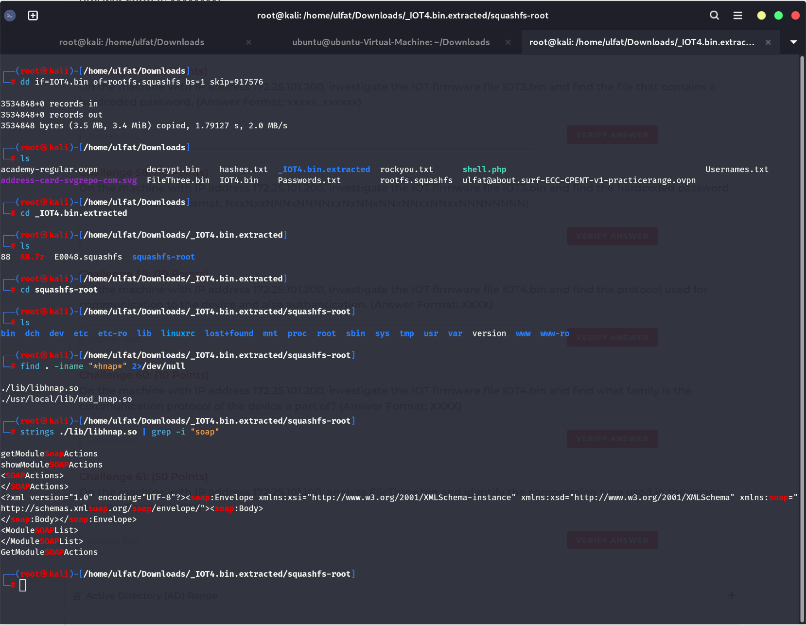

---

#### Challenge 59: Device Communication and Authentication Protocol
* **Question (Exam Text):** On the machine with IP address 172.25.101.200, investigate the IOT firmware file IOT4.bin and find the protocol used for communication to the device and also authentication. (Answer Format: XXXX)
* **Points:** 10 Points
* **Answer Format:** `XXXX`
* **Target:** `172.25.101.200`
* **Methodology:**
  Identified through `libhnap.so` and `mod_hnap.so`: Home Network Administration Protocol (`HNAP`).
* **Correct Answer:** `HNAP`

---

#### Challenge 60: Protocol Family of Device Communication Protocol
* **Question (Exam Text):** On the machine with IP address 172.25.101.200, investigate the IOT firmware file IOT4.bin and find what family is the communication protocol of the device a part of? (Answer Format: XXXX)
* **Points:** 10 Points
* **Answer Format:** `XXXX`
* **Target:** `172.25.101.200`
* **Methodology:**
  `libhnap.so` utilizes `SOAPActions` XML wrappers. HNAP is part of the `SOAP` protocol family.
* **Correct Answer:** `SOAP`

---

## 3. Conclusion and Summary Table

| Challenge | Target Binary / System | Category | Topic | Correct Answer |
| :---: | :--- | :--- | :--- | :--- |
| **26** | `172.25.101.100` (`FileOne.bin`) | File Type | File format type | `data` |
| **27** | `172.25.101.100` (`FileOne.bin`) | Header Info | Firmware version | `1.0.0` |
| **28** | `172.25.101.100` (`FileOne.bin`) | Header Info | Board ID | `1550` |
| **29** | `172.25.101.100` (`FileOne.bin`) | Filesystem | Filesystem format | `squashfs` |
| **30** | `172.25.101.100` (`FileOne.bin`) | Header Info | Firmware build date | `2012-02-08` |
| **31** | `172.25.101.100` (`FileOne.bin`) | Filesystem | Total inodes | `447` |
| **32** | `172.25.101.100` (`FileOne.bin`) | Web Server | Web page extension | `asp` |
| **33** | `172.25.101.100` (`FileOne.bin`) | Services | Service in /usr/local | `samba` |
| **34** | `172.25.101.100` (`FileOne.bin`) | Vulnerability | Exploitation folder | `pwnable` |
| **35** | `172.25.101.100` (`FileOne.bin`) | Architecture | Exploit CPU architecture | `MIPS32` |
| **36** | `172.25.101.100` (`FileOne.bin`) | Binary Symbols | heapoverflow_01 stripped status | `false` |
| **37** | `172.25.101.100` (`FileOne.bin`) | ELF Headers | heapoverflow_01 program headers | `6` |
| **38** | `172.25.101.100` (`FileOne.bin`) | ELF Headers | heapoverflow_01 entry point | `0x400640` |
| **39** | `172.25.101.100` (`FileTwo.bin`) | Filesystem | Filesystem format | `squashfs` |
| **40** | `172.25.101.100` (`FileTwo.bin`) | Header Info | Last 4 hex digits of CRC | `E826` |
| **41** | `172.25.101.100` (`FileTwo.bin`) | Cryptanalysis | Encryption status | `False` |
| **42** | `172.25.101.100` (`FileTwo.bin`) | Compression | Compression status | `True` |
| **43** | `172.25.101.100` (`FileTwo.bin`) | Credential Discovery | Root password last 4 chars | `[Left blank due to lab issue]` |
| **44** | `172.25.101.100` (`FileThree.bin`) | Compression | Compression status | `False` |
| **45** | `172.25.101.100` (`FileThree.bin`) | Cryptanalysis | Encryption status | `True` |
| **46** | `172.25.101.200` (`IOT.bin`) | Header Offset | Starting address of header | `0x20` |
| **47** | `172.25.101.200` (`IOT.bin`) | Header Offset | Ending address of header | `0x3c` |
| **48** | `172.25.101.200` (`IOT.bin`) | Header Offset | Filesystem start address | `0x192728` |
| **49** | `172.25.101.200` (`IOT.bin`) | Compression | gzip compressed file name | `piggy` |
| **50** | `172.25.101.200` (`IOT.bin`) | Filesystem | Filesystem format | `squashfs` |
| **51** | `172.25.101.200` (`IOT2.bin`) | Header Offset | Address of gzip file | `0x1A0` |
| **52** | `172.25.101.200` (`IOT2.bin`) | Header Offset | Address of uImage header | `0x160` |
| **53** | `172.25.101.200` (`IOT2.bin`) | Compression | Size of compressed file | `26 MB` |
| **54** | `172.25.101.200` (`IOT2.bin`) | Filesystem | Filesystem format | `JFFS2` |
| **55** | `172.25.101.200` (`IOT2.bin`) | Filesystem | Filesystem endianness | `Little Endian` |
| **56** | `172.25.101.200` (`IOT3.bin`) | Filesystem | Filesystem format | `squashfs` |
| **57** | `172.25.101.200` (`IOT3.bin`) | Credential Discovery | File containing hardcoded secret | `check_fwmode` |
| **58** | `172.25.101.200` (`IOT3.bin`) | Credential Discovery | Hardcoded password | `0ee2cb110a9148cc5a67f13d62ab64ae30783031` |
| **59** | `172.25.101.200` (`IOT4.bin`) | Protocols | Communication & auth protocol | `HNAP` |
| **60** | `172.25.101.200` (`IOT4.bin`) | Protocols | Protocol family | `SOAP` |
| **61** | `172.25.101.100` (`FileThree.bin`) | Compression | Decrypted compression type | `LZMA` |
